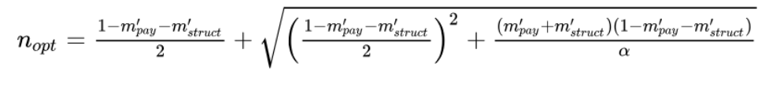
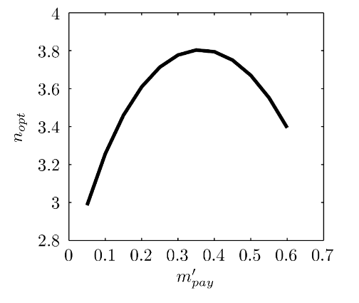
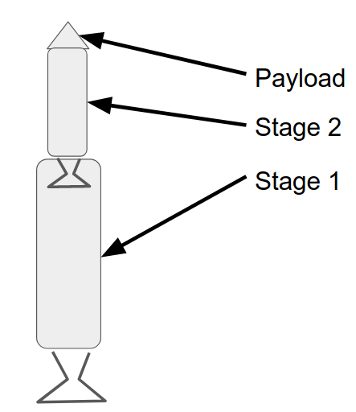

- [Rocket Propulsion Intro](#rocket-propulsion-intro)
- [The Rocket Equation](#the-rocket-equation)
  - [Constant Exit Velocity and Gravity](#constant-exit-velocity-and-gravity)
  - [Initial Acceleration](#initial-acceleration)
- [Updated Rocket Equation](#updated-rocket-equation)
  - [Optimized Masss Fraction](#optimized-masss-fraction)
- [Rocket Staging](#rocket-staging)

# Rocket Propulsion Intro

- Rockets produce thrust by ejecting mass at a high relative velocity $c$
- The momentum outflow rate = thrust force
  - $F = \dot m c$
  - $c$ is the velocity of the ejected mass once the pressure is no longer changing.

# The Rocket Equation

The governing rocket equation is:
- $m \dfrac{dv}{dt} = -c \dfrac{dm}{dt} - mg$
- Exit velocity $c$ is a function of atmospheric pressure/altitude
- Gravitational acceleration is also a function of altitude
- However, we assume that if the launch is vertical (which is true in the case of rockets) that $g$ and $c$ stay constant.

 

## Constant Exit Velocity and Gravity

Now we look at equation where $c$ and $g$ are held constant, which is true for vertical rocket flight.
- $v - v_0 = -c \ln \left(\dfrac{m(t)}{m_0} \right) -gt$
- This is only true for a vertical launch. If not, the last term changes.
- This neglects drag, which is a poor predictor of performance for SMALL rockets, but a decent predictor for large rockets.
- Velocities are relative to a fixed point at the center of the earth, or whatever object is causing the gravitational pull if the rocket is not on earth (i.e. mars if launching from there). A rocket sitting on a launch pad has $v_0 \not = 0$ for this reason.

 

The velocity change is set by mission requirements. If we assume constant mass flow from the engine, we get:
- $\dfrac{v - v_0}{c} = -\ln \left({\dfrac{m(t)}{m_0}} \right) - \dfrac{g}{a_0} \left(1 - \dfrac{m(t)}{m_0}\right)$
- Here, the left side $\dfrac{v - v_0}{c}$ is known
- The initial acceleration $a_0 = \dfrac{F}{m_0} > g$
- This is an implicit equation for mass fraction vs time

The final term is "Gravity Loss"
- It's the reduction in velocity increase, caused by overcoming gravity
- Term reduces as initial acceleration increases

## Initial Acceleration

There is an optimum value for the initial acceleration, and it is NOT setting it as large as possible. Setting it too high means you face higher drag forces lower in the atmosphere, as well as subjecting the pilot(s) to much higher forces and stresses. Setting it too low however may cause you to not take off at all, if $a_0 < g$

Consider the effect of acceleration on the propulsion system mass
- $m_0 = m_{structure} + m_{engine} + m_{payload} + m_{propellant}$

All propellant is burned at "burnout" $t_b$, after which the propellant mass is zero.
- $\dfrac{m(t_b)}{m_0} = \dfrac{m_0 - m_{prop}}{m_)} = 1 - \dfrac{m_{prop}}{m_0} = 1 - m_{prop}'$
  - $m_{prop}'$ (with the prime symbol ' ) is short hand for the propellant mass divided by intial mass.

We want to minimize $m_{struct}$ and $m_{eng}$, and maximize $m_{pay}$. But the engine mass is proportional to thrust, as follows:
- $\alpha = \dfrac{m_{eng}g}{F} = \dfrac{m_{eng}}{m_0 \dfrac{a_0}{g}} = \dfrac{m_{eng}'}{n}$
- Where $n = \textrm{G forces felt by pilot} + 1$

# Updated Rocket Equation

The definition yields
- $m'(tb) = m_{pay}' + m_{struct}' + n\alpha$

Which we use to get the rocket equation:
- $v_b - v_0 = -c \ln \left(m_{pay}' + m_{struct}' + n\alpha \right) - c \left(\dfrac{1 - m_{pay}' - m_{struct}'}{n} - \alpha \right)$

From this, we can see:
- Ideal velocity is shown in the $-c \ln \left(m_{pay}' + m_{struct}' + n\alpha \right)$ term.
  - Decreases with $n$ (heavier engine)
  - $n\alpha \ll 1$ and mass fractions $< 1$
  - Increasing $n$ means the input of $\ln$ (natural logarithm) gets closer to one, but is always less than one.
  - Therefore, a bigger $n$ value means this entire positive term becomes smaller.
- Gravity loss is shown in $- c \left(\dfrac{1 - m_{pay}' - m_{struct}'}{n} - \alpha \right)$ term.
  - Decreases with $n$ (reduced burn time)
  - $n$ must be $> 1$ otherwise it won't take off. $\alpha \ll 1$
  - First term in the parenthesis is more significant. Therefore increasing $n$ makes the whole term decrease.

 

## Optimized Masss Fraction

Taking this equation and differentiating with respect to N, and optimizing it, we get:

- With reasonable estimates of $m_{struct}' = 0.1$ and $\alpha = 0.02$

- One thing we find is that the optimum is not a strong function of the payload fraction. (Note, drag neglected in this graph)
- Varies between $3$ and $4$.
- Having a large $n$ means high speed at low altitude (where air density is higher), giving higher drag losses. This effect is even stronger for smaller rockets.

# Rocket Staging

Staging rockets means having multiple engines that fire in a sequential order. Once the fuel for one engine is expended, that engine and corresponding fuel tank are removed from the rocket to reduce mass for the subsequent engines. This is done through separation.
- $F = ma$, and so if we reduce our $m$, we can get the same $a$ by using less $F$.

If you separate too early, you may lose out on some thrust from your first engine, but most importantly you carry a heavy second stage propellant tank. If you separate too late, you carry a heavy first stage tank for a long time, which at that point is likely empty and dead weight.

Thus, we have the idea of "symmetrical" stages.
- Same specific impulse, same mass fractions
- Velocity increment should be divided equally between stages

The payload for the first stage is the entire second stage.
- Define $\epsilon = m_{struct}'$
  - Normalized with respect to the initial mass of **EACH** stage.

- The result for equal velocity increment for both stages is:
- $\left(\dfrac{m_{pay, 2}}{m_0, 1}\right)_{opt} = \left(\exp \dfrac{-\Delta V}{2c} - \epsilon \right)^2$

