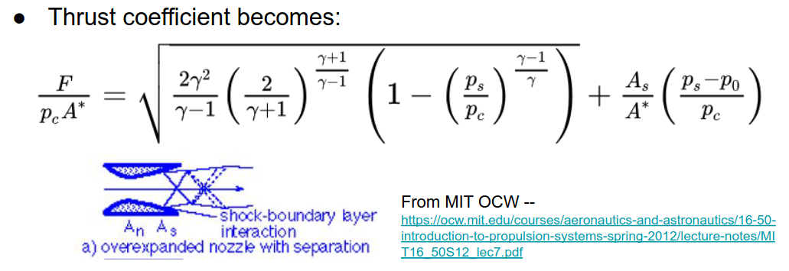

# Rocket Engine and Nozzle Modelling

We break this down into simple models.
- Turbopumps
- Injectors
- Combustion
- Nozzle Flow (focus for this lecture)
- Heat Transfer
- Structural

# Nozzle Flow

In the previous course, we modelled rocket nozzles by assumming the combustion chamber stagnation temperature & pressure, and gas composition
- Simplest case: Expansion to zero pressure/temperature

$c = \sqrt{(2 \dfrac{\gamma}{\gamma-1}RT_c)}$

Where
- $c$ is the exhaust velocity
- $\gamma$ is the specific heat, the same as $k$ from thermodynamics
- R is the gas constant of that gas
- $T_c$ is the combustion chamber stagnation temperature

Expansion to zero temperature means all stagnation enthalpy from combustion chamber is converted to kinetic energy.
- We assume a perfect gas

We can see from these equations that we need the gas properties.
- Using basic chemistry, we get mole fractions of products from known fuel and oxidizer compositions and design reaction (Not always stoichiometric!)
- Can compute properties of the gas mixture from mole fractions + molar masses and specific heat ratios of products
- We won't do this in detail however.

# Nozzle Shape

Variable-area channel flow of ideal gas is the most basic general modelling approach
- This was done in the previous course, model 2 in MIT OCW notes

Later, more complex modelling will be introduced to capture other effects

## Channel Flow Revisited

Assume
- Mass flow $\dot m$ uniformly distributed across channel width
- Angles of walls to axis of flow are small
- Gas properties are nearly constant
- $(\textrm{Velocity components normal to axis})^2 << (\textrm{Streamwise Velocity})^2$

Conservation of Mass
- $\rho uA(x) = \dot m = \textrm{constant}$

Conservation of Energy
- $c_p T + \dfrac{u^2}{2} = c_p T_c$

Isentropic Flow
- $\dfrac{T}{T_c} = \left(\dfrac{P}{P_c}\right)^\dfrac{\gamma-1}{\gamma}$
- Note this gamma fraction is an exponent, not multiplied! This is the same relationship from thermodynamics

## Corrected Flow Equation

$\dfrac{\dot m}{A} = P_c \sqrt{\dfrac{\gamma}{RT_c}} \ \ \ \ \dfrac{M}{\left(1 + \dfrac{\gamma-1}{2} M^2\right)^{\left(\dfrac{\gamma + 1}{2(\gamma -1)}\right)}}$
- Note this gamma fraction on the denominator is an exponent, not multiplied!

This essentially gives area as a function of Mach number
- Everything else is constant
- $A$ (Area) refers to the cross-sectional area of the nozzle
  - At $\textrm{Mach} = 1$, $A$ is called $A^*$

How does M and A vary with each other?
- For subsonic flow $(M < 1)$:
  - $\dot m, v \uparrow$ when $M \uparrow$
  - $M \uparrow$ when $A \downarrow$
- For supersonic flow $(M > 1)$, mass flux and velocity **decrease** with M
  - $\dot m, v \downarrow$ when $M \uparrow$
  - $M \uparrow$ when $A \uparrow$
- Static pressure always decreases with increasing M
- Throat area sets mass flow assuming flow is choked $(M = 1$ at $A=A^*)$

## Throat Mass Flow per Unit Area

This is a useful quantity

Defined by
- $\dot m = \dfrac{P_c}{A^*}{c^*}$

For the ideal gas model:
- $c^* = \dfrac{\sqrt{(RT_c)}}{\Gamma}$

Where
- $\Gamma = \sqrt{\gamma} \left(\dfrac{2}{\gamma + 1}\right) ^  {\left(\dfrac{\gamma + 1}{2(\gamma - 1)}\right)} \approx 0.67$ for most practical values of the specific heat ratio
- $\Gamma \approx 0.67$

## Effects Downstream of Throat

Mach/Velocity determined by the ratio of streamtube area to throat area
- Up to now, we have assumed that streamtube area = nozzle area, i.e. the "nozzle flows full"
  - We'll maintain this assumption for now...
- Flow not necessarily supersonic in entire nozzle downstream of the throat.
- Assume $M > 1$ to a point $x$

Using this, we get $M(x)$ from $\dfrac{A(x)}{A^*}$.

From $M(x)$, we can then get $P(x), T(x), u(x)$

## Flow Fullness

- Will be shown
- Relate exit velocity to pressure
  - Use conservation of energy and isentropic relation to get:
- $u = \sqrt{2c_pT_c}\left(1-\left(\dfrac{P}{P_c}\right)^{\left(\dfrac{\gamma-1}{\gamma}\right)}\right)^\dfrac{1}{2}$

Apply at the end of the nozzle, where $P = P_e$
- $u_e = \sqrt{2 c_p T_c} \left( 1 - \left( \dfrac{P_e}{P_c}\right)^{\left(\dfrac{\gamma-1}{\gamma}\right)} \right) ^ \dfrac{1}{2}$

## Thrust in Terms of Pressure Ratio
  
For a "full flow" nozzle:
- $F = \dot m u_e + A_e (P_e - P_0)$

Using our expression for exit velocity:
- $F = \dot m \sqrt{2 c_p T_c} \left(1 - \left(\dfrac{P_e}{P_c} \right) ^ {\left(\dfrac{\gamma -1}{\gamma} \right )} \right) ^ \dfrac{1}{2} + A_e (P_e - P_0)$

We can use our new $c^*$ term to eliminate mass flow.

Non-dimensional thrust:
- 

But area ratio is related to pressure ratio by the conversation of mass:
- 

# Thrust Coefficient for Rocket Engines

Define as
- $F = P_c A^* c_F$

Or as
- $\dfrac{F}{P_c}{A^*} = C_F$

So using the expression for non-dimensional thrust just above, gives the coefficient of thrust.

What is the relationship to the effective exhaust velocity?

From last time we had
- $F = \dot m c = \dfrac{P_C}{A^*}{c^*}c = P_c A^* c_F$

So...
- $c = c^* c_F$
  - $c^*$ is mainly propellant properties
  - $C_F$ is mainly pressure ratio and nozzle geometry
- This has allowed us to separate the effects of the nozzle geometry from the propellant.

# Non-Ideal Expansion

So far we have assumed that flow remains supersonic and fills the entire nozzle to the exit. Reality is a bit more complex.
- $A_n =$ throat area
- 

Ideal expansion gives the maximum thrust for a givven ambient pressure $P_0$
- Extending nozzle would expand too much, generating suction (local negative contribution to thrust)
- Shortening nozzle wouldn't expand enough, losing thrust that could have been generated

Consider the underexpanded nozzle in the above figure, d). 
- When $P_0$ is lowered below the ideal matching value (e.g. as the rocket climbs in the atmosphere), the nozzle becomes underexpanded
- Even though more expansion could occur and some potential thrust is lost, the nozzle is still fully filled.
  - Existing formulas still work

Consider the overexpanding nozzle in the above figure, b).
- If the ambient pressure $P_0$ is higher than the ideal value, the behavior depends on the ratio of $\dfrac{P_0}{P_e}$
- If $\dfrac{P_0}{P_e} <$ approx. $2$ to $2.5$
  - Nozzle likely to remain "full", thus the formula still works
- If $\dfrac{P_0}{P_e} >$ approx. $2$ to $2.5$
  - Oblique shocks form at nozzle exit strong enough to separate the boundary layer (see "a" in the figure above)
  - Separation point moves into the nozzle, decreasing the effective area.
    - Occurs at approximately $P_s$, where $\dfrac{P_s}{P_0} = \dfrac{1}{2}$ to $\dfrac{1}{2.5}$

## Modified Thrust for Overexpansion with Separation

As we saw above, the existing thrust equation will not work when separation occurs in overexpansion.

Replace $P_e$ by $P_s$ and $A_e$ by $A_s$
- $F = \dot m u_s + A_s (P_s - P_0)$

Therefore the thrust coefficient becomes:
- 