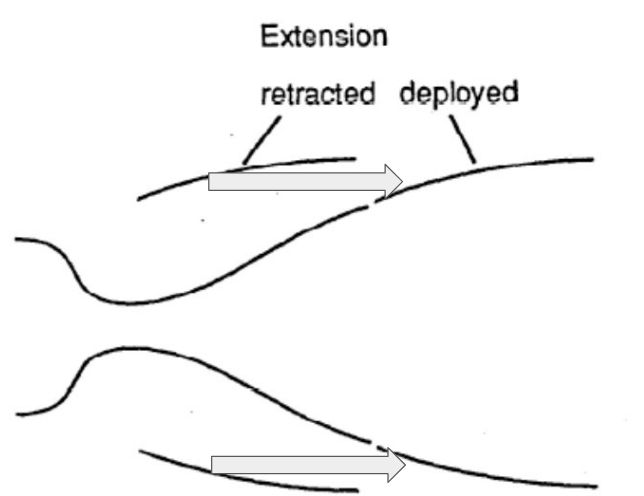
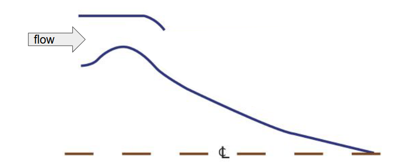
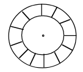
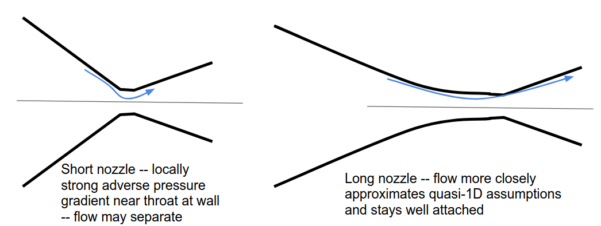
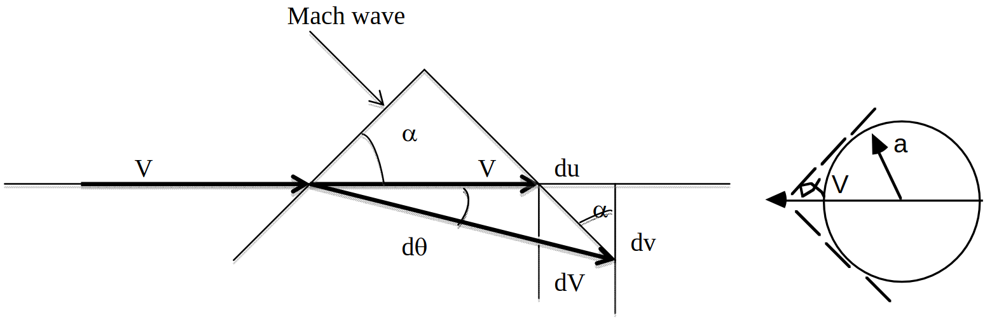

- [Bell Nozzles](#bell-nozzles)
  - [Advantages](#advantages)
  - [Disadvantages](#disadvantages)
- [Other Types of Bell Nozzles](#other-types-of-bell-nozzles)
  - [Extendable Nozzles](#extendable-nozzles)
  - [External Expansion Nozzles](#external-expansion-nozzles)
- [Nozzle Flow](#nozzle-flow)
- [Simplified Method of Characteristics](#simplified-method-of-characteristics)
- [Expansion in Supersonic Flow](#expansion-in-supersonic-flow)
  - [Prandtl-Meyer Function](#prandtl-meyer-function)
  - [Nozzle Shaping](#nozzle-shaping)
    - [Example](#example)

# Bell Nozzles

Bell Nozzle refers to this standard nozzle we've looked at.

These nozzles are excellent for standard conditions but they have disadvantages.

## Advantages

- Simple structure
  - Only hoop stresses
- Simple cooling system
- Easily matched to the combustor, based on the simple shape

## Disadvantages

- Overexpansion thrust loss
- Flow instability when overexpanded with separating flow, which can affect the thrust direction

# Other Types of Bell Nozzles

## Extendable Nozzles

The nozzle extension deploys at high altitudes
- The issue with a standard nozzle, is that at low altitudes we have sufficient expansion and the nozzle is full, but at higher altitudes where the ambient pressure is lower, there is a lot of expansion (and thus, thrust) that occurs outside the nozzle and is lost.
- Having a nozzle extension allows that "lost" thrust to be recaptured and used.
- Generally only practical to have two operating positions: retracted, and deployed
- 

## External Expansion Nozzles

External expansion nozzle has a central spike that extends past the outer rim
- Also known as an Aerospike
- Allows for better performance when operating outside of the design conditions, since the streamline of the flow adjusts/moves with the ambient pressure, limiting suction.
- 
  
The curvature of flow due to the angle changes along the spike occurs via expansion fans and oblique shocks.
- Only ways to turn supersonic flow

Annular geomoetry means many smaller combustors can be used instead of one. The advantage of this is that the failure of one combustor does not result in complete engine failure
- 

Disadvantages of the external expansion nozzle include:
- The spike is difficult to cool
- The structure tends to be heavy, as its not based on simple cylindrical pressure vessels like the bell nozzle

# Nozzle Flow

In the previous lecture we used corrected flow per unit area to relate Mach number to area. This does not tell us how long the nozzle should be, or how the area should vary along the streamwise direction.

Upstream of the throat, there's a few limits on how fast we can contract. This is mostly limited by wanting to ensure flow "turning back to axial" at the throat doesn't separate.

On the subsonic side of the nozzle, consider two profiles with the same initial to throat area ratio:
- 
- Flow separation is a concern in the short nozzle, but not in the long one.

Downstream of the throat $(M > 1)$, can be determined by using the **method of characteristics**

# Simplified Method of Characteristics

The approximate treatment is to assume the flow is:
- Two-dimensional
- Supersonic
- Isentropic

Axisymmetrical treatment exists but the math is much more complex.

# Expansion in Supersonic Flow

Flow turns through weak, isentropic waves
- 

Where
- $\alpha = \sin^{-1} \dfrac{a}{V} = \sin^{-1} \dfrac{1}{M} = \tan^{-1} \dfrac{1}{\sqrt{M^2-1}}$
- Therefore $\rightarrow \tan \alpha = \dfrac{1}{\sqrt{M^2 - 1}}$

Why does $\alpha = \sin^{-1} \dfrac{a}{V}$ ??
- Look at the above image, at the circular figure to the right.
- Angle is determined by the speed of sound $(a)$ and velocity $(V)$.
  - $V$ is the hypotenuse here, and $a$ is the opposite side, therefore we use $\sin$

Why does $\sin^{-1} \dfrac{1}{M} = \tan^{-1} \dfrac{1}{\sqrt{M^2-1}}$ ??
- Adjacent side length $= \sqrt{V^2 - a^2} \rightarrow \dfrac{\textrm{opposite}}{\textrm{adjacent}} = \dfrac{a}{\sqrt{V^2 - a^2}}$

The velocity magnitude also changes
- Total velocity change: $dV$
- Change in original direction: $du$
- Change perpendicular to original direction: $dv$
- $d\theta \ll 1 \Rightarrow dv \approx V d\theta, du \approx dV$
  - This is saying that the change in the angle theta is very small:
  - so $dv$, the change perpendicular to the original direction, is approximately $Vd\theta$, or velocity times the change in theta
  - $du$, the change in the original direction, is just approximately the total velocity change $dV$.
- We also see that $\dfrac{du}{dv} = \tan \alpha$

## Prandtl-Meyer Function

After some mathematics which we don't care about, we get the final result.
- $\theta(M) = \left(\sqrt{\dfrac{\gamma + 1}{\gamma - 1}}\right)\tan^{-1} \left(\sqrt{\dfrac{\gamma - 1}{\gamma + 1}(M^2 - 1)}\right) - \tan^{-1} \left(\sqrt{M^2 -1}\right)$

## Nozzle Shaping

We use the wave systems to set the length.

### Example

There's an example of this in MIT OCW but i have no idea WTF is going on here.
- [Lecture 8 - MIT OCW (link to page)](https://ocw.mit.edu/courses/16-50-introduction-to-propulsion-systems-spring-2012/resources/mit16_50s12_lec8/)
- Pages 5 and 6