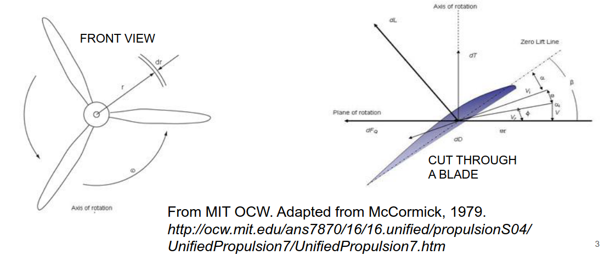
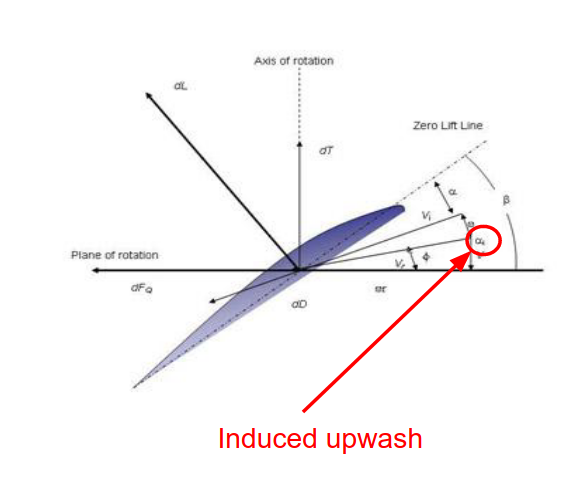
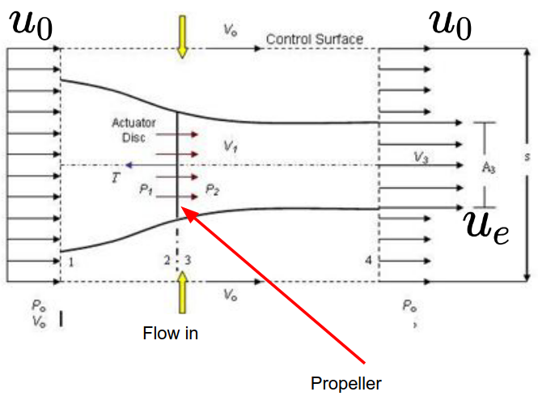
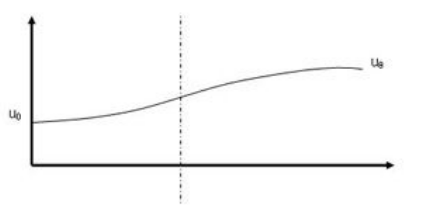
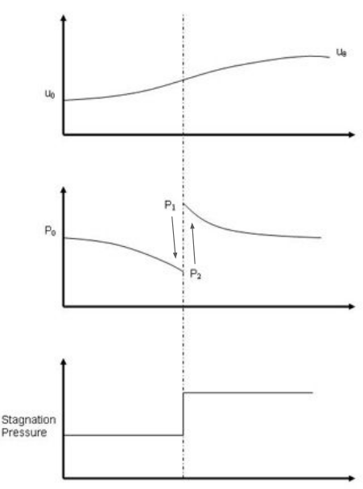
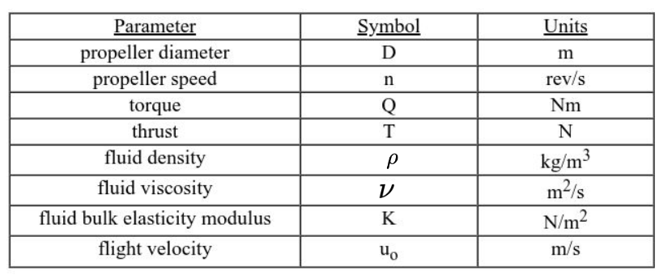

- [Propellers](#propellers)
- [Differential Equations](#differential-equations)
  - [Integral Momentum Analysis](#integral-momentum-analysis)
- [Propulsive Efficiency](#propulsive-efficiency)
- [Actuator Disk Theory](#actuator-disk-theory)
  - [Actuator Disk model of Propellers](#actuator-disk-model-of-propellers)
    - [Velocity](#velocity)
    - [Static and Stagnation Pressure](#static-and-stagnation-pressure)
    - [Exit Velocity](#exit-velocity)
    - [Ideal Propeller Power](#ideal-propeller-power)
- [Governning Non-Dimensional Parameters](#governning-non-dimensional-parameters)

# Propellers

Key characteristics:
- Performance
  -  Thrust, power, efficiency
- Actuator Disk Theory
- Non-Dimensional Parameters

Propellers are just airfoils rotating about an axis (i.e. the shaft). They produce lift and drag just as an airfoil would.

We have induced upwash due to the helical trailing vortex system
- Caused by the influence of other blades, and/or previous passing of the same blade.
- For detailed propeller design (we won't do this), dealing with the induced upwash is important.

# Differential Equations

The differential lift/torque equations are in the notes:

Thrust:
- $dF = dL \cos (\phi + \alpha_i) - dD \sin(\phi + \alpha_i)$
- $dQ = r dFq = r (dL \sin(\phi + \alpha_i) + dD \cos (\phi + \alpha_i))$

The differential lift and drag equations are:
- $dL = c_L \dfrac{1}{2} \rho V_e^2 c (dr)$
- $dD = c_D \dfrac{1}{2} \rho V_e^2 c (dr)$
- Only difference is the $c_L$ vs $c_D$ terms.

We can then integrate and sum over N blades to get total thrust & torque
- $F = \sum\limits_{i=1}^n \int \limits_{r_{in}}^{r_{out}}dF$
- $F = \sum\limits_{i=1}^n \int \limits_{r_{in}}^{r_{out}}dQ$

## Integral Momentum Analysis

Since we aren't looking at induced upwash, we instead look at integral momentum analysis

- In the boundaries far from the area of interest, the pressure is uniform.
- Stagnation pressure only changes when flow is passing through the propeller.
- $\sum F_x = \int_s \rho u_x \vec{u} \cdot \vec{n} ds$ 

What is the resulting expression for thrust?
- Flow into and out of the propeller are equal
- Conservation of mass then says that flow through the sides is extra flow out of the back
- Change in momentum only for flow that goes through the propeller can be found as:
  - $T = \dot m (u_e - u_0)$

# Propulsive Efficiency

We can find the power imparted to the fluid by the blades, and the rate of work done, from the following two equations:

Change in Fluid Kinetic Energy:
- $\dot W_{fluid} = \dot m \left( \dfrac{u_e^2}{2} - \dfrac{u_0^2}{2} \right)$

Propulsive Power (Rate of work done):
- $\dot W_{prop} = T u_0$

The ratio of these two powers is the propulsive efficiency

# Actuator Disk Theory

We need the exit velocity $u_e$ for thrust, power and efficiency. How do we find this?

We use the actuator disk theory to determine how $u_e$ depends on other factors.

Actuator Disk: An infinitely thin circular disk across which some flow properties change discontinuously

## Actuator Disk model of Propellers

We assume:
- Rotation/swirl in flow downstream is negligible
- $M \ll 1$ so flow behaves incompressibly
- $P_t = \textrm{constant}$ (stagnation pressure) for flow that dose not pass through the propeller.
- Steady flow - smear out blades
- Only pressure changes discontinuously across disk

### Velocity

Velocity varies continuously
- We have $u_0$ far upstream (before propeller), and want $u_e$ downstream (after propeller)
- Velocity at the disk location (dashed line) is denoted $u_{disk}$
- $u_{disk} = \dfrac{u_e + u_0}{2}$
  - Derivation is in the MIT OCW notes but i don't care about derivation

An important takeaway from this formula is that the velocity change is evenly split between upstream and downstream.

### Static and Stagnation Pressure

Pressure and velocity must have inverse relationship **away from disk**
- That is, $P \propto \dfrac{1}{V}$

The stagnation pressure is constant away from the disk due to Bernoulli's equation.

At the disk, however, the pressure rises sharply. The amount is equal to the static pressure rise.

### Exit Velocity

We still don't know $u_e$ and without that we can't find $u_{disk}$. But we do have the aircraft design parameters.
- Thrust and flight velocity is known for the vehicle
- Disk area is simply related to the propeller diameter
- So we know the exit velocity is a function of thrust $T$ and flight velocity $u_0$:

$\left(\dfrac{u_e}{u_0}\right)^2 = \dfrac{T}{A_{disk} u_0^2 \dfrac{\rho}{2}}+1$

### Ideal Propeller Power

The ideal propeller power is also a function of these design parameters

$\dot W_{fluid} = \dfrac{1}{2} T u_0 \left ( \left( \dfrac{T}{A_{disk}} u_0^2 \dfrac{\rho}{2} + 1 \right) ^ \dfrac{1}{2} \right )$
- This ideal power, we typically expect to need about 15% more than this in real appliations

Pollev question slide 23 TODO

# Governning Non-Dimensional Parameters

The thrust coefficient depends on:
- $Re$ (reynolds number of air flow)
- $M$ (Mach numbeR)
- $J$ (Advance Ratio)
  - Key performance parameter for propellers
  - It's the distance advanced by a propeller
  - $J = \dfrac{u_0}{Dn}$
  - $T = k_T \rho n^2 D^4$
  - $k_T = f(Re, \ \ M_{tip}, \ \ J)$
 
The torque coefficent follows similar behavior.
- $T = F  d \rightarrow$ Torque = Force * Distance
- $Q = k_Q \rho n^2 D^5
- $k_Q =  f(Re, \ M_{tip}, \ J)$

The propulsive efficiency is based on coefficients and the advance ratio
- $\eta_{prop} = \dfrac{1}{2\pi} \dfrac{k_t}{k_Q} J$
- If J and coefficients are known, we can find the efficiency
- If efficiency is known, it gives a constraint on the relationship between the coefficients and the advance ratio $J$ (adv. ratio is a design parameter).

The power coefficient is another quantity used to indicate propeller performance:
- $C_P = 2\pi k_Q$