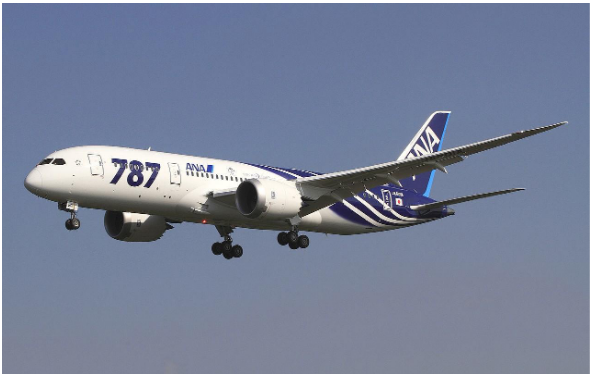

- [Intro to New Efficient Aircraft](#intro-to-new-efficient-aircraft)
  - [Number of Engines](#number-of-engines)
  - [Large vs Small Aircraft](#large-vs-small-aircraft)
  - [Environmental Considerations](#environmental-considerations)
  - [Aircraft Design: New Efficient Aircraft](#aircraft-design-new-efficient-aircraft)
# Intro to New Efficient Aircraft

Newer efficient aircraft are large, wide-body aircraft with two aisles.
- Designed for low fuel burn, two engines
- "Tube and Wing" configuration
- Swept Wings
- Engines hung on pylons, under and forward of wings

Hanging engines underneath the wings has structural advantages
- Engines are heavy, often 8,000kg or more
- Placing them under the wings where lift is generated helps reduce structural weight requirements
- In the event of engine fialure, having the engine under the wing will help mitigate some potential shrapnel or debris flying into the passenger bay
- Easy access for maintenance

## Number of Engines

The initial standard was to use four engines. Nowadays, two is the standard.

Engines must be sized so that if one engine fails as the aircraft is about to take off, the other engines can still complete the takeoff successfully.

An increase in the **bypass ratio** has allowed engine number to reduce overtime.
- Improves the match between the thrust required at sea level and the thrust required at cruising altitude.
- This means a thrust value much closer to the full thrust is being produced at both takeoff and cruising altitudes. Older aircraft were not nearly this efficient and could not adapt as well to altitude.

## Large vs Small Aircraft

Smaller aircraft have a $\dfrac{D}{W_e} \approx$ 10% to 15% higher than larger, twin aisle aircraft. The engine specific fuel consumption is about 20% worse for small engines than for larger engines. Why?
- Smaller aircraft have a lower characteristic length, meaning the Reynolds number of the flow going over the aircraft is going to be lower. Lower reynolds number means the fluid frictional forces are stronger, and so drag forces are higher. 
- Lower Reynolds number also is seen in the smaller engines due to the smaller area.
- In addition, the fineness ratio of smaller aircraft is further from ideal.

## Environmental Considerations

- 2% of global emissions
- 12% of transport-related emissions

Contrails are ice crystals formed when water vapor in the exhaust freeze due to the cold temperature high in the atmosphere. This is a temporary effect.

## Aircraft Design: New Efficient Aircraft

Design Objective:
- Move passengers with minimal environmental impact

Range (R1, max payload):
- 3000nm = 5556 km

Aerodynamics:
- $\dfrac{L}{D}_{cruise} = 21.6$

Cruise Mach Number:
- $M_{cruise} = 0.78$
- Reduces fuel consumption significantly compared to other standard of $0.85$, and since it's not a very long range flight the slower speed won't add up as much.

Additional Specifications
- Passenger Capacity: 280
- Max Payload: 40.2 tonne
- Max take-off mass: 175 tonne
- Empty weight: 100 tonne
- Fuel consumed for mission at max range: 27.8 tonne
- Estimated engine specific fuel consumption $(SFC)$: $0.50 kg / h / kg$
- Wing span: $60m$
- Wing area: $304m^2$
- Wing sweep: 25 degrees

Consequences of the Specifications:
- Estimated fuel increase of $\approx 15$%

Continued in lecture 6.
- [Lecture 6](./Lecture06.md)