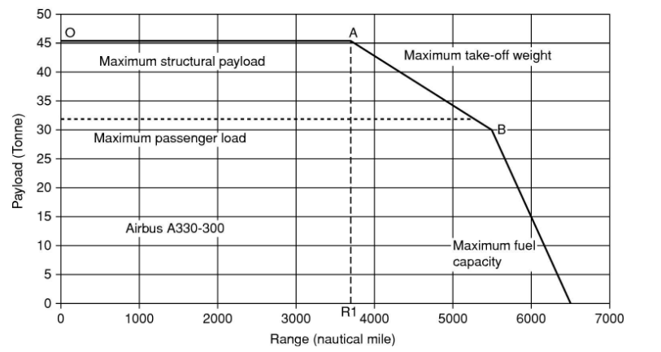
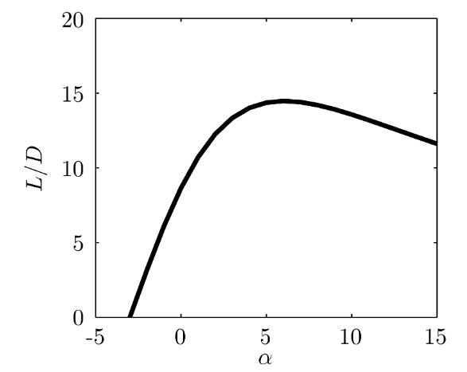
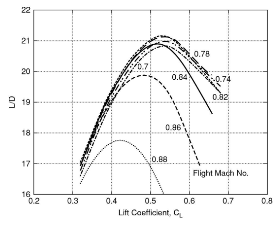
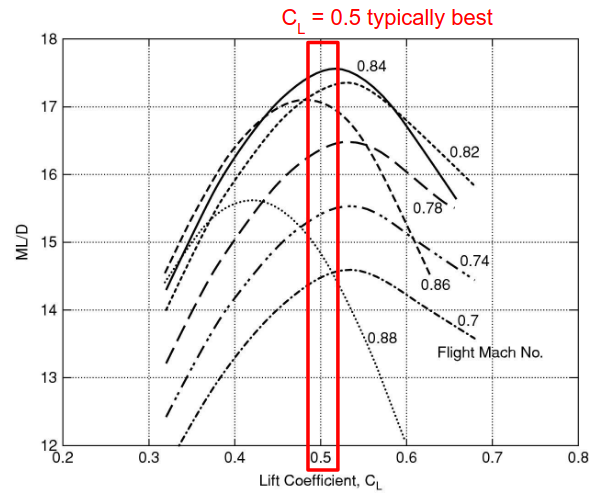

- [Sizing Continued](#sizing-continued)
  - [Payload vs Range](#payload-vs-range)
  - [Cruise vs Takeoff and Landing](#cruise-vs-takeoff-and-landing)
  - [Lift to Drag (L/D) Ratio](#lift-to-drag-ld-ratio)
    - [Cruise Lift to Drag (L/D) Ratio](#cruise-lift-to-drag-ld-ratio)
  - [Peak Mach Number](#peak-mach-number)
  - [Bruguet Range Equation](#bruguet-range-equation)
  - [Required Thrust](#required-thrust)
  - [Engine Design](#engine-design)
  - [Thrust Creation](#thrust-creation)
  - [Efficiency](#efficiency)
    - [Propulsive Efficiency](#propulsive-efficiency)
    - [Thermal Efficiency](#thermal-efficiency)
    - [Overall Efficiency](#overall-efficiency)
  - [Jet Velocity and Net Thrust](#jet-velocity-and-net-thrust)

# Sizing Continued

Size, speed and range dictate engine requirements

Aerodynamics are important too!

Takeoff, climb and cruise are the most critical flight conditions for engines.
- It is ideal to cruise quickly and at high altitude

## Payload vs Range

This image above is for an Airbus A330-300

We can identify three distinct segments on the graph.
- O to A
  - Payload is constant until max takeoff weight reached
- A to B
  - Payload replaced with fuel to increase range
- B to end
  - Drag must be reduced to further increase range

Increasing the range means more fuel must be carried, reducing the useful payload mass. There are also structural limits to the payload too.

## Cruise vs Takeoff and Landing

The aircraft must fly fast at cruise, slow to take off and land.
- It's critical that wing stall does not occur near the ground
- Need flight speed high enough to get $\textrm{Lift} = \textrm{Weight}$ at a $C_L$ well below stall value.

During cruise or when there is no flap deflection, $C_{D, 0} = 0.03$. This is typical.

When there is large flap deflection: $C_{D,0} = 0.1$. This is a significant increase in drag coefficient.

The drag cofficient is parabolic vs the angle of attack:
- $C_L = a(\alpha - \alpha_{L = 0})$
- $C_D \approx C_{D,0} + \dfrac{C_L^2}{\pi AR}$

$\dfrac{L}{D}$ vs $\alpha$ peaks well below stall, seen in the graph below.

- $AR = 8$
- $\alpha_{L = 0}= -3 \degree$ (zero lift angle of attack)
- $a = 5.5$
- $C_{D,0} = 0.03$

We can be aerodynamically efficient and stall-resistant at the same time.

Tires can overheat if overused (too long of a runway, or too fast)
- The solution is to limit the take-off velocity to 90 m/s
- Limit landing speed to 72 m/s

The landing speed typically dictates the required wing area.

## Lift to Drag (L/D) Ratio

Above is the estimated data for a Boeing 787-8

As Mach number increases, the max $\dfrac{L}{D}$ and $C_L$ both reduce
- This is due to the increasingly strong shocks occuring on the wings
- About $M\approx 0.8$ is the best value here.

### Cruise Lift to Drag (L/D) Ratio

Flying at maximum $\dfrac{L}{D}$ gives the maximum weight which can be kept in the air for a given engine thrust
- It's equivalent to setting endurance (flight time)

Cruise: Travel as far as possible for a given amount of fuel used
- Need to maximize $\textrm{Flight Speed} \times \dfrac{L}{D}$
- At curise altitudes, temperature and speed of sound are nearly constant
- $V \dfrac{L}{D} \propto M \dfrac{L}{D}$

## Peak Mach Number

In the above picture (boeing 787) we can see that the Mach Number multiplied by the lift to drag ratio, $M \times \dfrac{L}{D}$, peaks at a higher mach number.

Recall, we designed our new efficient aircraft to use $M = 0.78$. However, we can see from this graph that $0.84$ or $0.85$ for example would be better. Why did we do 0.78?
- If we design for lower speed, we reduce the structural weight
- Reduces lift required
- Which Reduces Drag
- Leading to less thrust required
- Needing smaller engines to do so
- Lowering fuel consumption

Conclusion: Can only look at curves for a given aircraft, cannot compare across different ones!!

Recall that the wing area is set by the takeoff and landing speeds. This leaves two options for cruising at optimal lift coefficient:
- Fly slow near the ground
- Fly high (reduced atmospheric density) and fast

Specific fuel consumption can be written as:
- $\textrm{SFC} = \dfrac{\dot m_f}{\textrm{thrust}}$

Overall efficiency, from enthalpy supply rate from fuel burn to propulsive power:
- $\eta = \dfrac{V}{\textrm{SFC} \times \textrm{LCV}}$

## Bruguet Range Equation

We learned about this previously. Now we redefine it in terms of the range factor.
- $H = \dfrac{n_0\left(\textrm{LCV}\right) \left(\dfrac{L}{D}\right)}{g}$
  - Here, $n_0$ is the overall engine efficiency, defined in detail [at the end of the lecture (click here to go)](#overall-efficiency)

This yields the range equation:
- $R = -H \ln{\left(\dfrac{m_{end}}{m_{start}}\right)}$

We can then use the Bruguet Equation to obtain the "Fuel Burn Parameter"
- $\dfrac{\textrm{Mass of fuel burned}}{\textrm{range} \times \textrm{mass of payload}}$

Using the Bruguet Range Equation:
- $\dfrac{m_{fb}}{Rm_{pl}} = \dfrac{1}{R} \left(1 + \dfrac{m_e}{m_{pl}}\right) \left(\exp{\left( \dfrac{R}{H} - 1 \right )}\right)$

## Required Thrust

The Top-Of-Climb condition sets the engine thrust required. This is where the engine is nearly at cruise altitude, but not quite. It's still climbing.

At this point, we find:
- $M \dfrac{L}{D} =$ optimum, $M =$ const. Drag is proportional to weight and not a function of air density

Engine thrust scales approximately with density, falling with altitude.

We want an engine sized so it is efficient while producing the required thrust at the optimum top-of-climb altitude.

To determine the thrust required, we typically require $\approx 300$ ft/min, or 1.5m/s climb rate at cruising altitude
- $\dfrac{F_N}{w} = \dfrac{D}{w} + \sin(\theta) = \dfrac{1}{\left(\dfrac{L}{D}\right)} + \sin (\theta)$
- $\theta \approx 0.5\degree$, which is the climb angle

## Engine Design

The design point for an engine is cruise. Most time is spent here, and we want the lowest fuel consumption at this condition. However, we must still have sufficient capacity for thrust to be able to climb to cruise in the first place.

If one engine fails, the other has to work harder due to the extra drag from rudder deflection. The rudder deflection is used to overcome the single engine moment resulting from only one engine firing.
- A good assumption for take-off thrust is $0.3 \times \textrm{maximum take-off weight}$

## Thrust Creation

Thrust generation requires the momentum of flow leaving the engine to be higher than the flow entering it.
- $m_{out} V_{out} > m_{in}V_{in}$, but typically $m_{out} = m_{in}$, so we have $V_{out} > V_{in}$
- Fuel is used to increase the momentum of the flow.
- $\textrm{Net Thrust} = \textrm{Gross (static) thrust} - \textrm{Ram Drag}$
- $\textrm{Bypass Ratio} = \dfrac{\textrm{Bypass Mass Flow}}{\textrm{Core Mass Flow}}$
- Overall engine efficiency is a product of thermal and propulsive efficiency

Looking at the bypass and core jet velocities, should they be equal? Nothing forces them to be equal, they don't HAVE to be. However, we want them to be:
- Different velocity exit jets will mix, creating additional losses. Ensuring the two velocites are nearly equal will limit mixing and limit losses.

Gross thrust is generated when the engine is not moving. Net thrust is caused by "Ram Drag", or momentum of flow entering the engine
- $F_N = \dfrac{F_G}{\left( m_{air} + m_f \right)V_j - m_{air} V}$
  - masses here are mass flow rates, $\dot m$
  - $F_G$ is gross thrust
  - $F_N$ is net thrust
  - $m_f < 2$% of air mass flow rate (typically)
  - $m_{air} V$ is ram drag

## Efficiency

### Propulsive Efficiency

Ratio of power delivered to aircraft, to power delivered to exhaust jet
- $\eta_p = \dfrac{VF_N}{\Delta \textrm{KE}} = \dfrac{2V}{V + V_j}$

Modern commercial jet engines have a bypass ratio $\approx 10$
- Resultant propulsive efficiency $\eta_p \approx 80\%$

### Thermal Efficiency

Relates the power of the jet to the rate at which energy is released by burning fuel
- $\eta_{th} = \dfrac{\Delta \textrm{KE}}{m_f \textrm{LCV}}$

What factors into the thermal efficiency?
- Efficiency of the Brayton cycle core
- Efficiency of other turbomachinery (ex: low pressure turbine and fan)

### Overall Efficiency

Essentially it's $\dfrac{\textrm{What you get}}{\textrm{What you pay for}}$
- $\eta_0 = \eta_p \times \eta_{th}$
- $\eta_0 = \dfrac{1}{\textrm{SFC}} \dfrac{V}{\textrm{LCV}}$
  - Recall that:
  - $\textrm{SFC}$ is the specific fuel consumption
  - $\textrm{LCV}$ is the (TODO i have no idea)

## Jet Velocity and Net Thrust

Net Thrust of engines with high jet velocity are weakly affected by flight speed. This is why turbojet or low bypass ratio turbofan engines typically are sized for takeoff. They have excess thrust at cruise.

Net thrust of engines with low jet velocity falls off rapidly wiht increasing flight speed. This means that for high bypass ratio turbofans, takeoff is easy since engines must be sized for cruise/top-of-climb.