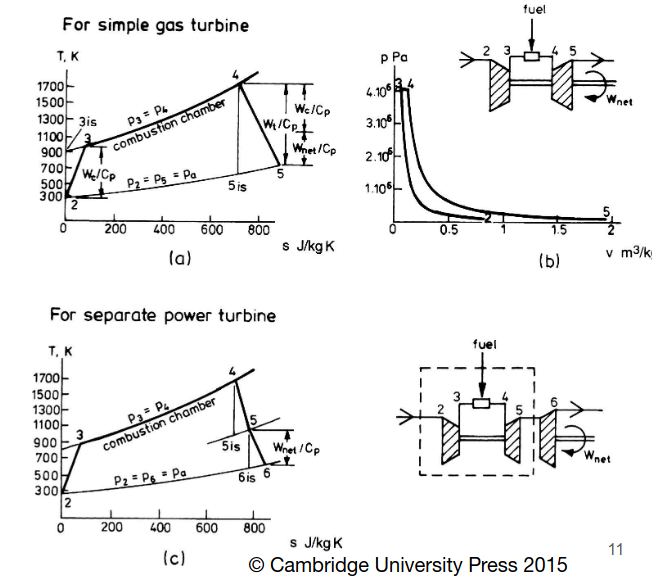
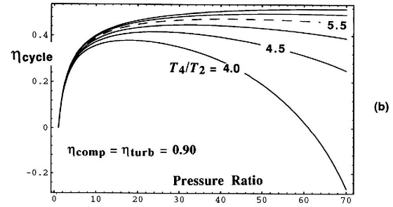

# Gas Turbine Cycle

We can think of a gas turbine as a core with a load.
- If the load is the nozzle we have a turbojet
- If the load is a turbine driving a fan we have a turbofan

The performance measure for gas turbines is thermal efficiency $\eta_{th}$
- Depends on the pressure ratio, ratio of turbine inlet and compressor inlet temperatures, and isentropic efficiencies

Isentropic efficiency used to relate the actual cycle to the ideal.

The Gas Turbine Cycle uses high enthalpy gas to drive the cycle.
- Pressure is raised by the compressor
- Fuel burned in high pressure air
- Hot, high pressure gas drives turbines
  - The turbine driving load may be on the same shaft as the compressor, but it does not have to be
  - 
The load of the cycle can be nearly anything
- Second turbine that produces shaft power
- Produce a jet using a nozzle
- Drive a fan

## Other Engines Compared to the Gas Turbine Cycle

A Bypass Jet Engine or Turbofan engine is "almost equivalent" to a gas turbine core driving a power turbine or used to create a jet. Why "almost"? What's different?
- The "Almost" has to do with the exhaust fan and jet
- Fan pressure rise also affects flow going through the core. For core flow, some pressure rise happens before compressor inlet.
- Jet still produced at low pressure turbine exit. Not all possible enthalpy is extracted to drive the fan.

## Station Numbering

When analyzing jet engines we use stagnation quantities for temperature and pressure.
- Denoted with subscript $0$ in the textbook, which is the same as the subscript $t$ we have used previously.
- Convention: Entry to engine is station 2, exhaust products leave at 5.

Looking at the combustor with a first law of thermodynamics analysis:
- $m_f \textrm{LCV} = m_{air} c_P (T_4 - T_3)$
- LCV is the lower heating value, not sure what "C" stands for though. Kerosene's $LCV=43$ MJ/kg
- $c_{P,air} = 1005$ J/kg/K
- Only a small flow rate of fuel is needed to increase air temperature significantly. This also does not account for bypass flow.
- $\left(\dfrac{m_f}{m_{air}}\right) = \left(0.0000234K^{-1} \right) (T_4 - T_3)$

# Non-Ideal Cycle

The compressor and turbine are assumed to be non-ideal so that entropy rises through these components. It's important to differentiate if there is a separate power turbine as the efficiency of each turbine could be different

## Isentropic Efficiency Equations

For the compressor:
- $\eta_{comp} = \dfrac{\textrm{ideal work}}{\textrm{actual work}}$

- $\eta_{comp} = \dfrac{T_{3is} - T_2}{T_3 - T_2}$

For the turbine:
- $\eta_{turb} = \dfrac{\textrm{actual work}}{\textrm{ideal work}}$

- $\eta_{turb} = \dfrac{T_4-T_5}{T_4-T_{5is}}$

Here, the subscript $is$ refers to the ideal isentropic value.

For both compressors and turbines in this course, unless otherwise specified, we use $90\%$ isentropic efficiency.

## Net Power

$\dfrac{W_{net}}{m_{air}c_P T_2} = \eta_{turb} \dfrac{T_4}{T_2} \left( 1-\dfrac{1}{r^{\left( \frac{\gamma - 1}{\gamma} \right)}} \right) - \dfrac{r^{\left( \frac{\gamma - 1}{\gamma} \right)} - 1}{\eta_{comp}}$
- Note the following below:
- $r =$ pressure ratio $= \dfrac{\textrm{Highest cycle pressure}}{\textrm{Ambient pressure}}$

What can we say about this equation?
- The pressure ratio is critical. Power goes to zero as $r \rightarrow 1$
- $\dfrac{T_4}{T_2}$ is another important parameter. Power scales linearly with this term.
  - It's how engines are controlled: Change the flow fuel rate
  - The ratio is important, not so much the individual values of temperature. When air is cold at high altitudes, the temperature value is not as high as you would expect.

## Thermal Efficiency

The thermal efficiency of the open cycle $=$ closed cycle efficiency. It doesn't matter if the cycle is open or closed. It also doesn't matter what the power produced is used for: driving a turbine, extracted via a shaft, used to create a jet...

In all cases, we get the following equation:
- $\eta_{th} = \dfrac{W_{net}}{m_f \textrm{LCV}}$

The thermal efficiency and work output are functions of the individual component efficiencies
- For example, in an exercise, compressor and turbine efficiency decreased from 90% to 85%, but it decreased work output by 22%. Big difference.
- Increasing component efficiencies increases the pressure ratio where the max thermal efficiency is obtained.

$\dfrac{T_4}{T_2} \approx 6$ in modern engines

The net work rises rapidly at a low pressure ratio, but there's a maximum for a given temperature ratio.
- Important to have $\dfrac{T_4}{T_2}$ as high as possible
- The pressure ratio for peak efficiency increases at higher temperature ratios
- For a high temperature ratio $>4.5$ and pressure ratio $>20$, efficiency curves are fairly flat. See below.

## Pressure Ratio

The max power occurs at lower pressure ratio than max efficiency. This leads to high pressure ratios in commercial jet engines, since we want to maximize efficiency, rather than power.

At low pressure ratio, efficiency rises so quickly that more input heat is converted to work. As the pressure ratio rises, the amount of fuel input decreases for a fixed turbine inlet temperature. At high pressure ratio, heat input decreases faster than efficiency increases. When these two effects balance, we get peak power.

If we design for a slighly lower pressure ratio than peak power, which is the maximum efficiency point, we get a slight efficiency reduction due to low sensitivity. 
- It's much easier to design high efficiency compressors at lower pressure ratios, likely a worthwhile tradeoff.
- If this is designed for cruise, we can also increase the pressure ratio for climb without large efficiency decreases.