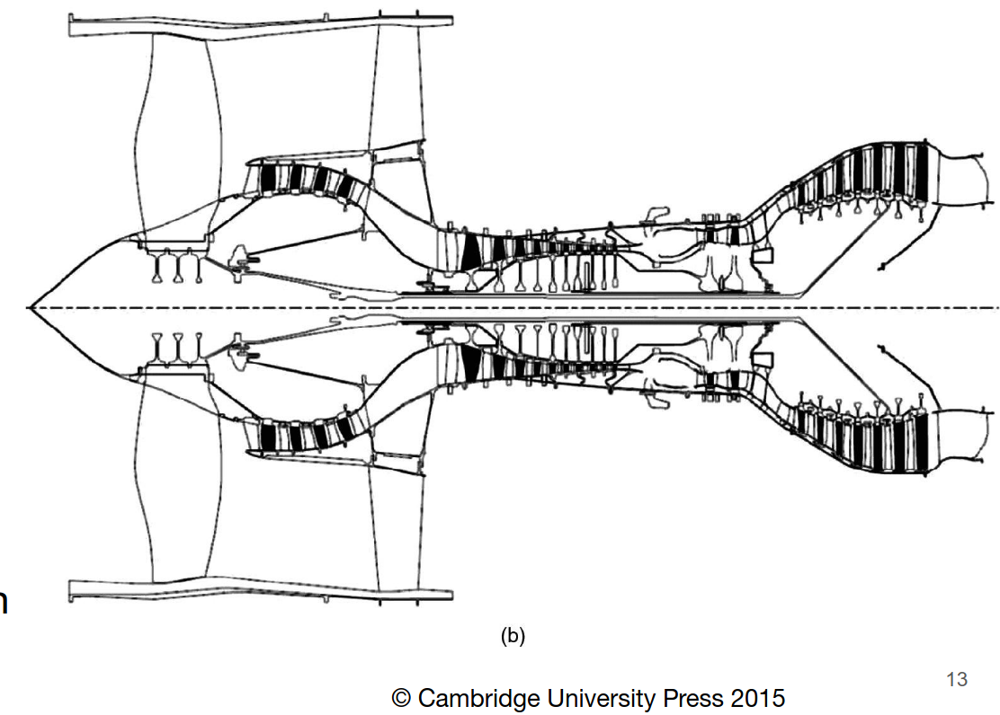
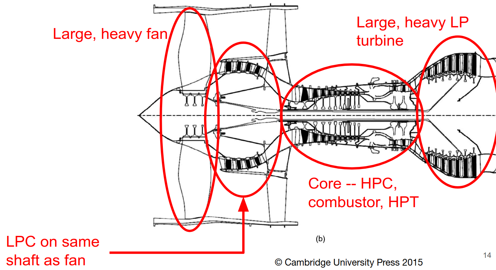
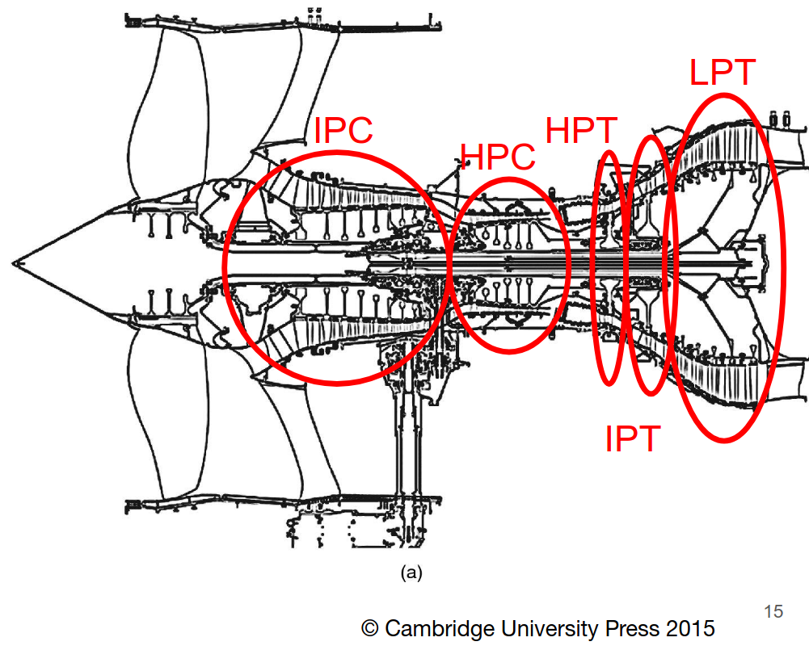
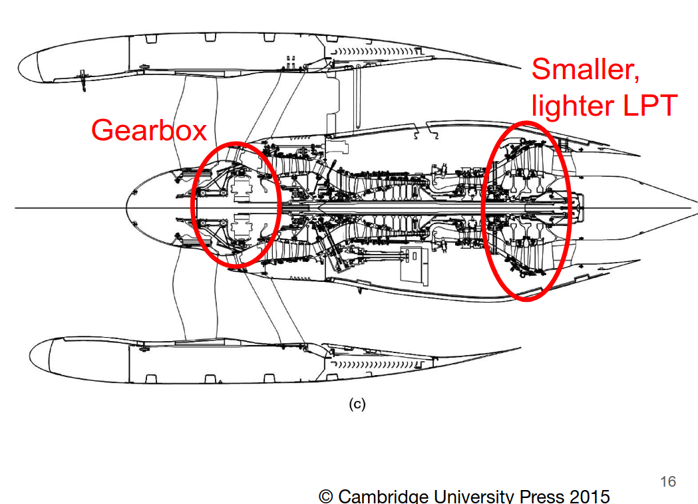
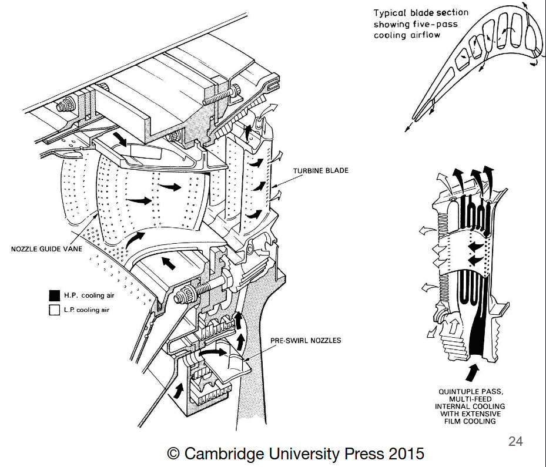

# Key Messages

- Bypass flow enables the efficient use of high temperature and pressure generated by the engine core
- Fan and low-pressure compressor/booster driven by low-pressure turbine
- High-pressure compressor driven by high pressure turbine
- Turbine inlet gas temperatures are normally above the blade melting temperature. This requires cooling using "cool" air bled from the compressor outlet.

# Turbojets

The simplest jet engine is a Single-Shaft Turbojet

More advanced turbojets have two spools (a spool is a shaft).
- Low pressure (LP) and high pressure (HP) shafts.
- Having two spools enhances off-design operational abilities.

Why is off-design capabilities enhanced by having two spools?
- Turbojets have poor matching and engines sized for take-off will have significant excess thrust capacity when cruising.
- Cruising, which runs at part-throttle, has a significant efficiency decrease
- This cruising efficiency is greatly improved by using two spools. The engine core can operate near design while the low pressure (LP) spool operates off-design
- When the engine is starting up, the shaft speeds are initially very low. This is easier to do with two shafts.

The bypass ratio enhances propulsive efficiency for subsonic flight.

Early turbofans had some of the low pressure compressor act on flow that didn't enter the core
- Bypass ratio < 1.5
- Still yields reduced jet velocity.

Why such a low bypass ratio?
- Higher bypass ratio = higher diameter $\rightarrow$ heavier, larger engines
- Jet velocity related to max possible flight speed (zero thrust generated when flight speed = jet velocity)
- May accept cruising inefficiently to have capability to go much faster in short bursts for military aircraft.

# Turbofans

## High Bypass Ratio Engines

Look at the picture above. It has a low pressure turbine powering both the low pressure compressor and fan. It has a high pressure turbine powering the high pressure compressor.

## Three Spool Engine

Now look at the picture above. This is a three spool engine, with a low, intermediate, and high pressure shaft (LP, IP, HP respectively).
- LPT only drives the fan

## Geared Turbofan Engine

In the picture above, there is only a low pressure turbine, and no other turbine. There is a gearbox between the LPT and the fan. This allows the LPT to be smaller (and thus lighter).

Downsides??
- Cooling: Gearbox generates heat through friction (heat) & other losses.
  - If mechanical efficiency was $99.5\%$, you would still need $66kW$ of cooling PER ENGINE
  - Even more cooling needed at takeoff

# New Efficient Aircraft

Back to the aircraft we were building towards in previous lectures...

We focus on two-spool engines.
- Fan + booster pressure ratio $\approx 2.5$
- HPC pressure ratio $\approx 18$
- This gives an overall pressure ratio of 45.

The highest possible $T_4$ is desirable.
- This is the turbine inlet temperature!

Why is this desirable?
- It reduces the core turbine pressure ratio relative to that of the core compressor.
- Basically, increases the power available for the LP Turbine.

The temperature ratio varies little across our flight conditions. Since the ambient temperature and thrust required vary, it turns out that core turbine inlet to ambient stagnation temperature ratio is nearly constant.
- $\left (\dfrac{\textrm{turbine inlet temperature}}{\textrm{ambient temperature}}\right)_{\textrm{stagnation temp.}} \approx \textrm{constant}$
- Recall, a stagnation quantity is one that is measured at a stagnation point. That means that at that point where the quantities are measured, fluid velocity is zero.

For our NEA:
- Take off = 6.07
- Top-of-climb = 6.52
- Start of cruise = 6.11

# High Temperature Operation & Cooling

Two things are required for high temperature opreation:
- Material improvements
- Improved use of cooling air from the compressor

There has been an average temperature increase of $7K$ per year, since 1940.

The turbine is cooled internally and externally
- Internal passages keep the metal cool from inside. Cool is relative, the "cool" air might be $900K$ but is still much "cooler" than the hot metal.
- Internal flow emerges from cooling holes, this is called film cooling.

But why do we use this $900K$ air to cool the turbine? Why not ambient air?
- Stagnation pressure of coolant supply must be higher than that of the turbine, otherwise we would have no flow.

About $20\%$ of compressor mass flow is used for cooling. This percentage increases as turbine inlet temperature increases

Some considerations with how much cooling to use:
- Turbine life
- Engine performance
- Turbine inlet temperature vs cooling air supply

## Film Cooling Effectiveness

The performance metric here is the film cooling effectiveness
- $\varepsilon = \dfrac{T_g - T_m}{T_g - T_c}$
  - $T_g \rightarrow$ gas temperature
  - $T_m \rightarrow$ metal temperature
  - $T_c \rightarrow$ cooling air temperature
- The current state of the art $\varepsilon = 0.65$

The turbine blade material set the allowable pressure ratio.
- Normally supply air from compressor outlet
- Allowable temperatures of the metal limit the supply temperature
- This temperature restriction affects the compressor pressure ratio.