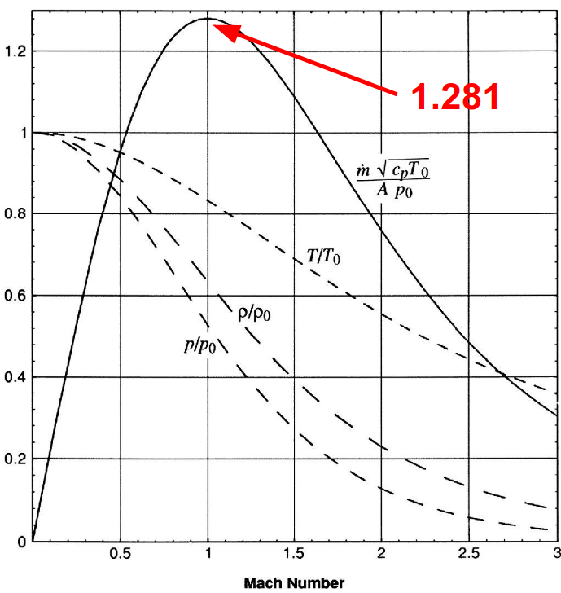

# Review of Compressible Flow

- We focus on quasi 1-D internal flow
- Have already seen most of this for rocket propulsion
- Most flow in jet engines have $0.3 \le \textrm{Mach} \le 1.0$

Therefore, we treat this flow as compressible flow. No way around that.
- Focus on behavior of choked flows

## Key Messages
- Compressible flow through a duct or nozzle has a max flow rate per unit area, when $Mach = 1$ at the throat.
- To accelerate past $M>1$, we need a converging-diverging area variation.
- Non-dimensional mass flow per unit area is a function of the Mach number
- In choked flow, like in nozzles and turbine passages, **the flow rate is independent of conditions downstream of the throat**
  - **NOTE:** Important. This means that ANYTHING downstream of the throat does NOT affect the throat, or anything before it!!
- Thrust variation with sped is stronger for low pressure ratio fans

 # Thermodynamic Analysis

We use stagnation quantities for most things. However, in some cases we care about the static pressure/temperatures. Why? Specifically, why speed of sound vs work exchange?
- The speed of sound is based on the static temperature. The wave propagation speed is not frame dependent so we cannot use stagnation temps.
- Work exchange is based on stagnation temperatures so that we can ignore/neglect all kinetic energy changes.

 ## Steady Flow Energy Equation for Gases

 Assumptions:
 - Adiabatic: No external work transfer
 - Perfect gas (ideal gas, but the specific heats do NOT change with temperature)
 - Constant stagnation temperature

Resulting equation:
- $c_p T + \dfrac{V^2}{2} = c_p T_0$
- $\dfrac{T_0}{T} = 1 + \dfrac{\gamma - 1}{2} M^2$

We then assume isentropic flow, giving us a pressure relation.
- $\left(\dfrac{P}{T}\right)^{\dfrac{\gamma}{\gamma - 1}}$

In terms of the mach number:
- $\dfrac{P_0}{P} = \left(1 + \dfrac{\gamma - 1}{2} M^2 \right)^{\dfrac{\gamma}{\gamma - 1}}$

The cruise mach number of our NEA is 0.78.
- $\dfrac{P_0}{P} = \left(1 + \dfrac{\gamma - 1}{2} M^2 \right)^{\dfrac{\gamma}{\gamma - 1}} = \left(\dfrac{T_0}{T}\right)^{\frac{\gamma}{\gamma - 1}}$

This gives the engine inlet conditions compared to ambient (static) conditions:
- $\dfrac{T_{02}}{T_a} = 1.122$
- $\dfrac{P_{02}}{P_a} = 1.495$
- Key point: The nozzle exit flow depends on $P_a$

Let's look at the effect of speed:
- Inflow parameters are stagnation quantities, and so they increase with Mach number.
- Engine nozzle outflow parameters are static quantities.
- Therefore the ratio of the two is increased with forward flight speed.

The flow in the nozzles can be considered isentropic. Therefore the inlet stagnation pressure and temperature, and exit static pressure, specify the flow conditions.

## Exit Temperature

The exit temperature can be found by:
- $T = T_0 \left(\dfrac{P_a}{P_0}\right)^\frac{\gamma - 1}{\gamma}$

## Nozzle Exit Velocity

Then we can get the nozzle exit velocity:
- $V = \sqrt{2  c_p  T_0  \left( 1 - \left( \dfrac{P_a}{P_0}\right)^\frac{\gamma-1}{\gamma}\right)}$

## Choke

- For given inlet stagnation conditions and gas properties, there is a maximum amount of mass flow that can fit through a certain area. 
- When the limit is reached, the flow is **choked**. 
- The choke always occurs at $\textrm{Mach} = 1.0$. 
- We call the minimum area the **throat**

What is the stagnation to static pressure ratio at choke for air with $\gamma = 1.4$?
- 1.893
- If static pressure fails to increase this ratio further, no increase in the mass flow per unit area occurs.
- For pressure ratios larger than 1.893, the flow accelerates downstream of the throat.
- Density $\downarrow \downarrow$ faster than Velocity $\uparrow$, therefore area must increase, $A \uparrow$.

Thus, the converging-diverging nozzle design is used.

In modern high-bypass-ratio engines, the bypass nozzle is choked at cruise but NOT at takeoff. The core nozzle is always unchoked.

We define the non-dimensional mass flow per unit area, also known as the corrected flow per unit area, as:
- $\bar{m} = \dfrac{m \sqrt{c_p T_0}}{AP_0}$

- $\bar{m} = \dfrac{m \sqrt{c_p T_0}}{AP_0} = M \dfrac{\gamma}{\sqrt{\gamma-1}}\left(1 + \dfrac{\gamma - 1}{2}M^2\right)^{-\dfrac{\gamma + 1}{2 (\gamma - 1)}}$

In terms of pressure ratio, this non-dmimensional flow can be expressed as:
- $\bar{m} = \dfrac{\gamma}{\gamma - 1}\sqrt{2\left[\left(\dfrac{P}{P_{0, in}}\right)^\dfrac{2}{\gamma} - \left(\dfrac{P}{P_{0, in}}\right)^\dfrac{\gamma+1}{\gamma}\right]}$

For an aircraft flying at $M=0.78$, what is the minimum fan pressure ratio at which the bypass nozzle will just be choked?
- Limiting pressure ratio is 1.893, found earlier as the stagnation to static pressure ratio to choke for air.
- We find the pressure ratio due to the flight speed
  - $\dfrac{P_0}{P} = \left(1 + \dfrac{1.4-1}{2} 0.78^2 \right)^{3.5} = 1.495$
- Then we compare:
  - $\dfrac{1.893}{1.495} = 1.267$
- Therefore $1.267$ is the maximum fan stagnation pressure ratio for unchoked flow in the nozzle.