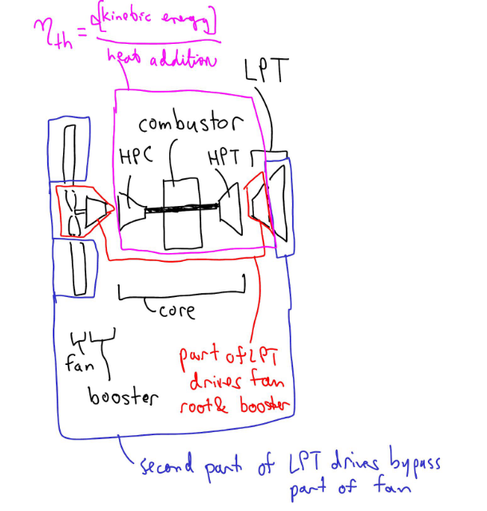
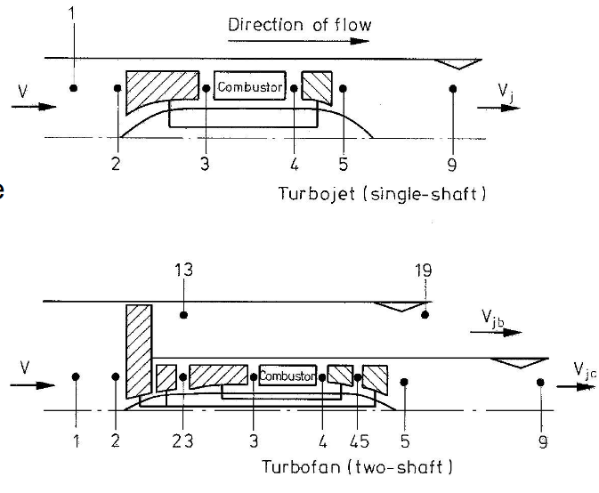
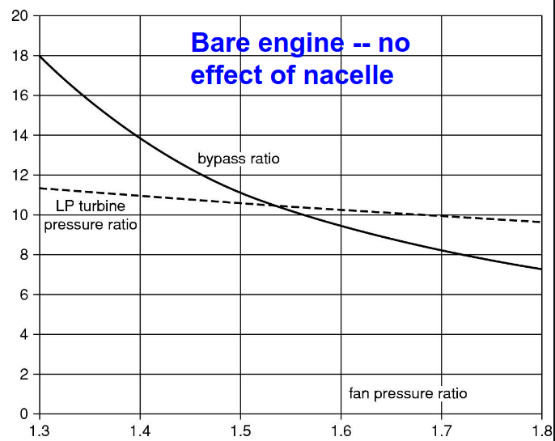
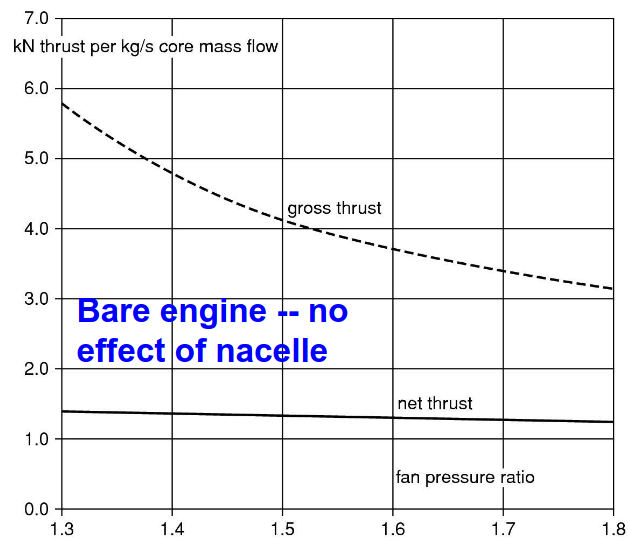
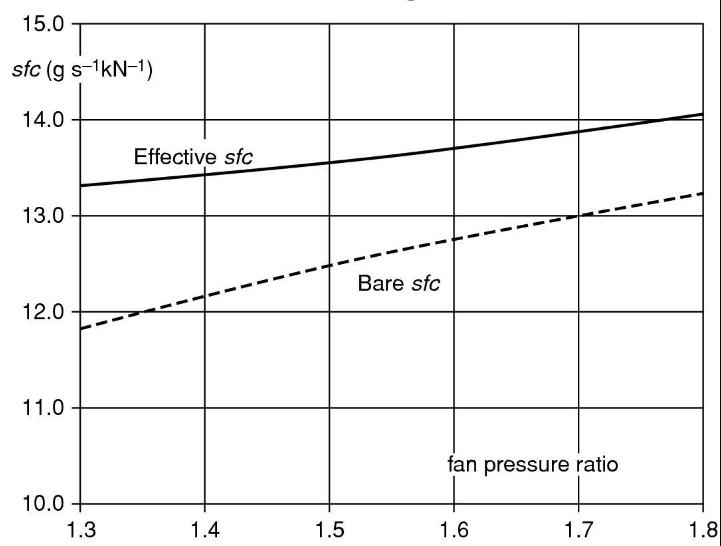
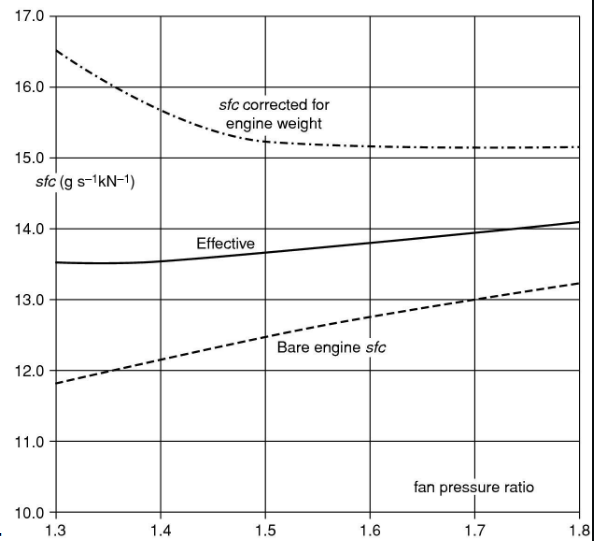
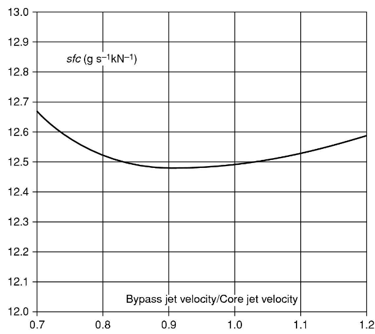

# Turbofan Efficiency

The overall efficiency is:
- $\eta_0 = \eta_p \times \eta_{th}$

Use a high overall pressure ratio and high turbine inlet temperature to get good thermal efficiency. We laos need a low jet velocity to get a high propulsive efficiency. This creates the turbofan.

A turbofan also has transmission efficiency factored in:
- $\eta_0 = eta_p \times \eta_{th} \times \eta_{tr}$

We can redefine ther thermal efficiency as the kinetic energy that would be produced if the core flow expanded to ambient pressure BEFORE work extracted to drive bypass part of fan, divided by heat input from combustion.
- $\eta_{th} = \dfrac{\textrm{Kinetic energy that would be produced}}{\textrm{heat input from combustion}}$

This creates a hypothetical point within the low pressure turbine (LPT) when sufficient work could have been extracted, to power the fan root and booster but NOT the bypass stream

Downstream of the hypothetical point within the LPT, there are losses with the flow in the LPT and the flow in the fan bypass streams (Transfer efficiency)
- Increase in propulsive efficiency more than offsets these losses.

Jet velocities are KEY to engine design.
- Selecting fan pressure ratio effectively gives us the bypass jet velocity
- When choosing core jet velocity, we select how much core power is extracted in the low pressure turbine (LPT), vs how much is left to generate the core jet.

The core and bypass jet velocities are always similar
- Reduces noise
- Increases propulsive efficiency

Modern regular engines have bypass ratios around 10, while geared turbofans have a bypass ratio around 12.

The fan pressure ratio is a beter measure of the engine "type".
- Specific thrust is another possibility:
- $\textrm{Specific Thrust} = \dfrac{F_N}{m_{air}} = V_j - V$

# Engine Station Numbering

The figure above shows the differences in numbering between Turbojets and Turbofans.

Looking at the turbofan specifically above:
- the J in $V_{jb}$ and $V_{jc}$ is "Jet"
- the B in $V_{jb}$ is "Bypass"
- the C in $V_{jc}$ is "Core"

So $V_{jb}$ is the Bypass Jet Velocity, and $V_{jc}$ is the Core Jet Velocity.

# T-S Diagram

When looking at these graphs:
- Remember, the core jet and bypass jet velocities are equal.
- $M = 0.85$ and it's taken at 31,000 ft altitude
- Fan Pressure Ratio (FPR) $= 1.8$, core pressure ratio $= 32$
- Turbine Inlet Temperature $= 1407K$
- Component Efficiencies $= 90\%$

# New Efficient Aircraft (NEA)

Tying back to the NEA, we previously specified that the core outlet conditions (Station 45) for cruise was $M = 0.78$ @ 35,000 ft.

Our next task:
- Find the pressure ratio for the low-pressure turbine (LPT) that ensures the core jet velocity maintains the desired ratio compared to the bypass jet velocity.
- This determines the power drawn from the LPT and thus power available to the fan.

## Fan Pressure Ratio - Initial Guess

The bypass nozzle pressure ratio is higher here, due to forward flight speed.
- $\dfrac{P_{013}}{P_a} = \dfrac{P_{013}}{P_{02}} \dfrac{P_{02}}{P_a}$

 

- $\dfrac{P_{02}}{P_a} = \left(\dfrac{T_{02}}{T_a}\right)^\frac{\gamma}{\gamma-1}$

 

- $\dfrac{T_{02}}{T_a} = 1 + \dfrac{\gamma - 1}{2} M^2$

## Nozzle Inlet Stagnation Temperature Ratio

We assume isentropic flow in the nozzle. This gives a nozzle inlet stagnation tmeperature ratio of:
- $\dfrac{T_{013}}{T_{02}} = 1 + \dfrac{(\textrm{Fan Pressure Ratio})^\frac{\gamma-1}{\gamma}-1}{\eta_f}$
  - The $\gamma$ fraction is an exponent here!

## Bypass Jet Velocity Vjb

And a bypass jet velocity $V_{jb}$ of:
- $V_{jb} = \sqrt{2 c_p (T_{013}) - T_9}$
- $V_{jb} = \sqrt{2 c_p (T_{013}) \left(1 - \left(\dfrac{P_a}{P_{013}}\right)^\frac{\gamma - 1}{\gamma}\right)}$

## Core Jet Velocity Vjc

And a core jet velocity $V_{jc}$ of:
- $V_{jc} = \sqrt{2 c_p (T_{05}) \left( 1 - \left( \dfrac{P_9}{P_{05}} \right)^\frac{\gamma - 1}{\gamma}\right)}$

## Why is Vjc = Vjb??

We choose the core jet velocity by varying the low pressure turbine (LPT) pressure ratio.
- The jet velocity magnitudes are always similar.
- Maximum propulsive efficiency occurs if the jet velocities are equal: 
- $V_{jc} = V_{jb}$

But why does having $V_{jc} = V_{jb}$ maximize propulsive efficiency??
- Minimizes losses due to the mixing of the two jets. Mixing losses $=0$ when the velocities are equal.
- If one jet is faster than the other, there is some entropy generated in the mixing of the two streams. This increases the propulsive power required to overcome these new losses.

## Bypass Ratio

Consider the power balance:
- $m_c c_p (T_{045} - T_{05}) = m_c c_p (T_{023} - T_{02}) + (\textrm{BPR}) m_c c_p (T_{013} - T_{02})$
  - $BPR$ is Bypass Pressure Ratio.
- $T_{05}$ is set by the low pressure turbine (LPT) pressure ratio, and isentropic efficiency.
- The only unknown here is the bypass ratio.

## Iterative Solution

An iterative solution is required here:
1. Select the core outlet conditions (T_{045} and P_{045})
   - These remain fixed.
2. Choose the fan pressure ratio
   - This determines the bypass jet velocity
3. Choose the ratio of Core Jet Velocity to Bypass Jet Velocity
   - Here we set it to 1.
4. Guess the value for the low pressure turbine pressure ratio $\dfrac{P_{045}}{P_{05}}$
5. Compute $T_{05}$ and $\dfrac{P_{05}}{P_a}$
6. Compute the core jet velocity and compare it to the bypass jet velocity. - 
   - If the core jet velocity is too fast (or too slow), increase (or decrease) $\dfrac{P_{045}}{P_{05}}$ and return to step 5.
7. Compute bypass ratio using the equation above.
8. Compute the gross thrust and net thrust per unit mass flow through the core.

## Fan Pressure Ratio

### LPT Pressure Ratio

The fan pressure ratio sets the Bypass Pressure Ratio and the Low Pressure Turbine (LPT) Pressure Ratio.

The results for our New Efficient Aircraft core at cruise flight conditions:
- Overall pressure ratio = 45
- Turbine inlet temperature = 1500 K
- M = 0.78 @ 35,000 ft
- We set the core and bypass jet velocites equal.

   

### Thrust per Unit Core Flow

The fan pressure ratio also sets the Thrust per Unit Core Flow

The gross thrust varies much more than net thrust, because the bypass ratio changes with the fan pressure ratio.
- Net thrust is a relevant quantity at cruise.
- Gross thrust approximates the take-off conditions.

   

### Specific Fuel Consumption, SFC

The fan pressure ratio also affects the specific fuel consumption, SFC

- The mass flow rate of fuel is the same for all fan pressure ratios.
- The net thrust variation thus yields variation in the specific fuel consumption
- Specific thrust $V_j - V$ also varies strongly with fan pressure ratio.
  - Alters the overall engine size requirement for a given thrust.

## Nacelle

The previous graphs for the fan pressure ratio neglected the nacelle. This is called a "Bare Engine".
- No drag is considered in a Bare Engine
- This drag acts on the Nacelle.

When an engine and nacelle are used together, it is referred to as a "Powerplant"

The nacelle drag must be accounted for to select optimum fan pressure ratio.
- The mass flow increases as the fan pressure ratio decreases, for the same thrust.
- This makes the engine larger and heavier.

### Simplified Model of a Nacelle

The drag is proportional to the wetted area. So, for fixed style and Mach Number:
- $D_{nac} \propto A_w \rho V^2$
- $A_w \propto \dfrac{\pi d^2}{4} = \dfrac{m}{\rho V}$
- $m = \dfrac{F_N}{X}$
- $X = V_j - V$

The result is:
- $D_{nac} = kV \left(\dfrac{F_N}{X}\right)$

Where:
- $D_{nac}$ is the drag acting on the nacelle
- $k$ is an empirical constant, a function of the fan and nacelle design.
- $F_N$ is net thrust

### Net Effective Thrust

Deducting the Nacelle drag yields the net effective thrust:
- $F_{N, Effective} = F_{N, Bare} \left(1 - \dfrac{kV}{X}\right)$

The constant $k$ is determined from experiments, or CFD simulations.
- Here, we use 0.04 as a plausible estimate

The reduction in thrust from this drag means the mass flow must increase.
- Therefore, the engine must be larger.

### Specific Fuel Consumption

The effective specific fuel consumption is highly senstiive to the empirical values assumed.

We still have no optimum fan pressu re ratio.
- Instead we need to consider the weight of the powerplant (nacelle + engine) first.

### Engine Weight

The engine weight effects lead to an optimum fan pressure ratio.
- Lowest engine fuel consumption is NOT the design aim of an engine.
- The aim is to make the AIRCRAFT fuel consumption low.
- This makes engine weight very important. Increased weight means more lift required, and thus more drag, so higher aircraft fuel consumption.
- The engine weight may be about 10% of the maximum takeoff weight, with the bare engine being half that.

The fan area can be assumed proportional to the mass flow rate.

Approximation:
- $W_{engine} \propto d^{2.4}$

A simple way of accounting for the engine weight:
- Subtract all the drag that comes from the engine weight, from the effective net thrust.

A larger engine doesn't only just add engine weight.
- Extra fuel capacity is required, increasing aircraft weight
- Extra structural weight to support the heavier aircraft and engine, increasing aircraft weight
- This extra weight increases the engine size, further increasing aircraft weight.

## Corrected Net Thrust

The corrected net thrust accounts for the engine weight.
- $F_{N, corrected} = F_{N, effective} - \dfrac{W_{engine}}{\dfrac{L}{D}}$

To use the scaling approximation above, we need a reference point.
- Take the powerplant (engine + nacelle) to be 12 tonne for 3m diameter fan.

## Corrected Specific Fuel Consumption

An optimum emerges at a fan pressure ratio (FPR) of about 1.6

A low pressure ratio means:
- Engine may be too large for installation or transport
- Low noise

In practice, this calculation isn't sufficient to choose the fan pressure ratio. Instead, select 1.5

## Jet Velocities

Previously we assumed $\dfrac{\textrm{Bypass Jet Velocity}}{\textrm{Core Jet Velocity}} = 1$

From this graph, we can now see there is an optimum value of the specific fuel consumption (SFC).
- Occurs at $\dfrac{\textrm{Bypass Jet Velocity}}{\textrm{Core Jet Velocity}} = 0.92$
- However, the difference between 1.0 and 0.92 is very small.

 

### Jet Velocities Not Equal

But why does a value $\dfrac{\textrm{Bypass Jet Velocity}}{\textrm{Core Jet Velocity}} < 1$ maximize the specific fuel consumption?
- If the flow were incompressible and had equal velocity, they would have equal momentum.
- The core flow is at a higher temperature, and thus has a lower density.

 

We don't want to have equal velocity in the core and bypass jet streams, we actually want equal MOMENTUM. Ensuring both streams have equal MOMENTUM minimizes mixing losses.
- As a result of the density difference, momentum is not the same if velocity is the same.
- Because the bypass has a lower density, its velocity should be higher.
- Therefore $\textrm{Bypass Jet Velocity} < \textrm{Core Jet Velocity}$