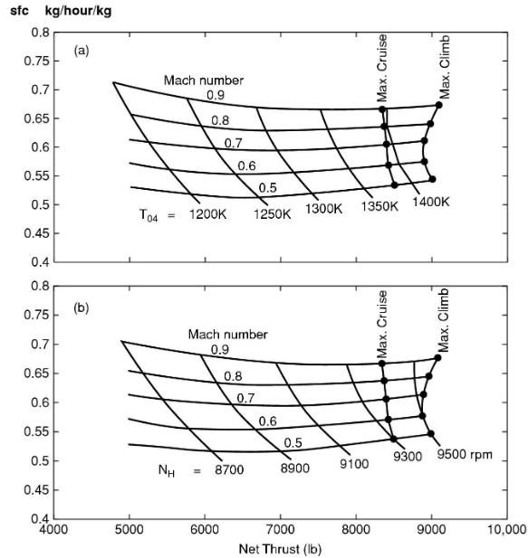
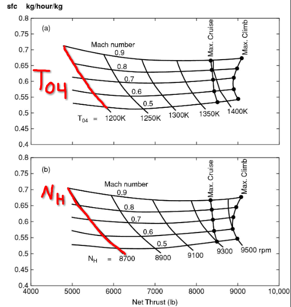

# Engine Scaling

Assume a Mixed Flow Nozzle, or a Bypass Ratio $\ge 10$
- The engine is essentialy controlled through the mass flow rate of fuel.
- Any variable in the engine can be expressed as a function of:
  - $m_f$, mass flow rate of fuel
  - $P_a$, ambient pressure
  - $T_a$, ambient temperature
  - $V$, flight speed.

The engine performance (except for unchoked nozzle performance) depends on stagnation quantities at the engine inlet, plus fuel mass flow.
- Stagnation pressure and temperature combines the atmospheric pressure and temperature with the flight speed: $P_{02}, T_{02}$
- $T_{02} = T_a + \dfrac{V^2}{2c_p}$
- $M = \dfrac{V}{\sqrt{\gamma R T_a}}$
- $P_{02} = P_a(1 + 0.5(\gamma - 1)M^2)^\frac{\gamma - 1}{\gamma}$

# Unchocked Nozzles

If the nozzle is unchoked, we need to separately consider $P_a$. We need two of the following:
- Atmospheric static pressure
- Inlet stagnation pressure
- Flight speed or Mach number

Then we can use the four main parameters mentioned earlier.

A high bypass engine nozzle is not always choked. For example, with a fan pressure ratio of 1.5, it's not always choked.
- Bypass nozzle: Choked at cruise but not for static conditions or take-off (M $\approx$ 0.25)
- Core nozzle: always unchoked.

Why is the core nozzle always unchoked?
- Even after passing through the low pressure turbine, the core stream is much hotter than the bypass stream
- Assume static pressure at core and bypass nozzle exits are equal
- If the stagnation pressure at the core nozzle inlet matches that at the bypass nozzle inlet, the exit Mach numbers of the nozzles will be equal. 
- Therefore, a lower pressure ratio is necessary for the core nozzle to achieve approximately equal velocities.

# Non Dimensional Groups
Non-dimensional parameters are used extensively in this lecture.

Relating the fuel flow rate effect to the flight mach number effect:
- $\dfrac{m \sqrt{c_p T_{02}}}{D^2 P_{02}} = F\left(\dfrac{T_{04}}{T_{02}}, \dfrac{P_a}{P_{02}}\right)$

This can also be written, explicitly including the fuel flow rate:
- $\dfrac{m \sqrt{c_p T_{02}}}{D^2 P_{02}} = F\left(\dfrac{m_f \textrm{LCV}}{\sqrt{c_p T_{02}} D^2 P_{02}}, \dfrac{P_a}{P_{02}}\right)$

Looking at the $\dfrac{m_f \textrm{LCV}}{\sqrt{c_p T_{02}} D^2 P_{02}}$ term, which is Power:
- It relates the energy flux from fuel burn, to the energy flux associated with a velocity. This is multiplied by area and pressure. This gives a velocity times force, which is power.

Some other dimensional parameters:

Non-Dimensional Rotational Speed
- $\dfrac{ND}{\sqrt{\gamma RT_{02}}}$

Non-Dimensional Gross Thrust for a choked nozzle
- $\dfrac{m_{air} V_{19} + P_{19} A_N}{D^2 P_{02}}$

## Gross Thrust

- The bypass nozzle is choked at cruise
- The thrust from the bypass $\approx 10\times$ more than from the core
- Approximate treatment of whole engine as having choked nozzle flow is reasonable.
- Assume mixed, choked flow for analysis

The gross thrust cannot be separated from the ambient pressure.
- The nozzle is choked, so there is no dependence on the mach number
- $V_j \not = V_{19}$. $V_j$ is most likely supersonic, since the flow will accelerate past the nozzle exit (throat) in most cases.
  - $F_G \approx m_{air} V_J = m_{air} V_{19} + (P_{19} - P_a) A_N$
- We rearrange, and bring all terms that depend on the conditions INSIDE the engine, to the right side.
  - $F_G + P_a A_N = m_{air} V_{19} + P_{19} A_N$

Non-Dimensionalize:
- Right Side:
  - $\dfrac{F_G + P_a A_N}{D^2 P_{02}}$
- Left Side:
  - $\dfrac{m_{air} V_{19} + P_{19} A_N}{D^2 P_{02}}$

$\textrm{Gross Thrust + Ambient Pressure} \times \textrm{Nozzle Area}$ is a relevant parameter.

## Net Thrust

- $\dfrac{F_G + P_a A_N}{D^2 P_{02}} = F\left(\dfrac{T_{04}}{T_{02}}, \dfrac{P_a}{P_{02}}\right)$
- $F_N = F_G - m_{air} V$

 

How would this non-dimensional parameter change if the nozzle was unchoked?
- $\dfrac{F_G + P_a A_N}{D^2 P_{02}} = F\left(\dfrac{T_{04}}{T_{02}}, \dfrac{P_a}{P_{02}}\right)$

If it's unchoked that means the nozzle exit pressure is equal to the ambient pressure.
- $m_{air} V_{19} = F_G$

And the parameter simplifies to:
- $\dfrac{F_G}{D^2 P_{02}}$

## Actual Engine Data

We can see that the turbine inlet temperature, and the high pressure shaft rotational speed, are substitutes for each other.
- This means that looking at these two parameters, each parameters' lines of constant values are parallel.

## Flow Parameters

Air Mass Flow Group
- $\dfrac{m_{air}\sqrt{T_{02}}}{P_{02}}$
- Corrected Mass Flow: $\dfrac{m_{air} \sqrt{\theta}}{\delta}$

Fuel Mass Flow Group
- $\dfrac{m_f}{P_{02}\sqrt{T_{02}}}$

Corrected Speed:
- $\dfrac{N}{\sqrt{T_{02}}}$ or $\dfrac{N}{\sqrt{\theta}}$

## Pressure and Temperature Parameters

From before:
- $\dfrac{m_{air} \sqrt{\theta}}{\delta}$
- $\dfrac{N}{\sqrt{\theta}}$

What is theta?
- $\theta = \dfrac{T_{02}}{T_{02, \textrm{ref}}}$
- $T_{02, \textrm{ref}} = 288K$

What is delta?
- $\delta = \dfrac{P_{02}}{P_{02, \textrm{ref}}}$
- $\P_{02, \textrm{ref}} = 101,325 Pa$

## Performance Scaling

Commercial aircraft must be able to fly safely if one engine fails.

A further detail: They must be able to fly safely if one engine fails, while also not altering thr throttles. With two engines in operation, the take-off distance is much shorter and climb rate is higher.

This also applies during cruise when the bypass nozzle is choked.

The thrust from the core and bypass jets are strong affected by $P_{02}$.
- $P_{02}$ is affected by $P_a$ (altitude) and flight mach number.
- We can trade these. Lower altitude means higher pressure. Keeping $P_{02}$ constant requires a reduced mach number.

Requirements if an engine is lost:
 - Must still have sufficient range to get to an airport for landing
 - Must be able to fly high enough to get over any mountains between current position and closest airport

## New Efficient Aircraft

Tying back to our NEA:
- We have two engines
- If one is lost, the other must produced double the thrust
- We can't raise the turbine inlet temperature to double the thrust, it could destroy the engine
- An approximate analysis can be conducted by assuming that the functioning engine is maintained at the same non-dimensional condition as it was before the loss of the other engine.

How do we do this?
- Fly lower and slower with one engine than we would with two.
- Small increase in turbine engine temperature, because when flying lower the atmospheric temperature is higher.
- Higher air density allows the aircraft to fly slower and still produce sufficient thrust
- Engine increases the net thrust, due to higher air density and lower forward speed.

Looking at the picture above:
- We want to fly at a coefficient of lift $C_L$ that maximizes $V\dfrac{L}{D}$
- For this to be true, look at the blue arrow. It points to a line where $P_a M^2$ is constant
- Assume crusing at 35,000 ft when thrust lost from one engine
- We consider only the bypass thrust of the NEA engine (bypass thrust is over 90% of the thrust)

Some takeways from this graph, for a twin-engine aircraft:
- $P_a M^2 = \textrm{CONSTANT}$
- We need double the design thrust
- Aircraft must ascend to about 19,000 ft with only one operating engine
  - Not high enough for many mountain ranges. Mt Everest is 29,029 ft, for example.
  - Twin-Engine aircraft must factor this into their route planning.
- Flight speed reduced (from 231 m/s at 35,000 ft) to 173 m/s at 19,000 ft.

 

We assume the non-dimensional condition is constant.

The bypass nozzle is choked, so we have only one independent parameter:
- $\dfrac{T_{04}}{T_{02}}$
- This is kept constant.

So our output parameters below are kept constnat.
- $\dfrac{F_G + P_a A_N}{D^2 P_{02}}$
- $\dfrac{m_{air}\sqrt{T_{02}}}{P_{02}}$

Looking at the range of the aircraft, between 35,000ft and 19,000 ft:
- $\dfrac{m_{f, 19}}{m_{f, 35}} = \dfrac{P_{0219}}{P_{0235}}\sqrt{\dfrac{T_{0219}}{T_{0235}}}$
- When flying at a lower altitude, our fuel flow is increased, but thrust is increased more. This causes the specific fuel consumption to drop.
- However, the decrease in velocity is greater than the decrease in specific fuel consumption, so overall the range is reduced.