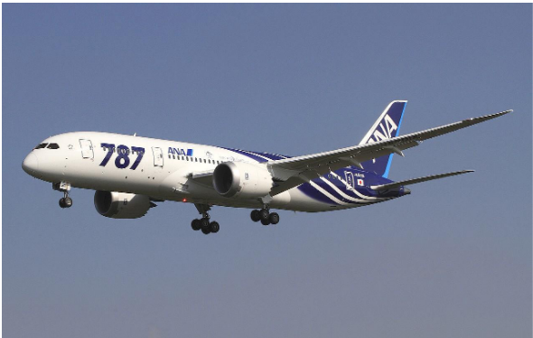
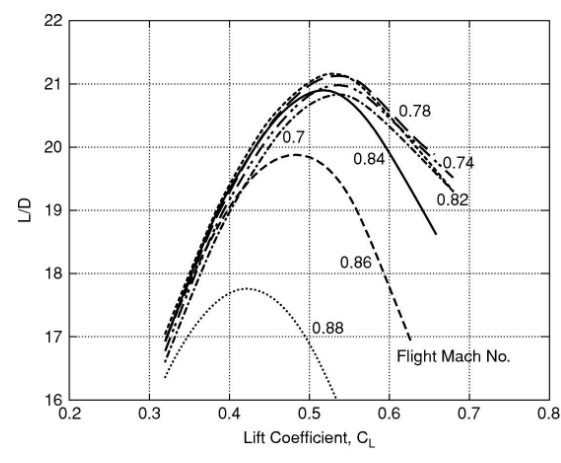
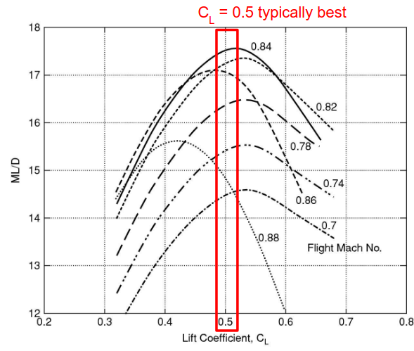
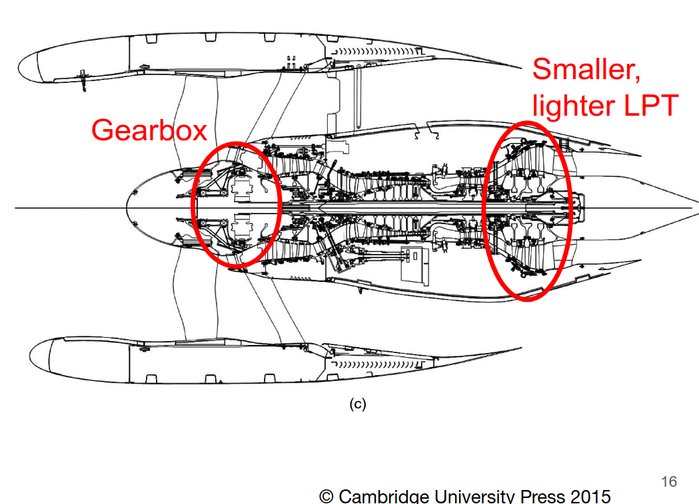
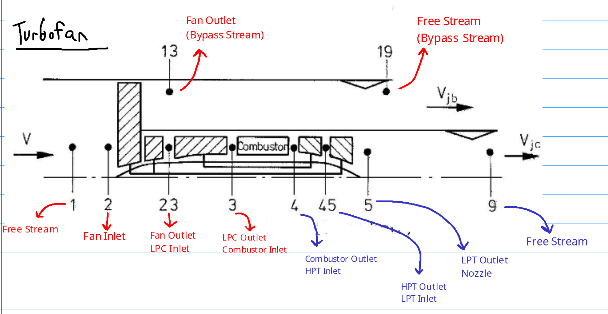

# Table of Contents

This file contains lectures 5 to 11 combined, so you can ctrl+F through it.

- [Table of Contents](#table-of-contents)
- [Lecture 5](#lecture-5)
  - [Intro to New Efficient Aircraft](#intro-to-new-efficient-aircraft)
    - [Number of Engines](#number-of-engines)
    - [Large vs Small Aircraft](#large-vs-small-aircraft)
    - [Environmental Considerations](#environmental-considerations)
  - [Aircraft Design: New Efficient Aircraft](#aircraft-design-new-efficient-aircraft)
- [Lecture 6](#lecture-6)
  - [Sizing Continued](#sizing-continued)
    - [Payload vs Range](#payload-vs-range)
    - [Cruise vs Takeoff and Landing](#cruise-vs-takeoff-and-landing)
    - [Lift to Drag (L/D) Ratio](#lift-to-drag-ld-ratio)
    - [Cruise Lift to Drag (L/D) Ratio](#cruise-lift-to-drag-ld-ratio)
    - [Peak Mach Number](#peak-mach-number)
    - [Bruguet Range Equation](#bruguet-range-equation)
    - [Required Thrust](#required-thrust)
    - [Engine Design](#engine-design)
    - [Thrust Creation](#thrust-creation)
  - [Efficiency](#efficiency)
    - [Propulsive Efficiency](#propulsive-efficiency)
    - [Thermal Efficiency](#thermal-efficiency)
    - [Overall Efficiency](#overall-efficiency)
  - [Jet Velocity and Net Thrust](#jet-velocity-and-net-thrust)
- [Lecture 7](#lecture-7)
  - [Gas Turbine Cycle](#gas-turbine-cycle)
    - [Other Engines Compared to the Gas Turbine Cycle](#other-engines-compared-to-the-gas-turbine-cycle)
    - [Station Numbering](#station-numbering)
  - [Non-Ideal Cycle](#non-ideal-cycle)
    - [Isentropic Efficiency Equations](#isentropic-efficiency-equations)
    - [Net Power](#net-power)
    - [Thermal Efficiency](#thermal-efficiency-1)
    - [Pressure Ratio](#pressure-ratio)
- [Lecture 8](#lecture-8)
  - [Key Messages](#key-messages)
  - [Turbojets](#turbojets)
  - [Turbofans](#turbofans)
    - [High Bypass Ratio Engines](#high-bypass-ratio-engines)
    - [Three Spool Engine](#three-spool-engine)
    - [Geared Turbofan Engine](#geared-turbofan-engine)
  - [New Efficient Aircraft](#new-efficient-aircraft)
  - [High Temperature Operation \& Cooling](#high-temperature-operation--cooling)
    - [Film Cooling Effectiveness](#film-cooling-effectiveness)
- [Lecture 9](#lecture-9)
  - [Review of Compressible Flow](#review-of-compressible-flow)
    - [Key Messages](#key-messages-1)
  - [Thermodynamic Analysis](#thermodynamic-analysis)
    - [Steady Flow Energy Equation for Gases](#steady-flow-energy-equation-for-gases)
    - [Exit Temperature](#exit-temperature)
    - [Nozzle Exit Velocity](#nozzle-exit-velocity)
    - [Choke](#choke)
- [Lecture 10](#lecture-10)
  - [Turbofan Efficiency](#turbofan-efficiency)
  - [Engine Station Numbering](#engine-station-numbering)
  - [T-S Diagram](#t-s-diagram)
  - [New Efficient Aircraft (NEA)](#new-efficient-aircraft-nea)
    - [Fan Pressure Ratio - Initial Guess](#fan-pressure-ratio---initial-guess)
    - [Nozzle Inlet Stagnation Temperature Ratio](#nozzle-inlet-stagnation-temperature-ratio)
    - [Bypass Jet Velocity Vjb](#bypass-jet-velocity-vjb)
    - [Core Jet Velocity Vjc](#core-jet-velocity-vjc)
    - [Why is Vjc = Vjb??](#why-is-vjc--vjb)
    - [Bypass Ratio](#bypass-ratio)
    - [Iterative Solution](#iterative-solution)
    - [Fan Pressure Ratio](#fan-pressure-ratio)
    - [LPT Pressure Ratio](#lpt-pressure-ratio)
    - [Thrust per Unit Core Flow](#thrust-per-unit-core-flow)
    - [Specific Fuel Consumption, SFC](#specific-fuel-consumption-sfc)
  - [Nacelle](#nacelle)
    - [Simplified Model of a Nacelle](#simplified-model-of-a-nacelle)
    - [Net Effective Thrust](#net-effective-thrust)
    - [Specific Fuel Consumption](#specific-fuel-consumption)
    - [Engine Weight](#engine-weight)
    - [Corrected Net Thrust](#corrected-net-thrust)
    - [Corrected Specific Fuel Consumption](#corrected-specific-fuel-consumption)
    - [Jet Velocities](#jet-velocities)
    - [Jet Velocities Not Equal](#jet-velocities-not-equal)
- [Lecture 11](#lecture-11)
  - [Engine Scaling](#engine-scaling)
  - [Unchocked Nozzles](#unchocked-nozzles)
  - [Non Dimensional Groups](#non-dimensional-groups)
    - [Gross Thrust](#gross-thrust)
    - [Net Thrust](#net-thrust)
  - [Actual Engine Data](#actual-engine-data)
    - [Flow Parameters](#flow-parameters)
    - [Pressure and Temperature Parameters](#pressure-and-temperature-parameters)
    - [Performance Scaling](#performance-scaling)
  - [New Efficient Aircraft](#new-efficient-aircraft-1)

# Lecture 5

## Intro to New Efficient Aircraft

Newer efficient aircraft are large, wide-body aircraft with two aisles.
- Designed for low fuel burn, two engines
- "Tube and Wing" configuration
- Swept Wings
- Engines hung on pylons, under and forward of wings

Hanging engines underneath the wings has structural advantages
- Engines are heavy, often 8,000kg or more
- Placing them under the wings where lift is generated helps reduce structural weight requirements
- In the event of engine fialure, having the engine under the wing will help mitigate some potential shrapnel or debris flying into the passenger bay
- Easy access for maintenance

### Number of Engines

The initial standard was to use four engines. Nowadays, two is the standard.

Engines must be sized so that if one engine fails as the aircraft is about to take off, the other engines can still complete the takeoff successfully.

An increase in the **bypass ratio** has allowed engine number to reduce overtime.
- Improves the match between the thrust required at sea level and the thrust required at cruising altitude.
- This means a thrust value much closer to the full thrust is being produced at both takeoff and cruising altitudes. Older aircraft were not nearly this efficient and could not adapt as well to altitude.

### Large vs Small Aircraft

Smaller aircraft have a $\dfrac{D}{W_e} \approx$ 10% to 15% higher than larger, twin aisle aircraft. The engine specific fuel consumption is about 20% worse for small engines than for larger engines. Why?
- Smaller aircraft have a lower characteristic length, meaning the Reynolds number of the flow going over the aircraft is going to be lower. Lower reynolds number means the fluid frictional forces are stronger, and so drag forces are higher. 
- Lower Reynolds number also is seen in the smaller engines due to the smaller area.
- In addition, the fineness ratio of smaller aircraft is further from ideal.

### Environmental Considerations

- 2% of global emissions
- 12% of transport-related emissions

Contrails are ice crystals formed when water vapor in the exhaust freeze due to the cold temperature high in the atmosphere. This is a temporary effect.

## Aircraft Design: New Efficient Aircraft

Design Objective:
- Move passengers with minimal environmental impact

Range (R1, max payload):
- 3000nm = 5556 km

Aerodynamics:
- $\dfrac{L}{D}_{cruise} = 21.6$

Cruise Mach Number:
- $M_{cruise} = 0.78$
- Reduces fuel consumption significantly compared to other standard of $0.85$, and since it's not a very long range flight the slower speed won't add up as much.

Additional Specifications
- Passenger Capacity: 280
- Max Payload: 40.2 tonne
- Max take-off mass: 175 tonne
- Empty weight: 100 tonne
- Fuel consumed for mission at max range: 27.8 tonne
- Estimated engine specific fuel consumption $(SFC)$: $0.50 kg / h / kg$
- Wing span: $60m$
- Wing area: $304m^2$
- Wing sweep: 25 degrees

Consequences of the Specifications:
- Estimated fuel increase of $\approx 15$%

Continued in lecture 6.

# Lecture 6

## Sizing Continued

Size, speed and range dictate engine requirements

Aerodynamics are important too!

Takeoff, climb and cruise are the most critical flight conditions for engines.
- It is ideal to cruise quickly and at high altitude

### Payload vs Range

This image above is for an Airbus A330-300

We can identify three distinct segments on the graph.
- O to A
  - Payload is constant until max takeoff weight reached
- A to B
  - Payload replaced with fuel to increase range
- B to end
  - Drag must be reduced to further increase range

Increasing the range means more fuel must be carried, reducing the useful payload mass. There are also structural limits to the payload too.

### Cruise vs Takeoff and Landing

The aircraft must fly fast at cruise, slow to take off and land.
- It's critical that wing stall does not occur near the ground
- Need flight speed high enough to get $\textrm{Lift} = \textrm{Weight}$ at a $C_L$ well below stall value.

During cruise or when there is no flap deflection, $C_{D, 0} = 0.03$. This is typical.

When there is large flap deflection: $C_{D,0} = 0.1$. This is a significant increase in drag coefficient.

The drag cofficient is parabolic vs the angle of attack:
- $C_L = a(\alpha - \alpha_{L = 0})$
- $C_D \approx C_{D,0} + \dfrac{C_L^2}{\pi AR}$

$\dfrac{L}{D}$ vs $\alpha$ peaks well below stall, seen in the graph below.

- $AR = 8$
- $\alpha_{L = 0}= -3 \degree$ (zero lift angle of attack)
- $a = 5.5$
- $C_{D,0} = 0.03$

We can be aerodynamically efficient and stall-resistant at the same time.

Tires can overheat if overused (too long of a runway, or too fast)
- The solution is to limit the take-off velocity to 90 m/s
- Limit landing speed to 72 m/s

The landing speed typically dictates the required wing area.

### Lift to Drag (L/D) Ratio

Above is the estimated data for a Boeing 787-8

As Mach number increases, the max $\dfrac{L}{D}$ and $C_L$ both reduce
- This is due to the increasingly strong shocks occuring on the wings
- About $M\approx 0.8$ is the best value here.

### Cruise Lift to Drag (L/D) Ratio

Flying at maximum $\dfrac{L}{D}$ gives the maximum weight which can be kept in the air for a given engine thrust
- It's equivalent to setting endurance (flight time)

Cruise: Travel as far as possible for a given amount of fuel used
- Need to maximize $\textrm{Flight Speed} \times \dfrac{L}{D}$
- At curise altitudes, temperature and speed of sound are nearly constant
- $V \dfrac{L}{D} \propto M \dfrac{L}{D}$

### Peak Mach Number

In the above picture (boeing 787) we can see that the Mach Number multiplied by the lift to drag ratio, $M \times \dfrac{L}{D}$, peaks at a higher mach number.

Recall, we designed our new efficient aircraft to use $M = 0.78$. However, we can see from this graph that $0.84$ or $0.85$ for example would be better. Why did we do 0.78?
- If we design for lower speed, we reduce the structural weight
- Reduces lift required
- Which Reduces Drag
- Leading to less thrust required
- Needing smaller engines to do so
- Lowering fuel consumption

Conclusion: Can only look at curves for a given aircraft, cannot compare across different ones!!

Recall that the wing area is set by the takeoff and landing speeds. This leaves two options for cruising at optimal lift coefficient:
- Fly slow near the ground
- Fly high (reduced atmospheric density) and fast

Specific fuel consumption can be written as:
- $\textrm{SFC} = \dfrac{\dot m_f}{\textrm{thrust}}$

Overall efficiency, from enthalpy supply rate from fuel burn to propulsive power:
- $\eta = \dfrac{V}{\textrm{SFC} \times \textrm{LCV}}$

### Bruguet Range Equation

We learned about this previously. Now we redefine it in terms of the range factor.
- $H = \dfrac{n_0\left(\textrm{LCV}\right) \left(\dfrac{L}{D}\right)}{g}$
  - Here, $n_0$ is the overall engine efficiency, defined in detail [at the end of the lecture (click here to go)](#overall-efficiency)

This yields the range equation:
- $R = -H \ln{\left(\dfrac{m_{end}}{m_{start}}\right)}$

We can then use the Bruguet Equation to obtain the "Fuel Burn Parameter"
- $\dfrac{\textrm{Mass of fuel burned}}{\textrm{range} \times \textrm{mass of payload}}$

Using the Bruguet Range Equation:
- $\dfrac{m_{fb}}{Rm_{pl}} = \dfrac{1}{R} \left(1 + \dfrac{m_e}{m_{pl}}\right) \left(\exp{\left( \dfrac{R}{H} - 1 \right )}\right)$

### Required Thrust

The Top-Of-Climb condition sets the engine thrust required. This is where the engine is nearly at cruise altitude, but not quite. It's still climbing.

At this point, we find:
- $M \dfrac{L}{D} =$ optimum, $M =$ const. Drag is proportional to weight and not a function of air density

Engine thrust scales approximately with density, falling with altitude.

We want an engine sized so it is efficient while producing the required thrust at the optimum top-of-climb altitude.

To determine the thrust required, we typically require $\approx 300$ ft/min, or 1.5m/s climb rate at cruising altitude
- $\dfrac{F_N}{W} = \dfrac{D}{W} + \sin(\theta) = \dfrac{1}{\left(\dfrac{L}{D}\right)} + \sin (\theta)$
- $\theta \approx 0.5\degree$, which is the climb angle

### Engine Design

The design point for an engine is cruise. Most time is spent here, and we want the lowest fuel consumption at this condition. However, we must still have sufficient capacity for thrust to be able to climb to cruise in the first place.

If one engine fails, the other has to work harder due to the extra drag from rudder deflection. The rudder deflection is used to overcome the single engine moment resulting from only one engine firing.
- A good assumption for take-off thrust is $0.3 \times \textrm{maximum take-off weight}$

### Thrust Creation

Thrust generation requires the momentum of flow leaving the engine to be higher than the flow entering it.
- $m_{out} V_{out} > m_{in}V_{in}$, but typically $m_{out} = m_{in}$, so we have $V_{out} > V_{in}$
- Fuel is used to increase the momentum of the flow.
- $\textrm{Net Thrust} = \textrm{Gross (static) thrust} - \textrm{Ram Drag}$
- $\textrm{Bypass Ratio} = \dfrac{\textrm{Bypass Mass Flow}}{\textrm{Core Mass Flow}}$
- Overall engine efficiency is a product of thermal and propulsive efficiency

Looking at the bypass and core jet velocities, should they be equal? Nothing forces them to be equal, they don't HAVE to be. However, we want them to be:
- Different velocity exit jets will mix, creating additional losses. Ensuring the two velocites are nearly equal will limit mixing and limit losses.

Gross thrust is generated when the engine is not moving. Net thrust is caused by "Ram Drag", or momentum of flow entering the engine
- $F_N = \dfrac{F_G}{\left( m_{air} + m_f \right)V_j - m_{air} V}$
  - masses here are mass flow rates, $\dot m$
  - $F_G$ is gross thrust
  - $F_N$ is net thrust
  - $m_f < 2$% of air mass flow rate (typically)
  - $m_{air} V$ is ram drag

## Efficiency

### Propulsive Efficiency

Ratio of power delivered to aircraft, to power delivered to exhaust jet
- $\eta_p = \dfrac{VF_N}{\Delta \textrm{KE}} = \dfrac{2V}{V + V_j}$

Modern commercial jet engines have a bypass ratio $\approx 10$
- Resultant propulsive efficiency $\eta_p \approx 80\%$

### Thermal Efficiency

Relates the power of the jet to the rate at which energy is released by burning fuel
- $\eta_{th} = \dfrac{\Delta \textrm{KE}}{m_f \textrm{LCV}}$

What factors into the thermal efficiency?
- Efficiency of the Brayton cycle core
- Efficiency of other turbomachinery (ex: low pressure turbine and fan)

### Overall Efficiency

Essentially it's $\dfrac{\textrm{What you get}}{\textrm{What you pay for}}$
- $\eta_0 = \eta_p \times \eta_{th}$
- $\eta_0 = \dfrac{1}{\textrm{SFC}} \dfrac{V}{\textrm{LCV}}$
  - Recall that:
  - $\textrm{SFC}$ is the specific fuel consumption
  - $\textrm{LCV}$ is the lower heating value of the fuel

## Jet Velocity and Net Thrust

Net Thrust of engines with high jet velocity are weakly affected by flight speed. This is why turbojet or low bypass ratio turbofan engines typically are sized for takeoff. They have excess thrust at cruise.

Net thrust of engines with low jet velocity falls off rapidly wiht increasing flight speed. This means that for high bypass ratio turbofans, takeoff is easy since engines must be sized for cruise/top-of-climb.

# Lecture 7

## Gas Turbine Cycle

We can think of a gas turbine as a core with a load.
- If the load is the nozzle we have a turbojet
- If the load is a turbine driving a fan we have a turbofan

The performance measure for gas turbines is thermal efficiency $\eta_{th}$
- Depends on the pressure ratio, ratio of turbine inlet and compressor inlet temperatures, and isentropic efficiencies

Isentropic efficiency used to relate the actual cycle to the ideal.

The Gas Turbine Cycle uses high enthalpy gas to drive the cycle.
- Pressure is raised by the compressor
- Fuel burned in high pressure air
- Hot, high pressure gas drives turbines
  - The turbine driving load may be on the same shaft as the compressor, but it does not have to be
  - 
The load of the cycle can be nearly anything
- Second turbine that produces shaft power
- Produce a jet using a nozzle
- Drive a fan

### Other Engines Compared to the Gas Turbine Cycle

A Bypass Jet Engine or Turbofan engine is "almost equivalent" to a gas turbine core driving a power turbine or used to create a jet. Why "almost"? What's different?
- The "Almost" has to do with the exhaust fan and jet
- Fan pressure rise also affects flow going through the core. For core flow, some pressure rise happens before compressor inlet.
- Jet still produced at low pressure turbine exit. Not all possible enthalpy is extracted to drive the fan.

### Station Numbering

When analyzing jet engines we use stagnation quantities for temperature and pressure.
- Denoted with subscript $0$ in the textbook, which is the same as the subscript $t$ we have used previously.
- Convention: Entry to engine is station 2, exhaust products leave at 5.

Looking at the combustor with a first law of thermodynamics analysis:
- $m_f \textrm{LCV} = m_{air} c_P (T_4 - T_3)$
- LCV is the lower heating value, not sure what "C" stands for though. Kerosene's $LCV=43$ MJ/kg
- $c_{P,air} = 1005$ J/kg/K
- Only a small flow rate of fuel is needed to increase air temperature significantly. This also does not account for bypass flow.
- $\left(\dfrac{m_f}{m_{air}}\right) = \left(0.0000234K^{-1} \right) (T_4 - T_3)$

## Non-Ideal Cycle

The compressor and turbine are assumed to be non-ideal so that entropy rises through these components. It's important to differentiate if there is a separate power turbine as the efficiency of each turbine could be different

### Isentropic Efficiency Equations

For the compressor:
- $\eta_{comp} = \dfrac{\textrm{ideal work}}{\textrm{actual work}}$

- $\eta_{comp} = \dfrac{T_{3is} - T_2}{T_3 - T_2}$

For the turbine:
- $\eta_{turb} = \dfrac{\textrm{actual work}}{\textrm{ideal work}}$

- $\eta_{turb} = \dfrac{T_4-T_5}{T_4-T_{5is}}$

Here, the subscript $is$ refers to the ideal isentropic value.

For both compressors and turbines in this course, unless otherwise specified, we use $90\%$ isentropic efficiency.

### Net Power

$\dfrac{W_{net}}{m_{air}c_P T_2} = \eta_{turb} \dfrac{T_4}{T_2} \left( 1-\dfrac{1}{r^{\left( \frac{\gamma - 1}{\gamma} \right)}} \right) - \dfrac{r^{\left( \frac{\gamma - 1}{\gamma} \right)} - 1}{\eta_{comp}}$
- Note the following below:
- $r =$ pressure ratio $= \dfrac{\textrm{Highest cycle pressure}}{\textrm{Ambient pressure}}$

What can we say about this equation?
- The pressure ratio is critical. Power goes to zero as $r \rightarrow 1$
- $\dfrac{T_4}{T_2}$ is another important parameter. Power scales linearly with this term.
  - It's how engines are controlled: Change the flow fuel rate
  - The ratio is important, not so much the individual values of temperature. When air is cold at high altitudes, the temperature value is not as high as you would expect.

### Thermal Efficiency

The thermal efficiency of the open cycle $=$ closed cycle efficiency. It doesn't matter if the cycle is open or closed. It also doesn't matter what the power produced is used for: driving a turbine, extracted via a shaft, used to create a jet...

In all cases, we get the following equation:
- $\eta_{th} = \dfrac{W_{net}}{m_f \textrm{LCV}}$

The thermal efficiency and work output are functions of the individual component efficiencies
- For example, in an exercise, compressor and turbine efficiency decreased from 90% to 85%, but it decreased work output by 22%. Big difference.
- Increasing component efficiencies increases the pressure ratio where the max thermal efficiency is obtained.

$\dfrac{T_4}{T_2} \approx 6$ in modern engines

The net work rises rapidly at a low pressure ratio, but there's a maximum for a given temperature ratio.
- Important to have $\dfrac{T_4}{T_2}$ as high as possible
- The pressure ratio for peak efficiency increases at higher temperature ratios
- For a high temperature ratio $>4.5$ and pressure ratio $>20$, efficiency curves are fairly flat. See below.

### Pressure Ratio

The max power occurs at lower pressure ratio than max efficiency. This leads to high pressure ratios in commercial jet engines, since we want to maximize efficiency, rather than power.

At low pressure ratio, efficiency rises so quickly that more input heat is converted to work. As the pressure ratio rises, the amount of fuel input decreases for a fixed turbine inlet temperature. At high pressure ratio, heat input decreases faster than efficiency increases. When these two effects balance, we get peak power.

If we design for a slighly lower pressure ratio than peak power, which is the maximum efficiency point, we get a slight efficiency reduction due to low sensitivity. 
- It's much easier to design high efficiency compressors at lower pressure ratios, likely a worthwhile tradeoff.
- If this is designed for cruise, we can also increase the pressure ratio for climb without large efficiency decreases.

# Lecture 8

## Key Messages

- Bypass flow enables the efficient use of high temperature and pressure generated by the engine core
- Fan and low-pressure compressor/booster driven by low-pressure turbine
- High-pressure compressor driven by high pressure turbine
- Turbine inlet gas temperatures are normally above the blade melting temperature. This requires cooling using "cool" air bled from the compressor outlet.

## Turbojets

The simplest jet engine is a Single-Shaft Turbojet

More advanced turbojets have two spools (a spool is a shaft).
- Low pressure (LP) and high pressure (HP) shafts.
- Having two spools enhances off-design operational abilities.

Why is off-design capabilities enhanced by having two spools?
- Turbojets have poor matching and engines sized for take-off will have significant excess thrust capacity when cruising.
- Cruising, which runs at part-throttle, has a significant efficiency decrease
- This cruising efficiency is greatly improved by using two spools. The engine core can operate near design while the low pressure (LP) spool operates off-design
- When the engine is starting up, the shaft speeds are initially very low. This is easier to do with two shafts.

The bypass ratio enhances propulsive efficiency for subsonic flight.

Early turbofans had some of the low pressure compressor act on flow that didn't enter the core
- Bypass ratio < 1.5
- Still yields reduced jet velocity.

Why such a low bypass ratio?
- Higher bypass ratio = higher diameter $\rightarrow$ heavier, larger engines
- Jet velocity related to max possible flight speed (zero thrust generated when flight speed = jet velocity)
- May accept cruising inefficiently to have capability to go much faster in short bursts for military aircraft.

## Turbofans

### High Bypass Ratio Engines

Look at the picture above. It has a low pressure turbine powering both the low pressure compressor and fan. It has a high pressure turbine powering the high pressure compressor.

### Three Spool Engine

Now look at the picture above. This is a three spool engine, with a low, intermediate, and high pressure shaft (LP, IP, HP respectively).
- LPT only drives the fan

### Geared Turbofan Engine

In the picture above, there is only a low pressure turbine, and no other turbine. There is a gearbox between the LPT and the fan. This allows the LPT to be smaller (and thus lighter).

Downsides??
- Cooling: Gearbox generates heat through friction (heat) & other losses.
  - If mechanical efficiency was $99.5\%$, you would still need $66kW$ of cooling PER ENGINE
  - Even more cooling needed at takeoff

## New Efficient Aircraft

Back to the aircraft we were building towards in previous lectures...

We focus on two-spool engines.
- Fan + booster pressure ratio $\approx 2.5$
- HPC pressure ratio $\approx 18$
- This gives an overall pressure ratio of 45.

The highest possible $T_4$ is desirable.
- This is the turbine inlet temperature!

Why is this desirable?
- It reduces the core turbine pressure ratio relative to that of the core compressor.
- Basically, increases the power available for the LP Turbine.

The temperature ratio varies little across our flight conditions. Since the ambient temperature and thrust required vary, it turns out that core turbine inlet to ambient stagnation temperature ratio is nearly constant.
- $\left (\dfrac{\textrm{turbine inlet temperature}}{\textrm{ambient temperature}}\right)_{\textrm{stagnation temp.}} \approx \textrm{constant}$
- Recall, a stagnation quantity is one that is measured at a stagnation point. That means that at that point where the quantities are measured, fluid velocity is zero.

For our NEA:
- Take off = 6.07
- Top-of-climb = 6.52
- Start of cruise = 6.11

## High Temperature Operation & Cooling

Two things are required for high temperature opreation:
- Material improvements
- Improved use of cooling air from the compressor

There has been an average temperature increase of $7K$ per year, since 1940.

The turbine is cooled internally and externally
- Internal passages keep the metal cool from inside. Cool is relative, the "cool" air might be $900K$ but is still much "cooler" than the hot metal.
- Internal flow emerges from cooling holes, this is called film cooling.

But why do we use this $900K$ air to cool the turbine? Why not ambient air?
- Stagnation pressure of coolant supply must be higher than that of the turbine, otherwise we would have no flow.

About $20\%$ of compressor mass flow is used for cooling. This percentage increases as turbine inlet temperature increases

Some considerations with how much cooling to use:
- Turbine life
- Engine performance
- Turbine inlet temperature vs cooling air supply

### Film Cooling Effectiveness

The performance metric here is the film cooling effectiveness
- $\varepsilon = \dfrac{T_g - T_m}{T_g - T_c}$
  - $T_g \rightarrow$ gas temperature
  - $T_m \rightarrow$ metal temperature
  - $T_c \rightarrow$ cooling air temperature
- The current state of the art $\varepsilon = 0.65$

The turbine blade material set the allowable pressure ratio.
- Normally supply air from compressor outlet
- Allowable temperatures of the metal limit the supply temperature
- This temperature restriction affects the compressor pressure ratio.

# Lecture 9

## Review of Compressible Flow

- We focus on quasi 1-D internal flow
- Have already seen most of this for rocket propulsion
- Most flow in jet engines have $0.3 \le \textrm{Mach} \le 1.0$

Therefore, we treat this flow as compressible flow. No way around that.
- Focus on behavior of choked flows

### Key Messages
- Compressible flow through a duct or nozzle has a max flow rate per unit area, when $Mach = 1$ at the throat.
- To accelerate past $M>1$, we need a converging-diverging area variation.
- Non-dimensional mass flow per unit area is a function of the Mach number
- In choked flow, like in nozzles and turbine passages, **the flow rate is independent of conditions downstream of the throat**
  - **NOTE:** Important. This means that ANYTHING downstream of the throat does NOT affect the throat, or anything before it!!
- Thrust variation with sped is stronger for low pressure ratio fans

## Thermodynamic Analysis

We use stagnation quantities for most things. However, in some cases we care about the static pressure/temperatures. Why? Specifically, why speed of sound vs work exchange?
- The speed of sound is based on the static temperature. The wave propagation speed is not frame dependent so we cannot use stagnation temps.
- Work exchange is based on stagnation temperatures so that we can ignore/neglect all kinetic energy changes.

### Steady Flow Energy Equation for Gases

Assumptions:
- Adiabatic: No external work transfer
- Perfect gas (ideal gas, but the specific heats do NOT change with temperature)
- Constant stagnation temperature

Resulting equation:
- $c_p T + \dfrac{V^2}{2} = c_p T_0$
- $\dfrac{T_0}{T} = 1 + \dfrac{\gamma - 1}{2} M^2$

We then assume isentropic flow, giving us a pressure relation.
- $\left(\dfrac{P}{T}\right)^{\dfrac{\gamma}{\gamma - 1}}$

In terms of the mach number:
- $\dfrac{P_0}{P} = \left(1 + \dfrac{\gamma - 1}{2} M^2 \right)^{\dfrac{\gamma}{\gamma - 1}}$

The cruise mach number of our NEA is 0.78.
- $\dfrac{P_0}{P} = \left(1 + \dfrac{\gamma - 1}{2} M^2 \right)^{\dfrac{\gamma}{\gamma - 1}} = \left(\dfrac{T_0}{T}\right)^{\frac{\gamma}{\gamma - 1}}$

This gives the engine inlet conditions compared to ambient (static) conditions:
- $\dfrac{T_{02}}{T_a} = 1.122$
- $\dfrac{P_{02}}{P_a} = 1.495$
- Key point: The nozzle exit flow depends on $P_a$

Let's look at the effect of speed:
- Inflow parameters are stagnation quantities, and so they increase with Mach number.
- Engine nozzle outflow parameters are static quantities.
- Therefore the ratio of the two is increased with forward flight speed.

The flow in the nozzles can be considered isentropic. Therefore the inlet stagnation pressure and temperature, and exit static pressure, specify the flow conditions.

### Exit Temperature

The exit temperature can be found by:
- $T = T_0 \left(\dfrac{P_a}{P_0}\right)^\frac{\gamma - 1}{\gamma}$

### Nozzle Exit Velocity

Then we can get the nozzle exit velocity:
- $V = \sqrt{2  c_p  T_0  \left( 1 - \left( \dfrac{P_a}{P_0}\right)^\frac{\gamma-1}{\gamma}\right)}$

### Choke

- For given inlet stagnation conditions and gas properties, there is a maximum amount of mass flow that can fit through a certain area. 
- When the limit is reached, the flow is **choked**. 
- The choke always occurs at $\textrm{Mach} = 1.0$. 
- We call the minimum area the **throat**

What is the stagnation to static pressure ratio at choke for air with $\gamma = 1.4$?
- 1.893
- If static pressure fails to increase this ratio further, no increase in the mass flow per unit area occurs.
- For pressure ratios larger than 1.893, the flow accelerates downstream of the throat.
- Density $\downarrow \downarrow$ faster than Velocity $\uparrow$, therefore area must increase, $A \uparrow$.

Thus, the converging-diverging nozzle design is used.

In modern high-bypass-ratio engines, the bypass nozzle is choked at cruise but NOT at takeoff. The core nozzle is always unchoked.

We define the non-dimensional mass flow per unit area, also known as the corrected flow per unit area, as:
- $\bar{m} = \dfrac{m \sqrt{c_p T_0}}{AP_0}$

- $\bar{m} = \dfrac{m \sqrt{c_p T_0}}{AP_0} = M \dfrac{\gamma}{\sqrt{\gamma-1}}\left(1 + \dfrac{\gamma - 1}{2}M^2\right)^{-\dfrac{\gamma + 1}{2 (\gamma - 1)}}$

In terms of pressure ratio, this non-dmimensional flow can be expressed as:
- $\bar{m} = \dfrac{\gamma}{\gamma - 1}\sqrt{2\left[\left(\dfrac{P}{P_{0, in}}\right)^\dfrac{2}{\gamma} - \left(\dfrac{P}{P_{0, in}}\right)^\dfrac{\gamma+1}{\gamma}\right]}$

For an aircraft flying at $M=0.78$, what is the minimum fan pressure ratio at which the bypass nozzle will just be choked?
- Limiting pressure ratio is 1.893, found earlier as the stagnation to static pressure ratio to choke for air.
- We find the pressure ratio due to the flight speed
  - $\dfrac{P_0}{P} = \left(1 + \dfrac{1.4-1}{2} 0.78^2 \right)^{3.5} = 1.495$
- Then we compare:
  - $\dfrac{1.893}{1.495} = 1.267$
- Therefore $1.267$ is the maximum fan stagnation pressure ratio for unchoked flow in the nozzle.

# Lecture 10

## Turbofan Efficiency

The overall efficiency is:
- $\eta_0 = \eta_p \times \eta_{th}$

Use a high overall pressure ratio and high turbine inlet temperature to get good thermal efficiency. We laos need a low jet velocity to get a high propulsive efficiency. This creates the turbofan.

A turbofan also has transmission efficiency factored in:
- $\eta_0 = eta_p \times \eta_{th} \times \eta_{tr}$

We can redefine ther thermal efficiency as the kinetic energy that would be produced if the core flow expanded to ambient pressure BEFORE work extracted to drive bypass part of fan, divided by heat input from combustion.
- $\eta_{th} = \dfrac{\textrm{Kinetic energy that would be produced, if the LPT wasn't powering the fan}}{\textrm{heat input from combustion}}$

This creates a hypothetical point within the low pressure turbine (LPT) when sufficient work could have been extracted, to power the fan root and booster but NOT the bypass stream

In the figure above:
- The booster is the low pressure compressor (LPC).
- The Kinetic energy is shown here visually. It does not include the fan, and it does not include the portion of the LPT that powers the fan.

Downstream of the hypothetical point within the LPT, there are losses with the flow in the LPT and the flow in the fan bypass streams (Transfer efficiency)
- Increase in propulsive efficiency more than offsets these losses.

Jet velocities are KEY to engine design.
- Selecting fan pressure ratio effectively gives us the bypass jet velocity
- When choosing core jet velocity, we select how much core power is extracted in the low pressure turbine (LPT), vs how much is left to generate the core jet.

The core and bypass jet velocities are always similar
- Reduces noise
- Increases propulsive efficiency

Modern regular engines have bypass ratios around 10, while geared turbofans have a bypass ratio around 12.

The fan pressure ratio is a beter measure of the engine "type".
- Specific thrust is another possibility:
- $\textrm{Specific Thrust} = \dfrac{F_N}{m_{air}} = V_j - V$

## Engine Station Numbering

The figure above shows the differences in numbering between Turbojets and Turbofans.

The figure above shows a detailed explanation of each stage of the turbofan.

Looking at the turbofan specifically above:
- the J in $V_{jb}$ and $V_{jc}$ is "Jet"
- the B in $V_{jb}$ is "Bypass"
- the C in $V_{jc}$ is "Core"

So $V_{jb}$ is the Bypass Jet Velocity, and $V_{jc}$ is the Core Jet Velocity.

Looking at the turbofan:
1. 

## T-S Diagram

When looking at these graphs:
- Remember, the core jet and bypass jet velocities are equal.
- $M = 0.85$ and it's taken at 31,000 ft altitude
- Fan Pressure Ratio (FPR) $= 1.8$, core pressure ratio $= 32$
- Turbine Inlet Temperature $= 1407K$
- Component Efficiencies $= 90\%$

## New Efficient Aircraft (NEA)

Tying back to the NEA, we previously specified that the core outlet conditions (Station 45) for cruise was $M = 0.78$ @ 35,000 ft.

Our next task:
- Find the pressure ratio for the low-pressure turbine (LPT) that ensures the core jet velocity maintains the desired ratio compared to the bypass jet velocity.
- This determines the power drawn from the LPT and thus power available to the fan.

### Fan Pressure Ratio - Initial Guess

The bypass nozzle pressure ratio is higher here, due to forward flight speed.
- $\dfrac{P_{013}}{P_a} = \dfrac{P_{013}}{P_{02}} \dfrac{P_{02}}{P_a}$

 

- $\dfrac{P_{02}}{P_a} = \left(\dfrac{T_{02}}{T_a}\right)^\frac{\gamma}{\gamma-1}$

 

- $\dfrac{T_{02}}{T_a} = 1 + \dfrac{\gamma - 1}{2} M^2$

### Nozzle Inlet Stagnation Temperature Ratio

We assume isentropic flow in the nozzle. This gives a nozzle inlet stagnation tmeperature ratio of:
- $\dfrac{T_{013}}{T_{02}} = 1 + \dfrac{(\textrm{Fan Pressure Ratio})^\frac{\gamma-1}{\gamma}-1}{\eta_f}$
  - The $\gamma$ fraction is an exponent here!

### Bypass Jet Velocity Vjb

And a bypass jet velocity $V_{jb}$ of:
- $V_{jb} = \sqrt{2 c_p (T_{013}) - T_9}$
- $V_{jb} = \sqrt{2 c_p (T_{013}) \left(1 - \left(\dfrac{P_a}{P_{013}}\right)^\frac{\gamma - 1}{\gamma}\right)}$

### Core Jet Velocity Vjc

And a core jet velocity $V_{jc}$ of:
- $V_{jc} = \sqrt{2 c_p (T_{05}) \left( 1 - \left( \dfrac{P_9}{P_{05}} \right)^\frac{\gamma - 1}{\gamma}\right)}$

### Why is Vjc = Vjb??

We choose the core jet velocity by varying the low pressure turbine (LPT) pressure ratio.
- The jet velocity magnitudes are always similar.
- Maximum propulsive efficiency occurs if the jet velocities are equal: 
- $V_{jc} = V_{jb}$

But why does having $V_{jc} = V_{jb}$ maximize propulsive efficiency??
- Minimizes losses due to the mixing of the two jets. Mixing losses $=0$ when the velocities are equal.
- If one jet is faster than the other, there is some entropy generated in the mixing of the two streams. This increases the propulsive power required to overcome these new losses.

### Bypass Ratio

Consider the power balance:
- $m_c c_p (T_{045} - T_{05}) = m_c c_p (T_{023} - T_{02}) + (\textrm{BPR}) m_c c_p (T_{013} - T_{02})$
  - $BPR$ is Bypass Pressure Ratio.
- $T_{05}$ is set by the low pressure turbine (LPT) pressure ratio, and isentropic efficiency.
- The only unknown here is the bypass ratio.

### Iterative Solution

An iterative solution is required here:
1. Select the core outlet conditions (T_{045} and P_{045})
   - These remain fixed.
2. Choose the fan pressure ratio
   - This determines the bypass jet velocity
3. Choose the ratio of Core Jet Velocity to Bypass Jet Velocity
   - Here we set it to 1.
4. Guess the value for the low pressure turbine pressure ratio $\dfrac{P_{045}}{P_{05}}$
5. Compute $T_{05}$ and $\dfrac{P_{05}}{P_a}$
6. Compute the core jet velocity and compare it to the bypass jet velocity. - 
   - If the core jet velocity is too fast (or too slow), increase (or decrease) $\dfrac{P_{045}}{P_{05}}$ and return to step 5.
7. Compute bypass ratio using the equation above.
8. Compute the gross thrust and net thrust per unit mass flow through the core.

### Fan Pressure Ratio

### LPT Pressure Ratio

The fan pressure ratio sets the Bypass Pressure Ratio and the Low Pressure Turbine (LPT) Pressure Ratio.

The results for our New Efficient Aircraft core at cruise flight conditions:
- Overall pressure ratio = 45
- Turbine inlet temperature = 1500 K
- M = 0.78 @ 35,000 ft
- We set the core and bypass jet velocites equal.

   

### Thrust per Unit Core Flow

The fan pressure ratio also sets the Thrust per Unit Core Flow

The gross thrust varies much more than net thrust, because the bypass ratio changes with the fan pressure ratio.
- Net thrust is a relevant quantity at cruise.
- Gross thrust approximates the take-off conditions.

   

### Specific Fuel Consumption, SFC

The fan pressure ratio also affects the specific fuel consumption, SFC

- The mass flow rate of fuel is the same for all fan pressure ratios.
- The net thrust variation thus yields variation in the specific fuel consumption
- Specific thrust $V_j - V$ also varies strongly with fan pressure ratio.
  - Alters the overall engine size requirement for a given thrust.

## Nacelle

The previous graphs for the fan pressure ratio neglected the nacelle. This is called a "Bare Engine".
- No drag is considered in a Bare Engine
- This drag acts on the Nacelle.

When an engine and nacelle are used together, it is referred to as a "Powerplant"

The nacelle drag must be accounted for to select optimum fan pressure ratio.
- The mass flow increases as the fan pressure ratio decreases, for the same thrust.
- This makes the engine larger and heavier.

### Simplified Model of a Nacelle

The drag is proportional to the wetted area. So, for fixed style and Mach Number:
- $D_{nac} \propto A_w \rho V^2$
- $A_w \propto \dfrac{\pi d^2}{4} = \dfrac{m}{\rho V}$
- $m = \dfrac{F_N}{X}$
- $X = V_j - V$

The result is:
- $D_{nac} = kV \left(\dfrac{F_N}{X}\right)$

Where:
- $D_{nac}$ is the drag acting on the nacelle
- $k$ is an empirical constant, a function of the fan and nacelle design.
- $F_N$ is net thrust

### Net Effective Thrust

Deducting the Nacelle drag yields the net effective thrust:
- $F_{N, Effective} = F_{N, Bare} \left(1 - \dfrac{kV}{X}\right)$

The constant $k$ is determined from experiments, or CFD simulations.
- Here, we use 0.04 as a plausible estimate

The reduction in thrust from this drag means the mass flow must increase.
- Therefore, the engine must be larger.

### Specific Fuel Consumption

The effective specific fuel consumption is highly senstiive to the empirical values assumed.

We still have no optimum fan pressu re ratio.
- Instead we need to consider the weight of the powerplant (nacelle + engine) first.

### Engine Weight

The engine weight effects lead to an optimum fan pressure ratio.
- Lowest engine fuel consumption is NOT the design aim of an engine.
- The aim is to make the AIRCRAFT fuel consumption low.
- This makes engine weight very important. Increased weight means more lift required, and thus more drag, so higher aircraft fuel consumption.
- The engine weight may be about 10% of the maximum takeoff weight, with the bare engine being half that.

The fan area can be assumed proportional to the mass flow rate.

Approximation:
- $W_{engine} \propto d^{2.4}$

A simple way of accounting for the engine weight:
- Subtract all the drag that comes from the engine weight, from the effective net thrust.

A larger engine doesn't only just add engine weight.
- Extra fuel capacity is required, increasing aircraft weight
- Extra structural weight to support the heavier aircraft and engine, increasing aircraft weight
- This extra weight increases the engine size, further increasing aircraft weight.

### Corrected Net Thrust

The corrected net thrust accounts for the engine weight.
- $F_{N, corrected} = F_{N, effective} - \dfrac{W_{engine}}{\dfrac{L}{D}}$

To use the scaling approximation above, we need a reference point.
- Take the powerplant (engine + nacelle) to be 12 tonne for 3m diameter fan.

### Corrected Specific Fuel Consumption

An optimum emerges at a fan pressure ratio (FPR) of about 1.6

A low pressure ratio means:
- Engine may be too large for installation or transport
- Low noise

In practice, this calculation isn't sufficient to choose the fan pressure ratio. Instead, select 1.5

### Jet Velocities

Previously we assumed $\dfrac{\textrm{Bypass Jet Velocity}}{\textrm{Core Jet Velocity}} = 1$

From this graph, we can now see there is an optimum value of the specific fuel consumption (SFC).
- Occurs at $\dfrac{\textrm{Bypass Jet Velocity}}{\textrm{Core Jet Velocity}} = 0.92$
- However, the difference between 1.0 and 0.92 is very small.

 

### Jet Velocities Not Equal

But why does a value $\dfrac{\textrm{Bypass Jet Velocity}}{\textrm{Core Jet Velocity}} < 1$ maximize the specific fuel consumption?
- If the flow were incompressible and had equal velocity, they would have equal momentum.
- The core flow is at a higher temperature, and thus has a lower density.

 

We don't want to have equal velocity in the core and bypass jet streams, we actually want equal MOMENTUM. Ensuring both streams have equal MOMENTUM minimizes mixing losses.
- As a result of the density difference, momentum is not the same if velocity is the same.
- Because the bypass has a lower density, its velocity should be higher.
- Therefore $\textrm{Bypass Jet Velocity} < \textrm{Core Jet Velocity}$

# Lecture 11

## Engine Scaling

Assume a Mixed Flow Nozzle, or a Bypass Ratio $\ge 10$
- The engine is essentialy controlled through the mass flow rate of fuel.
- Any variable in the engine can be expressed as a function of:
  - $m_f$, mass flow rate of fuel
  - $P_a$, ambient pressure
  - $T_a$, ambient temperature
  - $V$, flight speed.

The engine performance (except for unchoked nozzle performance) depends on stagnation quantities at the engine inlet, plus fuel mass flow.
- Stagnation pressure and temperature combines the atmospheric pressure and temperature with the flight speed: $P_{02}, T_{02}$
- $T_{02} = T_a + \dfrac{V^2}{2c_p}$
- $M = \dfrac{V}{\sqrt{\gamma R T_a}}$
- $P_{02} = P_a(1 + 0.5(\gamma - 1)M^2)^\frac{\gamma - 1}{\gamma}$

## Unchocked Nozzles

If the nozzle is unchoked, we need to separately consider $P_a$. We need two of the following:
- Atmospheric static pressure
- Inlet stagnation pressure
- Flight speed or Mach number

Then we can use the four main parameters mentioned earlier.

A high bypass engine nozzle is not always choked. For example, with a fan pressure ratio of 1.5, it's not always choked.
- Bypass nozzle: Choked at cruise but not for static conditions or take-off (M $\approx$ 0.25)
- Core nozzle: always unchoked.

Why is the core nozzle always unchoked?
- Even after passing through the low pressure turbine, the core stream is much hotter than the bypass stream
- Assume static pressure at core and bypass nozzle exits are equal
- If the stagnation pressure at the core nozzle inlet matches that at the bypass nozzle inlet, the exit Mach numbers of the nozzles will be equal. 
- Therefore, a lower pressure ratio is necessary for the core nozzle to achieve approximately equal velocities.

## Non Dimensional Groups
Non-dimensional parameters are used extensively in this lecture.

Relating the fuel flow rate effect to the flight mach number effect:
- $\dfrac{m \sqrt{c_p T_{02}}}{D^2 P_{02}} = F\left(\dfrac{T_{04}}{T_{02}}, \dfrac{P_a}{P_{02}}\right)$

This can also be written, explicitly including the fuel flow rate:
- $\dfrac{m \sqrt{c_p T_{02}}}{D^2 P_{02}} = F\left(\dfrac{m_f \textrm{LCV}}{\sqrt{c_p T_{02}} D^2 P_{02}}, \dfrac{P_a}{P_{02}}\right)$

Looking at the $\dfrac{m_f \textrm{LCV}}{\sqrt{c_p T_{02}} D^2 P_{02}}$ term, which is Power:
- It relates the energy flux from fuel burn, to the energy flux associated with a velocity. This is multiplied by area and pressure. This gives a velocity times force, which is power.

Some other dimensional parameters:

Non-Dimensional Rotational Speed
- $\dfrac{ND}{\sqrt{\gamma RT_{02}}}$

Non-Dimensional Gross Thrust for a choked nozzle
- $\dfrac{m_{air} V_{19} + P_{19} A_N}{D^2 P_{02}}$

### Gross Thrust

- The bypass nozzle is choked at cruise
- The thrust from the bypass $\approx 10\times$ more than from the core
- Approximate treatment of whole engine as having choked nozzle flow is reasonable.
- Assume mixed, choked flow for analysis

The gross thrust cannot be separated from the ambient pressure.
- The nozzle is choked, so there is no dependence on the mach number
- $V_j \not = V_{19}$. $V_j$ is most likely supersonic, since the flow will accelerate past the nozzle exit (throat) in most cases.
  - $F_G \approx m_{air} V_J = m_{air} V_{19} + (P_{19} - P_a) A_N$
- We rearrange, and bring all terms that depend on the conditions INSIDE the engine, to the right side.
  - $F_G + P_a A_N = m_{air} V_{19} + P_{19} A_N$

Non-Dimensionalize:
- Right Side:
  - $\dfrac{F_G + P_a A_N}{D^2 P_{02}}$
- Left Side:
  - $\dfrac{m_{air} V_{19} + P_{19} A_N}{D^2 P_{02}}$

$\textrm{Gross Thrust + Ambient Pressure} \times \textrm{Nozzle Area}$ is a relevant parameter.

### Net Thrust

- $\dfrac{F_G + P_a A_N}{D^2 P_{02}} = F\left(\dfrac{T_{04}}{T_{02}}, \dfrac{P_a}{P_{02}}\right)$
- $F_N = F_G - m_{air} V$

 

How would this non-dimensional parameter change if the nozzle was unchoked?
- $\dfrac{F_G + P_a A_N}{D^2 P_{02}} = F\left(\dfrac{T_{04}}{T_{02}}, \dfrac{P_a}{P_{02}}\right)$

If it's unchoked that means the nozzle exit pressure is equal to the ambient pressure.
- $m_{air} V_{19} = F_G$

And the parameter simplifies to:
- $\dfrac{F_G}{D^2 P_{02}}$

## Actual Engine Data

We can see that the turbine inlet temperature, and the high pressure shaft rotational speed, are substitutes for each other.
- This means that looking at these two parameters, each parameters' lines of constant values are parallel.

### Flow Parameters

Air Mass Flow Group
- $\dfrac{m_{air}\sqrt{T_{02}}}{P_{02}}$
- Corrected Mass Flow: $\dfrac{m_{air} \sqrt{\theta}}{\delta}$

Fuel Mass Flow Group
- $\dfrac{m_f}{P_{02}\sqrt{T_{02}}}$

Corrected Speed:
- $\dfrac{N}{\sqrt{T_{02}}}$ or $\dfrac{N}{\sqrt{\theta}}$

### Pressure and Temperature Parameters

From before:
- $\dfrac{m_{air} \sqrt{\theta}}{\delta}$
- $\dfrac{N}{\sqrt{\theta}}$

What is theta?
- $\theta = \dfrac{T_{02}}{T_{02, \textrm{ref}}}$
- $T_{02, \textrm{ref}} = 288K$

What is delta?
- $\delta = \dfrac{P_{02}}{P_{02, \textrm{ref}}}$
- $\P_{02, \textrm{ref}} = 101,325 Pa$

### Performance Scaling

Commercial aircraft must be able to fly safely if one engine fails.

A further detail: They must be able to fly safely if one engine fails, while also not altering thr throttles. With two engines in operation, the take-off distance is much shorter and climb rate is higher.

This also applies during cruise when the bypass nozzle is choked.

The thrust from the core and bypass jets are strong affected by $P_{02}$.
- $P_{02}$ is affected by $P_a$ (altitude) and flight mach number.
- We can trade these. Lower altitude means higher pressure. Keeping $P_{02}$ constant requires a reduced mach number.

Requirements if an engine is lost:
 - Must still have sufficient range to get to an airport for landing
 - Must be able to fly high enough to get over any mountains between current position and closest airport

## New Efficient Aircraft

Tying back to our NEA:
- We have two engines
- If one is lost, the other must produced double the thrust
- We can't raise the turbine inlet temperature to double the thrust, it could destroy the engine
- An approximate analysis can be conducted by assuming that the functioning engine is maintained at the same non-dimensional condition as it was before the loss of the other engine.

How do we do this?
- Fly lower and slower with one engine than we would with two.
- Small increase in turbine engine temperature, because when flying lower the atmospheric temperature is higher.
- Higher air density allows the aircraft to fly slower and still produce sufficient thrust
- Engine increases the net thrust, due to higher air density and lower forward speed.

Looking at the picture above:
- We want to fly at a coefficient of lift $C_L$ that maximizes $V\dfrac{L}{D}$
- For this to be true, look at the blue arrow. It points to a line where $P_a M^2$ is constant
- Assume crusing at 35,000 ft when thrust lost from one engine
- We consider only the bypass thrust of the NEA engine (bypass thrust is over 90% of the thrust)

Some takeways from this graph, for a twin-engine aircraft:
- $P_a M^2 = \textrm{CONSTANT}$
- We need double the design thrust
- Aircraft must ascend to about 19,000 ft with only one operating engine
  - Not high enough for many mountain ranges. Mt Everest is 29,029 ft, for example.
  - Twin-Engine aircraft must factor this into their route planning.
- Flight speed reduced (from 231 m/s at 35,000 ft) to 173 m/s at 19,000 ft.

 

We assume the non-dimensional condition is constant.

The bypass nozzle is choked, so we have only one independent parameter:
- $\dfrac{T_{04}}{T_{02}}$
- This is kept constant.

So our output parameters below are kept constnat.
- $\dfrac{F_G + P_a A_N}{D^2 P_{02}}$
- $\dfrac{m_{air}\sqrt{T_{02}}}{P_{02}}$

Looking at the range of the aircraft, between 35,000ft and 19,000 ft:
- $\dfrac{m_{f, 19}}{m_{f, 35}} = \dfrac{P_{0219}}{P_{0235}}\sqrt{\dfrac{T_{0219}}{T_{0235}}}$
- When flying at a lower altitude, our fuel flow is increased, but thrust is increased more. This causes the specific fuel consumption to drop.
- However, the decrease in velocity is greater than the decrease in specific fuel consumption, so overall the range is reduced.