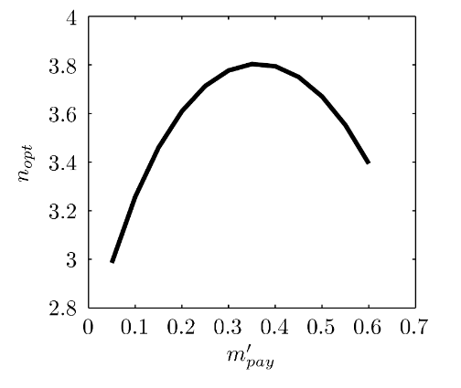

- [Rocket Propulsion](#rocket-propulsion)
  - [Problem 1](#problem-1)
    - [Part A](#part-a)
    - [Part B](#part-b)
    - [Part C](#part-c)
  - [Problem 2](#problem-2)
    - [Part A](#part-a-1)
    - [Part B](#part-b-1)
- [Propellers](#propellers)
  - [Problem 1](#problem-1-1)
    - [Part A - $U\_e$](#part-a---u_e)
    - [Part B - $m$](#part-b---m)
    - [Part C - Fan Pressure Rise](#part-c---fan-pressure-rise)
    - [Part D - Propulsive Efficiency](#part-d---propulsive-efficiency)
  - [Problem 2](#problem-2-1)
    - [Part A - Advance Ratio](#part-a---advance-ratio)
    - [Part B - Thrust Coefficient](#part-b---thrust-coefficient)
    - [Part C - Power Coefficient](#part-c---power-coefficient)

Covers lectures 1 to 4.

# Rocket Propulsion

## Problem 1

A rocket motor with a bell-shaped, fixed-geometry nozzle is designed to be pressure-matched ($P_e = P_0$) at launch (at sea level). The combustion chamber properties remain constant throughout the burn. Assume $\dfrac{P_c}{P_e} > 10$ (at sea level). As the rocket climbs in a vertical launch, explain whether the following variables change or not, and why, during the ascent.
- (a) the nozzle exit pressure $P_e$,
- (b) the propellant mass flow rate $\dot m$, and
- (c) the thrust $F$

### Part A

 
 Click the arrow see the answer 

We are told that the nozzle is pressure matched at launch, so $P_e = P_0$. We are told that the combustion chamber properties are constant throughout the entire mission. **We are also told that the ratio of the combustion chamber pressure to the nozzle exit pressure is greater than 10.**

The exact number $\dfrac{P_c}{P_e} > 10$ does not matter, but it being such a large number (10) indicates that the nozzle has supersonic flow.
- A condition of sub-sonic flow is that the nozzle exit pressure would have to be equal to atmospheric pressure. 
- However, for supersonic flow, which is the case here, there is no such condition, and so $P_e \not = P_{atm}$. 
- The exit pressure is constant throughout the entire mission, since it is not a function of altitude or atmospheric pressure in supersonic flow.

Answer: The nozzle exit pressure is constant and does not change throughout the mission.

  

### Part B

 
 Click the arrow see the answer 

Repeating what was stated in part A: we are told that the nozzle is pressure matched at launch, so $P_e = P_0$. **We are told that the combustion chamber properties are constant throughout the entire mission.** We are also told that the ratio of the combustion chamber pressure to the nozzle exit pressure is greater than 10.

Knowing that the combustion chamber properties are constant through the flight, and that the nozzle exit air flow is supersonic, we can conclude that the nozzle must be choked to allow supersonic flow to happen. 
- Since the nozzle is choked, and there is no indication that the properties of the nozzle (pressure, area etc...) are changing, the nozzle has constant properties. 
- Since it has constant properties, this means that the mass flow through the choke, which is equal to the mass flow throughout the whole system, is constant.

Answer: the propellant mass flow rate $\dot m$ is constant and does not change throughout the mission.

  

### Part C

 
 Click the arrow see the answer 

Repeating what was stated in part A: **we are told that the nozzle is pressure matched at launch, so $P_e = P_0$.** We are told that the combustion chamber properties are constant throughout the entire mission. We are also told that the ratio of the combustion chamber pressure to the nozzle exit pressure is greater than 10.

Since the rocket is pressure matched at launch, and we know from part A that the nozzle exit pressure $P_e$ is constant, we can conclude:
- The atmospheric pressure decreases as the rocket ascends
- The nozzle exit pressure decreases
- Therefore looking at the rocket equation below:

For a "full flow" nozzle:
- $F = \dot m u_e + A_e (P_e - P_0)$

We know the nozzle is full flow here, since as the rocket ascends, the atmospheric presure drops. When this happens, the nozzle becomes underexpanded. This leads to a less efficient thruster, but the flow is still full which is all we care about for this problem.

Looking at the equation, $\dot m$, $u_e$, $A_c$, $P_e$ are all constant. $P_0$ is decreasing and it's a negative term, meaning the overall term is increasing. Therefore the thrust actually increases as the rocket ascends.

Answer: Thrust increases.

   

## Problem 2

A single-stage rocket launched vertically from the surface of the Earth has typical structural mass fraction and engine-mass-fraction-to-initial-non-dimenional acceleration values, $m′_{struct} = 0.1$ and $α = \dfrac{m_{eng}'}{n} = 0.02$. The payload is 25% of the total rocket initial mass.

- (a) Without formally computing an optimum, select a reasonable value of $n = \dfrac{a0}{g}$, explaining your choice.
- (b) The rocket’s motor propellant exhaust specific gas constant is $R = 320 J/kg/K$ and the combustion chamber temperature is $T_c = 2800 K$. Assume the thrust coefficient is $c_F = 1.42$. Determine the change in velocity magnitude for the rocket over the duration of the burn

### Part A

 
 ANSWER 

We know that the G's felt on a rocket pilot is approximately 3.5 from looking at this graph, with $m_{pay} = 0.25$

### Part B

 
 ANSWER 

We use this equation to find $c$.
- $c^* = \dfrac{\sqrt{(RT_c)}}{\Gamma}$
- $\Gamma \approx 0.67$
- $c^* = 1412.8 m/s$

Then we find $c$:
- $c = c^* C_F = 2006.2$

Now we find Delta V:
- $v_b - v_0 = -c \ln \left(m_{pay}' + m_{struct}' + n\alpha \right) - c \left(\dfrac{1 - m_{pay}' - m_{struct}'}{n} - \alpha \right)$
- We know $c$, structural and payload mass, $\alpha$, $n$, but not engine mass.
- Look at the engine mass:
  - $\alpha = \dfrac{m_{eng}'}{n} = 0.02 \rightarrow m_{eng}' = 0.02n = 0.07$
- Now solve:
  - $\Delta V = 1407.9 \approx 1408 m/s$

       

# Propellers

## Problem 1

### Part A - $U_e$

Given
- $d = 4.6m$
- $F = 36.kN$
- $\rho_{air} = 1.03 kg/m^3$
- $V = 100 m/s$

We can generalize the propeller as a disk and do:
- $\left(\dfrac{u_e}{u_0}\right)^2 = \dfrac{T}{A_{disk} u_0^2 \dfrac{\rho}{2}}+1$
- Calculating for $u_e$ we get:
  - $u_e = 119.19 m/s$

### Part B - $m$

We can find $m$ from:
- $T = \dot m (u_e - u_0)$
- $m = \dfrac{T}{u_e - u_0}$
- $m = 1895 kg/s$

### Part C - Fan Pressure Rise

We can find pressure rise from:
- $\Delta P = \dfrac{1}{2} \rho (u_e^2 - u_0^2)$
- $\Delta P = 2142 Pa$

### Part D - Propulsive Efficiency

- $\eta_{prop} = \dfrac{2}{1 + \dfrac{u_e}{u_0}}$
- $\eta_{prop} = 0.913 = 91%

   

## Problem 2

### Part A - Advance Ratio

$J = \dfrac{u_0}{Dn}$

Where
- $D$ is the propeller diameter
- $n$ is the propeller fan speed in rpm

Fan speed is given as $1000rpm = \dfrac{1000}{60} rev/s = 16.67$ rev/s

$J = \dfrac{100}{4.6 * 16.67} = 1.3$

### Part B - Thrust Coefficient

$T = k_T \rho n^2 D^4$

- $k_T = \dfrac{T}{\rho n^2 D^4}$
- $k_T = 0.28$

### Part C - Power Coefficient

We start with the propulsive efficiency (found in 1d)
- $\eta_{prop} = \dfrac{1}{2\pi} \dfrac{k_t}{k_Q} J$
- $k_Q = \dfrac{1}{2\pi} \dfrac{k_t}{\eta_{prop}} J$
- $k_Q = 0.0639$

Now we use:
- $C_P = 2\pi k_Q$
- $C_P = 0.4015$