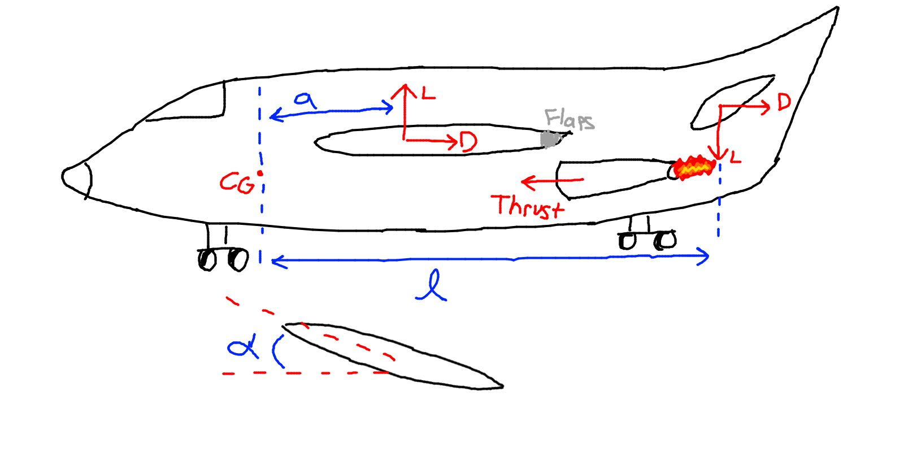
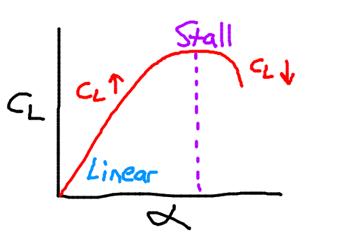
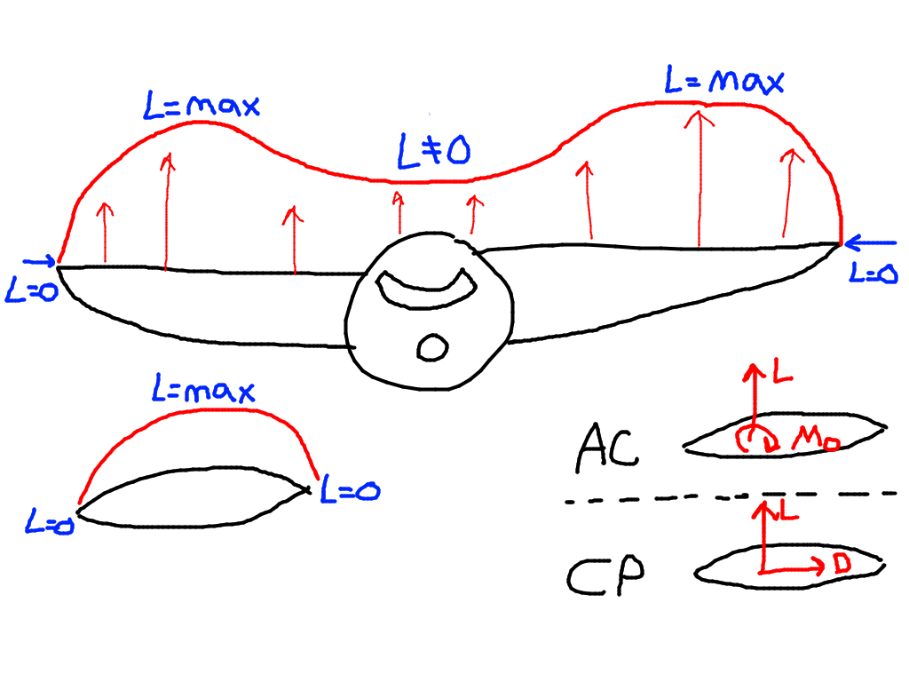

| Number    | Function                  | Part          |
| ---       | ---                       | ---           |
| 1         | Payload                   | Fuselage      |
| 2         | Lift                      | Wing          |
| 3         | Stability                 | Stabilizers (Horizontal & Vertical)    |
| 4         | Control                   | Ailerons (roll), Elevators (pitch), Rudder (yaw) |
| 5         | Takeoff (T/O) & Landing   | High lift devices (e.g flaps), landing gear |
| 6         | Thrust                     | Engine |

Without a tail, we have instability...

$\Sigma M_{CG} = La \not = 0$

Adding the tail for stability we get:

$\Sigma M_{CG} = La - L_t l = 0$

Where:
- $L$ is the lift vector generated by the wings
- $a$ is the arm (length) from the center of gravity (CG) to the lift $L$
- $L_t$ is the lift vector generated by the tail (downwards)
- $l$ is the arm (length) from the center of gravity (CG) to the tail lift $L_t$ 

The weight of the aircraft, $W$, acts at the center of gravity, CG.

The lift force $L$ is calculated by:
- $L = C_L q S$
  
Where:
- $L$ is the lift
- $C_L$ is the coefficient of lift
- $q$ is given by the formula:
  - $\int v^2/2$
  - Represents the dynamic pressure
- $S$ is the area of the wing

When we increase the angle of attack $\alpha$, we increase the coefficient of lift $C_L$. This increases the lift $L$. Once in the air and cruising, we can lower the angle of attack $\alpha$ until the lift $L$ reaches its cruising value.
- If we increase $\alpha$ too much the lift will actually decrease due to flow separation (see graph below)

# Airframe

Purpose: 
- Resist and transmit loads applied to the aircraft
  - Ground loads (Takeoff & Landing)
  - Air Loads (Due to pressure distributions)
- Provide aerodynamic shape
- Protect the internals (passenger, cargo etc..) from environmental conditions

The lift is zero at the tip of the wing, maximum somewhere in the middle of the wing, and zero at the other tip of the wing.

However, in an actual aircraft, the fuselage also generates some lift!
- Looking at the wings and fuselage, the lift of an aircraft is ONLY zero at the either end of the wingspan.

## Center of Pressure vs Aerodynamic Center
The center of pressure, CP, is where the lift and drag forces act in an airfoil. The position is a function of the angle of attack $\alpha$.
- CP, position $= f(\alpha)$

The aerodynamic center is based on the geometry of the airfoil, and does not vary with the angle of attack. Here, we have a lift vector and a moment instead.
- AC, position $\not = f(\alpha)$

## Forces

$L = C_L q S$

Where
- $L$ is the lift force
- $C_L$ is the lift coefficient
- $q = \int \dfrac{v^2}{2}$
- $S$ is the wing area

The coefficient of lift $C_L$ varies with the angle of attack.
- Symmetric airfoil, stall occurs at $\alpha \approx 15 \degree$
- Cambered airfoil, stall occurs at $\alpha \approx 12 \degree$
- Stall is when the coefficient of lift stops increasing with angle of attack, and begins to decrease.

## Moments

$M = C_M q S c$

Where
- C_M is the moment coefficient
- q is the same as above for the forces... $q = \int \dfrac{v^2}{2}$
- $S$ is the wing area
- $c$ is the chord (a distance value) of the wing.

