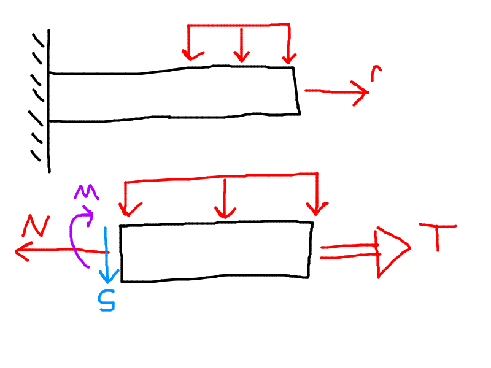
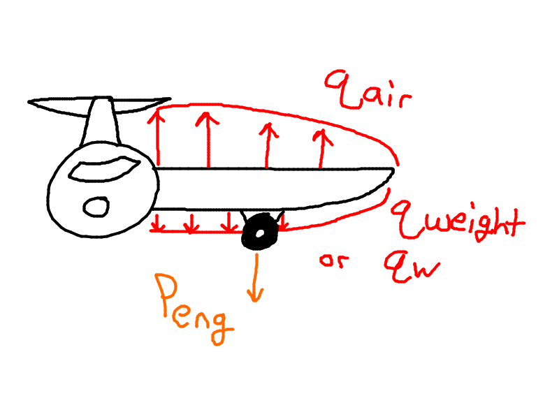
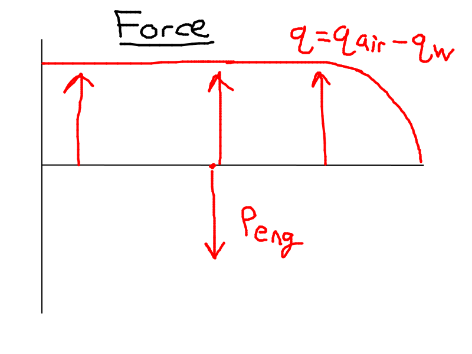
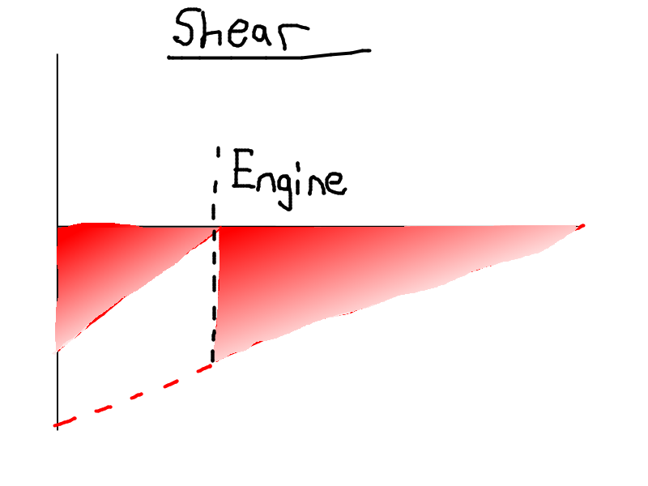
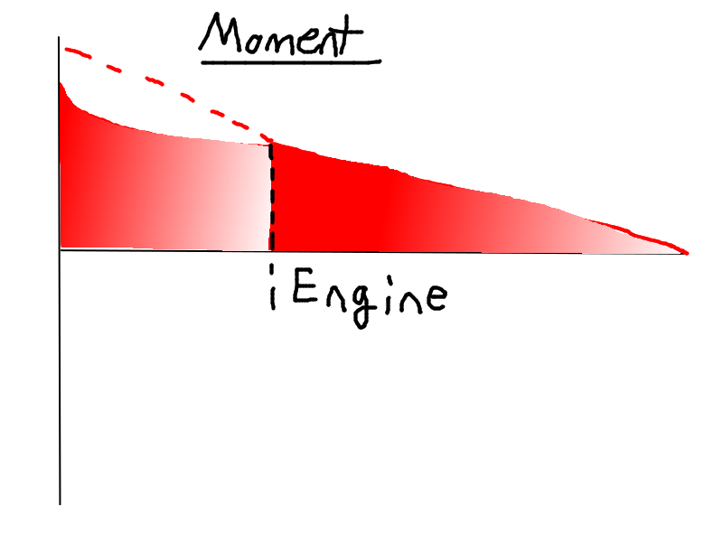
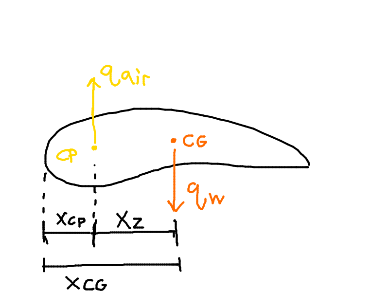
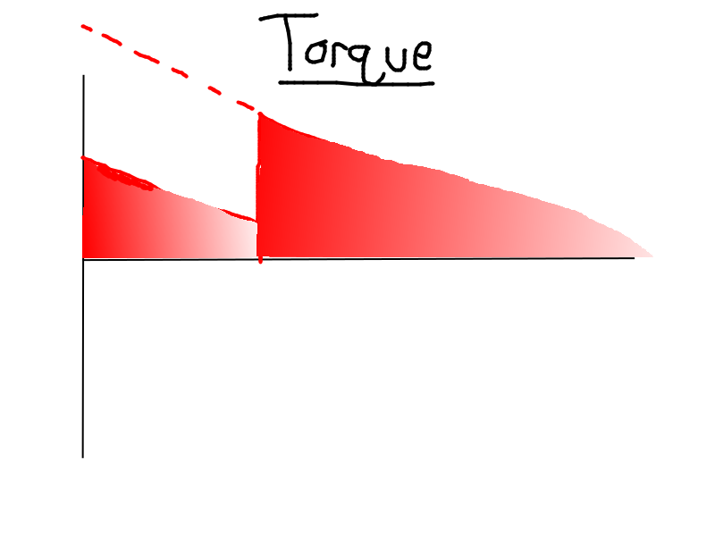

# Semi Monocoque Structure: Step By Step

To design a semi-monocoque structure, use the following steps:
1. Identify the external loads applied to the structure
   - Aerodynamic loads from the wings
   - Reactions
   - Weight(s) of object(s)
2. Calculate internal loadings in the cross-sections of interest
   - $N$ is normal force (textbook calls it a direct force)
   - $s$ is shear force (used to be V)
   - $M$ is the bending moment
   - $T$ is torque/torsion
   - 
3. Calculate stress in the cross-sections of interest
   - $\sigma$ is normal stress (textbook calls it a direct stress)
   - $\tau$ is the shear stress
4. Design structure so that it can support the external loads
   - $\sigma_i < \sigma_{allow}$
   - $\sigma_{allow}$ is a function of $\sigma_{yield}$ and Factor of Safety (F.S, or S.F)

Steps 3 and 4 are the focus of this class.

# Wing as a Cantilever Beam

- The wing can be approximated/modelled as a cantilever beam.
- The distributed load is the difference $q = q_{air} - q_{weight}$
- The wing (and any structure) can be thought of as a "conductor" of forces, wherein it conducts force from the source, to where it is attached. In the case of the wing, it conducts from the wing to where it attaches to the fuselage.

## Force, Shear, Moment and Torque Diagrams

We can represent the forces on the wing/cantilever beam as follows:
- $q$ = $q_{air}$ - $q_{weight}$
- 

Then we can represent the shear force in the following diagram:
- $S = \huge \int_{\frac{L}{2}}^{z} \normalsize qdz +  \sum_{i=1}^{N} \normalsize P_{eng,i}$
- 

Then, the bending moment diagram:
- $M = \huge \int_\frac{L}{2}^{z} \normalsize S dz$
- 
- 
Finally, the torque diagram:
- $m_z = q_{air} (x_z - x_{cp}) + q_w(x_{cg} - x_z)$
- 
- 

# Wing Structure

The skin of an aircraft wing is the outer surface and can be made of composite or metal. The skin is supported by spars and ribs.
- Spars run down the length of the wing and resist the bending moment. The spar fits between and is locked in by the ribs and stringers.
- Ribs run perpendicular to the length of the wing and resist torque/twisting. Typically two ribs.
- Stringers support the spar and keep it anchored. Typically a number of these.

Stringers are fastened to the skin by various methods, for example by rivets, bonding or glue.

The stringer fits in gaps from the rib

Spar webs and ribs are fastened together.

