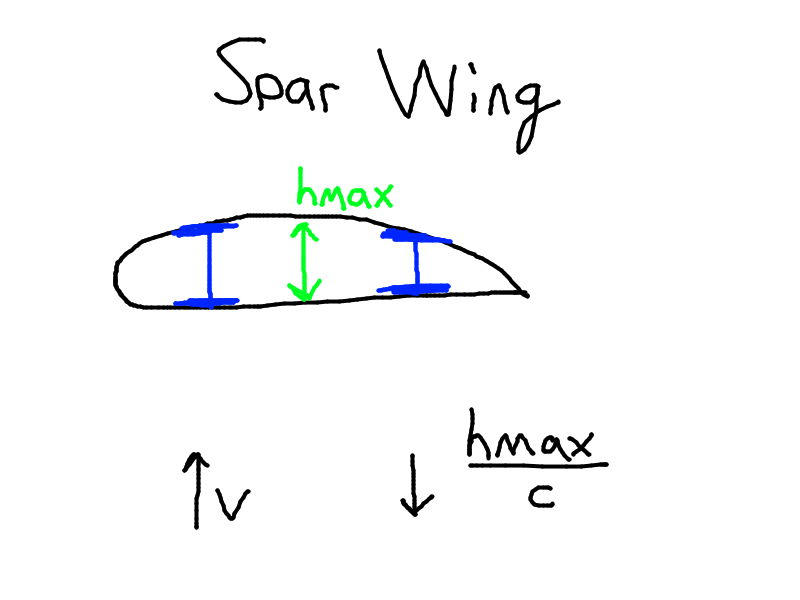

# Functions of Airframe Components

Here, $m_{skin}, m_{stringer}, m_{spar}, m_{ribs}$ all refer to mass values.

## Skin
- Creates the aerodynamic shape
 - Transfers $q_{air}$ to ribs & stringers
 - Forms closed section to resist torsion $T$
 - Resists bending moment $M_b$, develops normal stresses $\sigma_z$

$\bar m_{skin} \le \dfrac{m_{skin}}{m_{wing}} \le 0.2 \textrm{ to } 0.4$

### Spar and Caisson Wings

As $V \uparrow$, we find $\dfrac{h_{max}}{c} \downarrow$. This means TODO

## Stringers
- Supports skin against global buckling
- Resists bending moment $M_b$, develops normal stresses $\sigma_z$

$\bar m_{stringer} = 0.04 \textrm{ to } 0.08$ for spar wings

$\bar m_{stringer} = 0.25 \textrm{ to } 0.30$ for caisson wings

TODO diagrams

## Spars

Caps
- Resist bending moment $M_b$, develops normal stresses $\sigma_z$

Webs
- Transfer shear force $S$, develops shear stress $\tau$
- Closed section resists torsion $T$, develops shear stress $\tau$

$\bar m_{spar} = 0.23 \textrm{ to } 0.28$ for spar wings

$\bar m_{spar} = 0.07 \textrm{ to } 0.11$ for box wings

## Ribs
  
- Creates aerodynamic shape
- Transfers loads from the skin and stringers to the spar
- Supports the skin against global buckling

# Airframe Loads

- Forces applied to the airframe to establish its straight level

## Straight Level Flight

- $\sum F_y: L_{str} - W = 0$
- $L_{str} = W$

## Accelerating Flight

- $L' = L_{str} + \Delta L$
- $L' - W = ma$
- $L' = L_{str} + \Delta L = W + ma$

We know $W = mg \rightarrow m = \dfrac{W}{g}$
- $L' = L_{str} + \Delta L = W\left(1 + \dfrac{a}{g}\right)$

We let $n = 1 + \dfrac{a}{g}$ and call it the **Load Factor**

# Extreme Loads

$L' = L_{str} + \Delta L$
- $L_{str} = C_L \dfrac{\rho v^2}{2} S$
- $\Delta L \leftarrow a \rightarrow n$

Extreme loads can be achieved due to extreme combinations of $C_L$, $v$, and $n$
- $C_L(\alpha) = C_{L, max}$
- $v = v_{max}$
- $n = n_{max}$
- plus any configuration changes that may change the  load distribution

## Case A - Steep Climb

We have the maximum angle of attack, $\alpha = \alpha_{max}$
- This gives us the maximum coefficient of lift $C_{L, max}$
- As well as the highest load factor $n_{max}$
- We can find the acceleration by $a = \dfrac{v^2}{R}$
  - R is the radius of the climb.

## Case A' - Recovery from a dive

We have the max load factor $n_{max}$ occuring at the maximum velocity $v_{max}$

## Case C - Dive with deflective ailerons

Recall ailerons are responsible for rolling. They deflect the air and cause the aircraft to roll. Diving with deflective ailerons means it's diving while rolling.

Here we have maximum velocity, zero coefficient of lift (since we're diving, aka going straight down).
- $v = v_{max}$
- $C_L = 0$
- We have very large torques as a result.

## Case D - Entering an Aerobatic Dive with load factor $n = n_{min}$

# Limit and Ultimate Loads

## Limit Load

- The maximum anticipated load that the aircraft will ever experience in its service life. The aircraft may reach this level of loading, once, a few times, or never in its entire life.
- Airframe must be able to support these limit loads without having permanent (plastic) deformation.

## Ultimate Loads

- $\textrm{Limit Loads} \times \textrm{Factor of Safety}$

## Factor of Safety

Factor of Safety $\approx$ 1.5
- Originates from the ratio of aluminum's ultimate strength to its yield strength. Stuck around through the years, even on non-aluminum components.

Rationale for the factor of safety:
- Approximations are used in the analysis, so the factor of safety acts as a safety cushion against any inaccuracies that may arise.
- Variation of material properties, including between different samples of the same material.
- Variation in fabrication and inspection standards & techniques
- Velocity $v$ and load factor $n$ are both under pilot control. The limit load can be exceeded under emergency conditions where the pilot has to do some crazy maneouvers.

# Maneouvers

## Case A' - Pull-out from a dive

- $R$ - radius of curve of the flight path
- $a = \dfrac{v^2}{R}$
- $L' - W \cos \theta = m \dfrac{v^2}{R}$
- $L' = W \cos \theta + \dfrac{W}{g} \dfrac{v^2}{R}$
- $L' = W \left(\cos \theta + \dfrac{v^2}{gR} \right)$
- $L' = Wn$
- where $n = \cos \theta + \dfrac{v^2}{gR}$

Note:
- At the lowest point, $\theta$ = 0
- This gives load factor $n = 1 + \dfrac{v^2}{gR} \le n_{max}$

Smaller turn radius $R$, and/or higher velocity V, both increase the load factor.
- $R \downarrow$ and/or $V \uparrow$ causes $n \uparrow$
- Severe pull-outs are possible with a low $R$ and a high $V$, that can create a load factor $n > n_{max}$