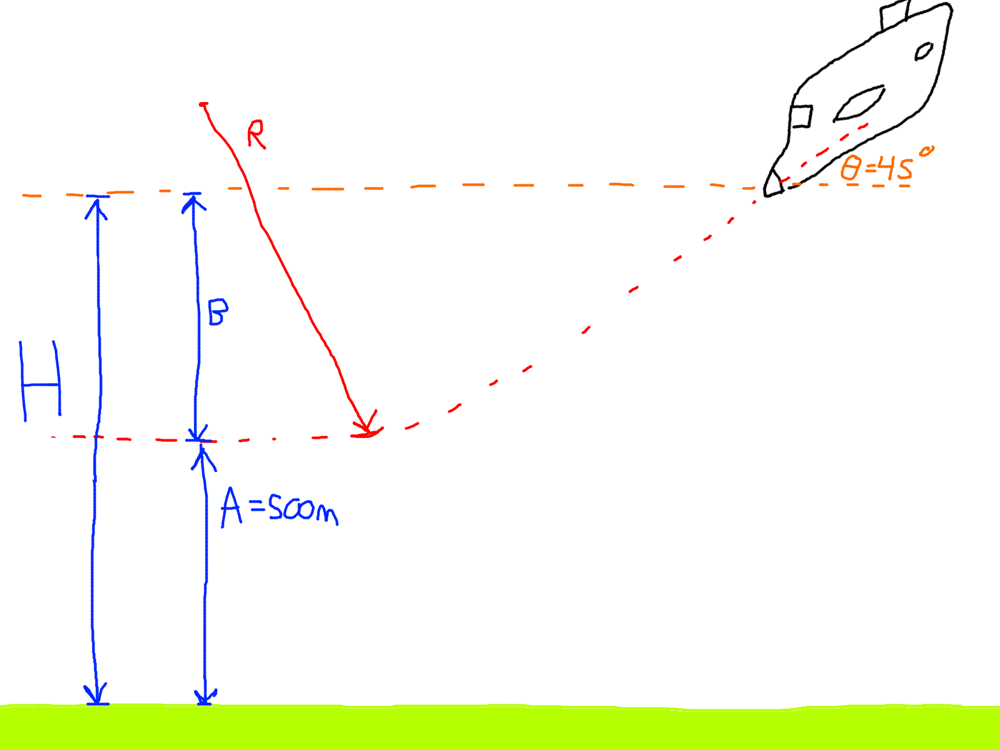
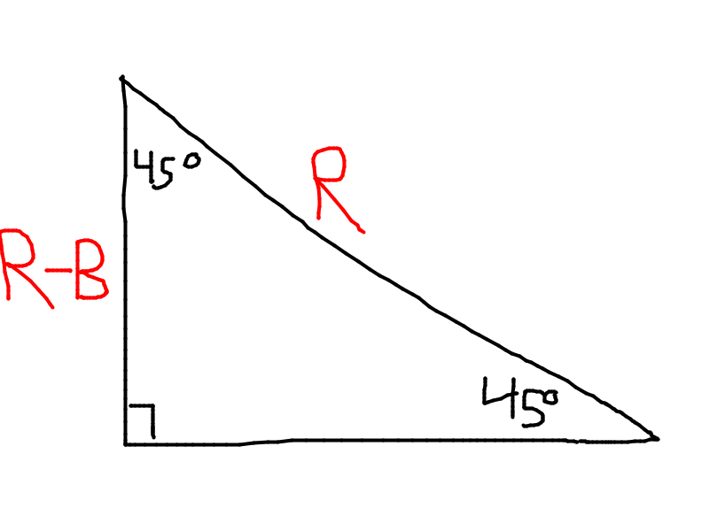
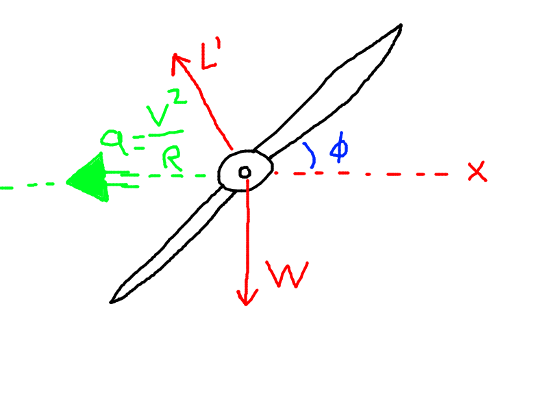
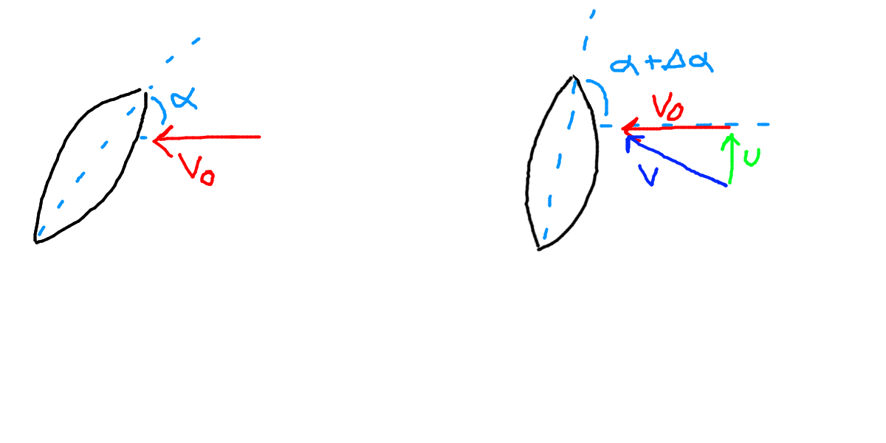
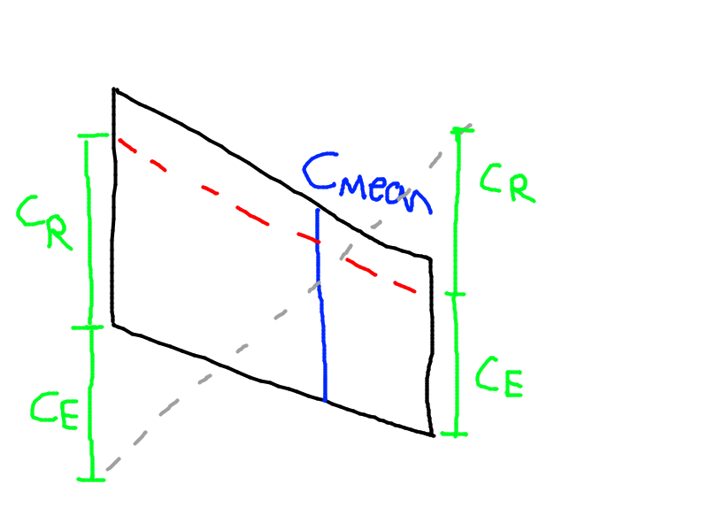

# Banked Turns

## Example 1

Semi-aerobatic aircraft reached its $v_{Max} = 185 \frac{m}{s}$ in dive, inclined at $45 \degree$. If $n_{max} = 5.5$, find the height $H$ at which the pull-out **must begin** to achieve straight level flight at $500m$ above the ground.

Solution

"Must Begin" in the problem statement implies we are proceeding to overstress.

We know
- $n = 1 + \dfrac{v^2}{gR} \le n_{max} = 5.5$

So we can find
- $R = \ge \dfrac{v^2}{g(n_{max}-1)} = \dfrac{185}{9.81*(5.5-1)} = 775$

Now we look at the triangle highlighted where the hypotenuse is the radius, and the height is $R - B$.
- $\dfrac{R-B}{\cos 45} = R$
- Solving... $B = 227m$

Now we know B, and A is given...
- $H = A + B = 500 + 227 = 727m$

End of example

---

- $\hat i: L' - \sin \phi = \dfrac{W}{g} \dfrac{v^2}{R}$
- $\hat j: L \cos \phi - W = 0$
- $n_{BT} = \dfrac{L'}{W} = \dfrac{1}{\cos \phi}$
- From this, we find:
  - As $\phi$ increases, $\cos \phi$ decreases, and $n$ increases.

$\dfrac{L_x'}{L_y'} = \tan \phi = \dfrac{v^2}{gR}$
- From this, we find:
  - As $R$ decreases, $\tan \phi increases, $\phi$ increases, and $n$ increases.
  - $R$ decreasing here may cause overstressing.

## Example 2

A military aircraft has a maximum load factor $n_{max} = 6$, lift coefficient $C_{L, max} = 1.25$, wing area $S_{wing} = 16m^2$, weight $W = 50kN$. The air density is $\rho = 1.223 kg/m^3$

Find the following values for a turn with velocity $v = 180 m/s$:
1. $\phi$, the angle of the banked turn
2. $R$, the radius of the curve

TODO finish

# Gust Loads

Gust loads are caused by turbulence. They produce two effects:
1. An increase in the angle of attack $\alpha$ which causes the coefficient of lift $C_L$ to increase.
   - $\alpha \uparrow$ which causes $C_L \uparrow$
   - We can find $\Delta \alpha = \dfrac{u}{v}$ where $u$ is the gust, and $v$ is TODO

2. An increase in the velocity TODO $v$ which causes an increase in the dynamic pressure $q = \dfrac{\rho V^2}{2}$
   - $v \uparrow$, which causes $q \uparrow$
   - $v = \sqrt{v_o^2 + u^2} \approx v_0$ as $v_0 \gg v$

Looking at the $C_L$ and $\alpha$ graph:
- $\Delta L = \left(\dfrac{\partial C_L}{\partial \alpha}\right) \dfrac{\rho v^2}{2} S$
- $\Delta L = \dfrac{\partial C_L}{\partial \alpha} \dfrac{u}{v} \dfrac{\rho v^2}{2}S$
- We see $v$ cancel on the second and third terms
- $\Delta L = \dfrac{\partial C_L}{\partial \alpha} \dfrac{\rho v}{2} u S$

We then look at the load factor
- $\Delta n = \dfrac{\Delta L}{w} = \dfrac{\partial C_L}{\partial \alpha} u \dfrac{\rho v}{2} \dfrac{S}{w}$
- The two $w$ terms cancel
- $\Delta n = \dfrac{\partial C_L}{\partial \alpha} \dfrac{\rho v}{2 \bar w} u$
- We find that $n = 1 + \Delta n$
- $n = 1 + \dfrac{\partial C_L}{\partial \alpha} \dfrac{\rho v}{2\bar w} u$
  - where $\bar w$ is the wing loading

From this, we can say that a high speed aircraft with low or moderate wing loading will be more affected by gusts.
- $n = f(v, \dfrac{1}{w})$

# Example 3
- Example 14.8 in the textbook

### Aircraft Characteristics

- Wing area $S_W = 60m^2$ 
- Mean chord $C_{mean} = 2.6m$ 
- Drag coefficient $C_{D} = 0.02 + 0.04C_L^2$ 
- Lift coefficient slope for the wing $\dfrac{\partial C_L}{\partial \alpha}_{Wing} = 4.5$
- Lift coefficient slope for the tail $\dfrac{\partial C_L}{\partial \alpha}_{Tail} = 2.2$
- Tail area $S_{tail} = 10m^2$
- TODO idk $C_m = -0.03$

### Flight Conditions
- $v_{glide} = 245 m/s$
  - Gliding, so zero thrust.
- $C_L$ = 0.09$
- $\rho_{air} = 1.223$
- $u = 5 m/s$

### Find

- $P$ (tail load)
- $n_{gust}$ (load factor)

### Solution

First, lets determine the angle of the lift vector. If the angle is small enough, we can just assume that the lift acts vertically and ignore any vector components, making the calculation simpler.
- $W = \dfrac{\rho v^2}{2} S_w \left(\dfrac{\partial C_L}{\partial \alpha} \alpha_w \right)$
- $\alpha_W = \dfrac{2W}{\rho v^2 S_w \dfrac{\partial C_L}{\partial \alpha}}$
- $\alpha_W = 0.015 rad \approx 0.87 \degree$.

This angle is small enough that we don't care about it, and we assume the lift acts vertically.

Now we look at the moment about the center of gravity
- $M_{CG} = 0.6L - 0.5D + M_o - 9.0P = 0

The only unknown is $P$.
- $L = W - P$
- $D = C_D \dfrac{\rho v^2}{2} S_W$
  - $C_D = 0.02 + 0.04(C_L)^2$ 
  - $C_D = 0.02 + 0.04(0.09^2) = 0.02$
  - $\therefore D = 0.02 \dfrac{1.223 (245)^2}{2} 60 = TODO$
- $M_o = C_m \dfrac{\rho v^2}{2} S_w c_{mean}$

Solving all this and calculating P we get:
- $P = -10813 N$

We can use $P$ to find the lift, and then the lift to find the load factor.
- $L = W - P = 150000 + 10813 = 160 813$
- $\Delta L = \dfrac{\partial C_L}{\partial \alpha}_{wing} \dfrac{\rho v}{2} u S_w$
- $\Delta L = 202254 N$
- $\Delta P = \dfrac{\partial C_L}{\partial \alpha}_{tail} \dfrac{\rho v}{2} u S_T$
- $\Delta P = 16480$

Finally, the load factor:
- $n = 1 + \Delta n = 1 + \dfrac{\Delta L + \Delta P}{w} = 2.46$

TODO finish