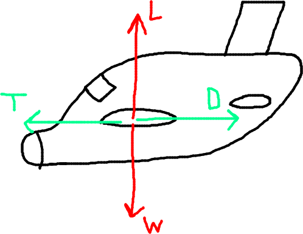
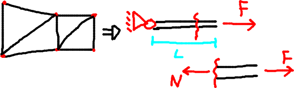
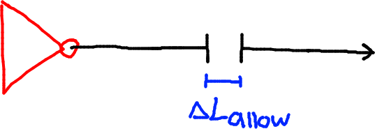
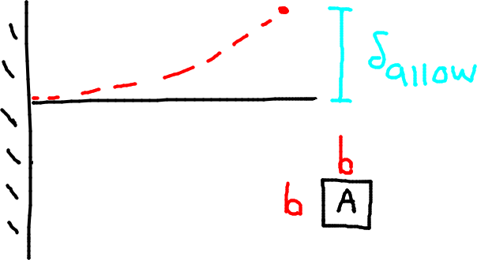
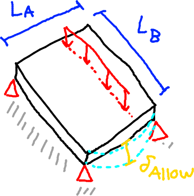
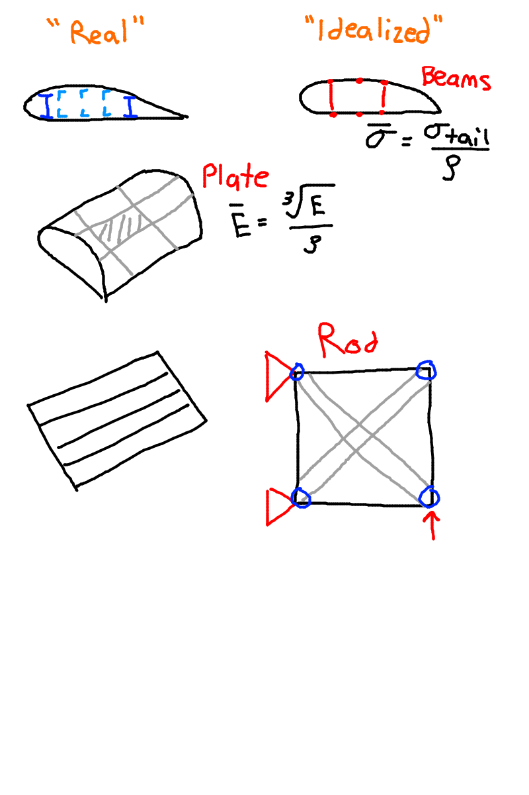

- [Material Selection in Aerospace Engineering](#material-selection-in-aerospace-engineering)
  - [Fuel Consumption](#fuel-consumption)
  - [Reducing Fuel Consumption](#reducing-fuel-consumption)
- [Structural Idealization:](#structural-idealization)
  - [Rod](#rod)
  - [Beam](#beam)
  - [Plates](#plates)
  - [Summary](#summary)
    - [Rod:](#rod-1)
    - [Beam](#beam-1)
    - [Plates](#plates-1)
    - [Overall](#overall)

# Material Selection in Aerospace Engineering

## Fuel Consumption

Airbus 330 Neo-900
- $5.94 kg/km$ fuel usage
- $11000km$ range
- $~65,000 kg * 0.5/kg = 33,000 / \textrm{flight}$

If you fly once per day with a cost of $33,000 per flight, then you can expect about a million dollars a month.

- $Q_{hr}$ - amount of fuel consumed in an hour
- $TSFC$ - thrust specific fuel consumption

In the diagram above we see:
- $L = W$
- $k = \dfrac{L}{D}$ => "aerodynamic quality"
- $T=D=\dfrac{L}{K} = \dfrac{W}{K}$

Using this we can find:
- $Q_{hr} = TSFC * T = \dfrac{TSFC}{k}W$

## Reducing Fuel Consumption

Having winglets reduces fuel consumption by ~5%.

Looking at the mass fractions:
- $m = m_{payload} + m_{fuel} + \dots + m_{eng} + m_{airframe}$
- $m_{airframe} \approx 25$% to $30$% of the aircraft.

Lowering the mass of the airframe decreases the fuel and engine mass required, which reduces the total mass. This reduces the weight, which reduces the fuel consumed, reducing operating expenses.
- $m_{airframe} \downarrow$ causes $m \downarrow$, which causes $W \downarrow$, which causes $Q_{hr} \downarrow$, which makes operating costs $ \$\$ \downarrow$

To lower the mass of the airframe, we want to use a **LIGHTWEIGHT** material.

# Structural Idealization: 

- Rods (2 face members)
- Beams (bending)
- Plates

To do this, we have the following criteria:

Objective:
- Minimum Mass

Constraints:
- Strength, Stiffness etc.

Variables:
- Cross-sectional area, thickness....

## Rod

We want a lightweight and strong rod.

- $M = 3AL$
- $\sigma = \dfrac{N}{A} = \dfrac{F}{A} \le \sigma_{Fail}$
- $A \ge \dfrac{F}{\sigma_{fail}}$
- $A_{min} = \dfrac{F}{\sigma_{fail}}$
- $m = \rho AL$
- $m = \dfrac{\rho}{\sigma_{fail}}FL$

We can state the specific strength $\bar{\sigma}$ (sigma bar) as:
- $\bar{\sigma} = \dfrac{\sigma_{fail}}{\rho}$

And the mass $m$
- $m = \dfrac{FL}{\bar{\sigma}}$

If we want to reduce the mass, we need a material with a high $\bar{\sigma}$

- $m = \rho A L$
- $\sigma = \epsilon E$ in the linear elastic region
- $\sigma = \dfrac{F}{A} = E \dfrac{\Delta L}{L}$

We can state the specific stiffness $\bar{E}$ as:
- $\bar{E} = \dfrac{E}{\rho}$

Then we can look at the length in the picture above.
- $\Delta L = \dfrac{FL^2}{AE} \le \Delta L_{allow}$
- $A \ge \dfrac{FL^2}{E \Delta_{allow}}$

The mass in terms of this length can be expressed as:
- $m = \dfrac{\rho}{E} * \dfrac{FL^2}{\Delta L_{allow}}$
- Here, $\rho$, $E$ are material properties.

If we want to reduce the mass, we should increase # TODO

## Beam

We want a lightweight and stiff beam

The beam's cross section is seen in the image above.
- $A = b^2$
- $I = \dfrac{b^4}{12} = \dfrac{A^2}{12}$

Looking at $\delta$, the deflection of the beam:
- $\delta = C_1 \dfrac{FL^3}{EI} \le \delta_{allow}$
  - $C_1$ depends on the boundary conditions
- $\delta = \dfrac{12C_1}{k_1} * \dfrac{FL^3}{EA^2} \le \delta_{allow}$
- $A \ge \sqrt{\dfrac{k_1 FL^3}{\delta_{allow}E}}$

Looking at the mass:
- $m = \dfrac{\rho}{\sqrt{E}}L\sqrt{\dfrac{k_1 FL^3}{\delta_{allow}}}$
- $\rho$, $E$ are material properties.

The specific stiffness $\bar{E}$ is:
- $\dfrac{\sqrt{E}}{\rho}$

## Plates

- $\delta_{allow} = C_2 \dfrac{qL^3}{EI}$
- $I = \dfrac{L_Bt^3}{12}$
- $\delta = 12C_2 \dfrac{q L_A^3}{E L_B t^3} \le \delta_{allow}$
  - $12C_2 \rightarrow k_2$

Looking at the thickness:
- $t_{min} = $\sqrt[3]{k_2 \dfrac{q L_A^3}{E L_b \delta_{allow}}}$

Looking at the mass:
- $m = \rho L_A L_B \dfrac{1}{\rho \sqrt{E}} \sqrt[3]{k_2 \dfrac{qL_A^3}{k_2 L_B \delta_{Allow}}}$

Looking at the specific stiffness:
- $\bar{E_{plate}} = \dfrac{\sqrt[3]{E}}{\rho}$

## Summary

### Rod:

Specific Strength
- $\bar{\sigma} = \dfrac{\sigma_{fail}}{\rho}$

Mass
- $m = \dfrac{FL}{\bar{\sigma}}$

Specific Stiffness
- $\bar{E} = \dfrac{E}{\rho}$

### Beam

Specific Strength:
- Unknown

Mass
- $m = \dfrac{\rho L}{\sqrt{E}}\sqrt{\dfrac{k_1 FL^3}{\delta_{allow}}}$

Specific Stiffness:
- $\bar{E}_{beam} = \dfrac{\sqrt{E}}{\rho}$

### Plates

Specific Strength:
- Unknown

Mass:
- $m = \rho L_A L_B \dfrac{1}{\rho \sqrt{E}} \sqrt[3]{k_2 \dfrac{qL_A^3}{k_2 L_B \delta_{Allow}}}$
  - note: this is a cube root, not a square root!!

Specific Stiffness
- $\bar{E}_{plate} = \dfrac{\sqrt[3]{E}}{\rho}$

### Overall

One note we can make is that the stiffness equation is very similar for the three components.

- $\bar{E} = \dfrac{E^\frac{1}{\lambda}}{\rho}$
  - The $\dfrac{1}{\lambda}$ is an exponent, and lambda is the material index.
  - $\lambda = 1 \rightarrow$ rod
  - $\lambda = 2 \rightarrow$ beam
  - $\lambda = 3 \rightarrow$ plate

