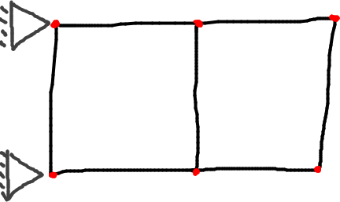
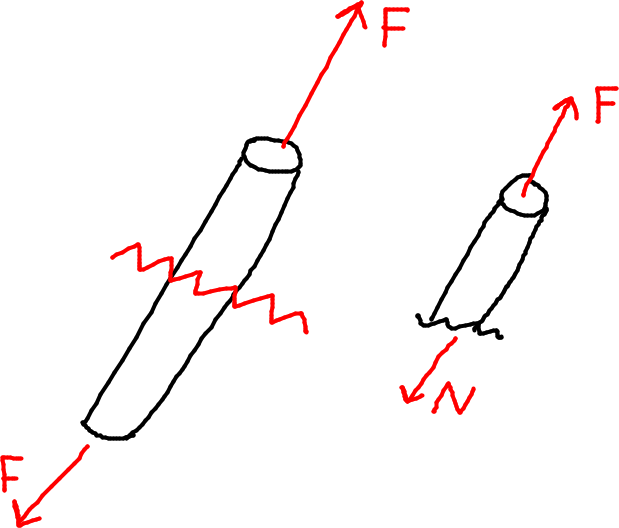
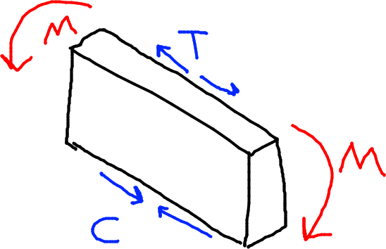
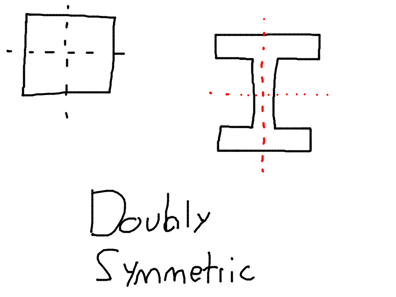
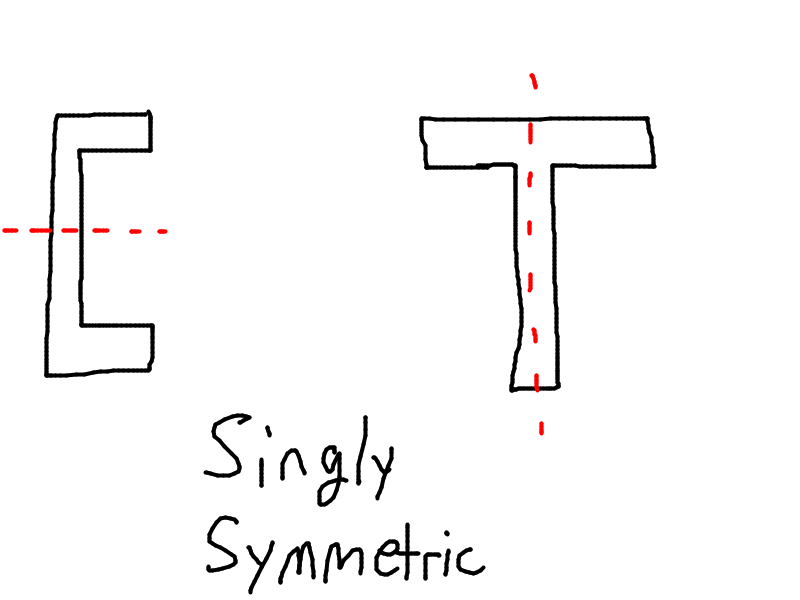
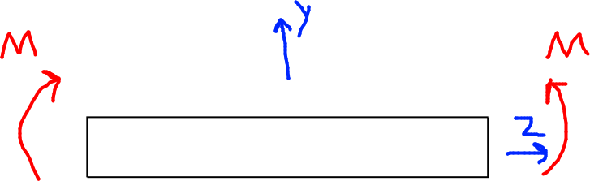
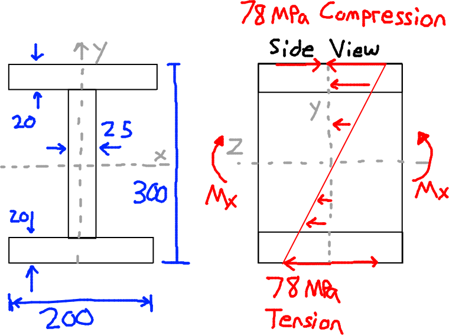
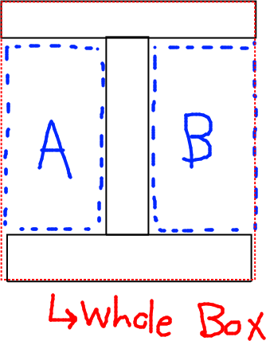
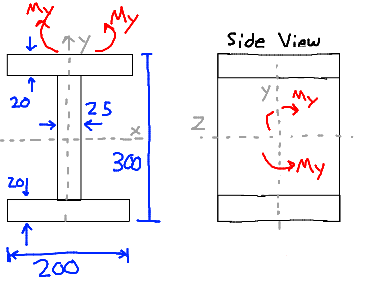

- Consists of beam/rods/2-force members, all mean the same thing.

- $N \rightarrow \sigma = \dfrac{N}{A}$

# Beams

- Top fibres are in tension
- Bottom fibres are in compression
- Along the neutral plane, neither tension nor compression

Consider the image below

Find $\sigma=f(y)$

Assume:
- Cross section remains straight and perpendicular to longitudinal fibers
- Material is linearly elastic

For stress, we find:
- $\sigma_z = -\dfrac{Ey}{R}$

For strain, we find:
- $\epsilon_z = -\dfrac{y}{R}$

Based on the integral $-\dfrac{E}{R} \int_A ydA =0$, and knowing that $\int yda$ is the first moment of area:
- This can only be zero when $y_c = 0$, in other words, when the centroid lies on the neutral axis.
- So we know that $\sigma = 0$, $\epsilon$ = 0 when lying on the neutral axis or the centroidal axis (same thing)
- **Neutral Axis passes through the CENTROID of the cross section**

After some more derivation, we can find the Bending Flexure Formula:
- $\sigma_z = \dfrac{M_x}{I_{xx}}y$

Note:
- Normal strain varies linearly as you travel up or down the cross section
- If we have a negative moment (like a smile), stress is negative above the NA (compression), and positive below the NA (tension)

Flexural Stiffness is $EI$, and is found in the equation for curvature:
- $\kappa = \dfrac{M}{EI}$

   

# Example 6.1

- Note, $78 MPa$ is the answer, not a given value.
- Given $M_x = -100 kNm$
- Given dimensions pictured above

## Solution

We have to find $\sigma_z = f(y)$

Using the flexure formula:
- $\sigma_z = \dfrac{M_x}{I_{xx}}y$

We first need to find $I_{xx}$.
- $I_{xx} = I_{\textrm{outer whole box}} - I_A - I_B$
- See the picture below

- $I_{xx} = \dfrac{200\times300^2}{12} - \dfrac{(200-25)(300-(2\times20))^2}{12} = 193.7\times10^6 mm^4$

Now we can find stress:
- $\sigma_z = \dfrac{-100 \times 10^6 Nmm}{193.7\times10^6 mm^4}y = -0.52y$
- $\sigma_z = -0.52y$

Now we can find the max and min stress, at the max and min values of $y$ respectively.
- At $y=150mm$, $\sigma_z = -78MPa$
- At $y=-150mm$, $\sigma_z = 78 MPa$
- This means that the top of the I-beam is in compression, and the bottom in tension.

# Example 6.2

Same beam as example 6.1. However, now the moment acts about the Y axis instead of the X.

This is the same picture as before

- $M_y = 100 kNm$

We solve for $I_{yy}$ instead of $I_{xx}$ this time, since the moment is about the Y axis. Instead of $\textrm{Big outer box} - (\textrm{A + B})$
- We look at $(2\times \textrm{flange bar}) + \textrm{web}$
- $I_{yy} = 2\dfrac{20*200^3}{12} + \dfrac{260 * 25^3}{12} = 27*10^6 mm^4$

Then solve for stress as a function of $x$
- $\sigma_{z} = - \dfrac{100 * 10^6}{27 * 10^6} x = -3.7x$

Then we look at the left and right sides of the I-beam
- At $x=100mm$, $\sigma_x = -370 MPa$
- At $x = -100 mm$, $\sigma_x = 370 MPa$

This means that the right side of the I beam is in compression, and the left in tension.
