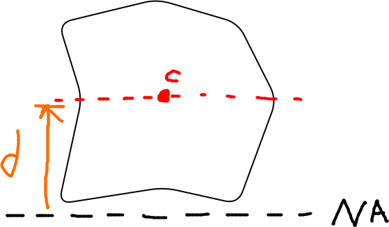
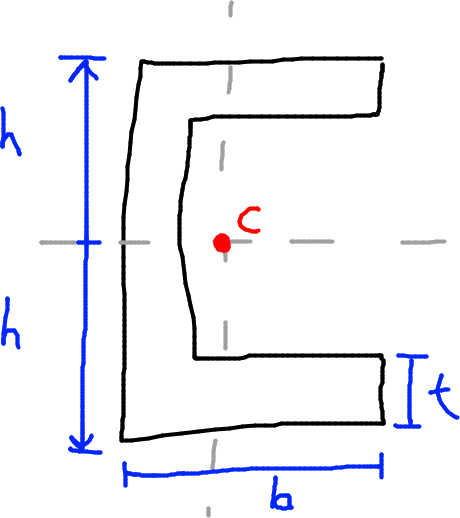
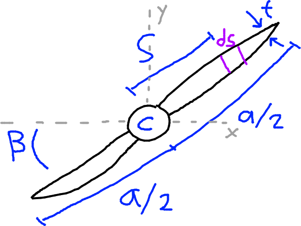
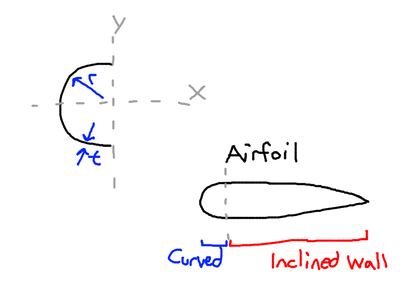

# Parallel Axis Theorem

- $I_N = I_C + Ad^2$
- $d$ might be replaced with $L$, means the same thing. Its the perpendicular distance from the neutral axis NA, to the centroidal axis C.

# Perpendicular Axis Theorem

If $I_{xx}$, $I_{yy}$ is known:
- $I_o = I_{xx} + I_{yy} \rightarrow$ Second polar moment of area
- I think $I_o$ is the moment of inertia about its own origin axis, like Z axis.

For a rectangular cross section:
- $I_{xx} = \dfrac{bh^3}{12}$
- $I_{xx, \textrm{base of rectangle}}=\dfrac{bh^3}{3}$

For a circular cross section:
- $I_{xx} = I_{yy} = \dfrac{\pi d^4}{64}$
- $I_o = I_{xx} + I_{yy} = \dfrac{\pi d^4}{32}$

# Thin Wall Assumption

- If $t \ll \textrm{other dimensions}$ then we can omit higher powers of $t$, that is, $t^n$ where $n > 1$

For a C channel like pictured below, the following is true:

- $I_{xy} = 0 \rightarrow$ singly symmetric
- We neglect higher orders of thickness since $t \ll c, b$
- $I_{xx} = \dfrac{t(2h)^3}{12} + 2bth^2$

# Inclined Wall

- $I_{xx} = \dfrac{a^3 t \sin^2 \beta}{12}$
- $I_{yy} = \dfrac{a^3 t \cos^2 \beta}{12}$

# Curved Section

- $I_{xx} = \dfrac{\pi r^3t}{2}$

