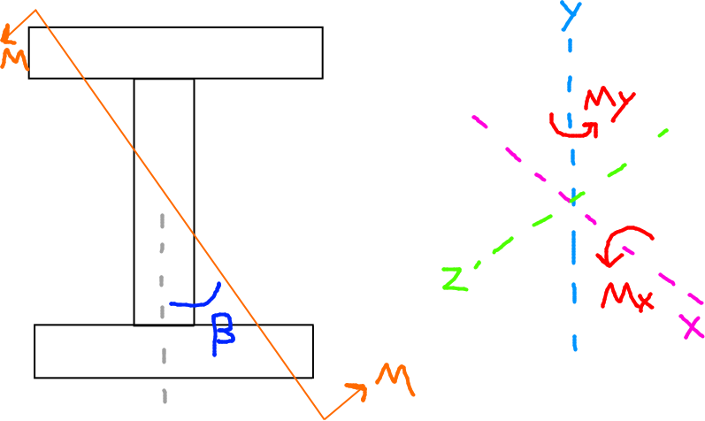
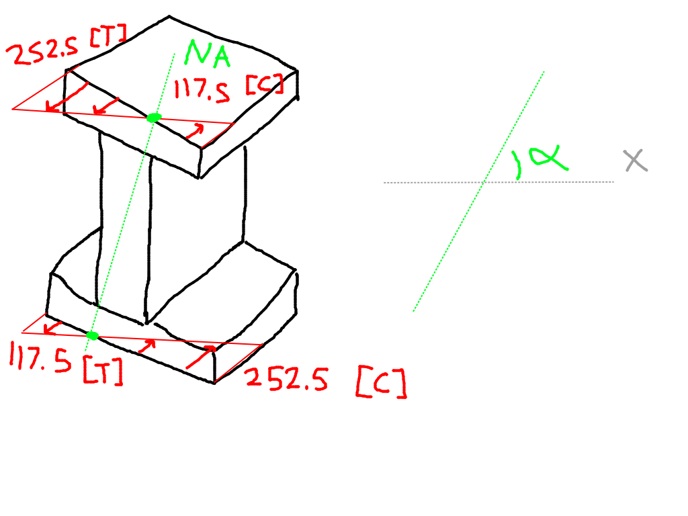
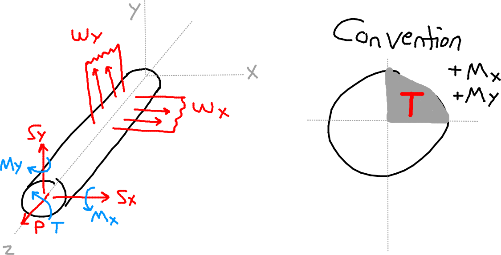
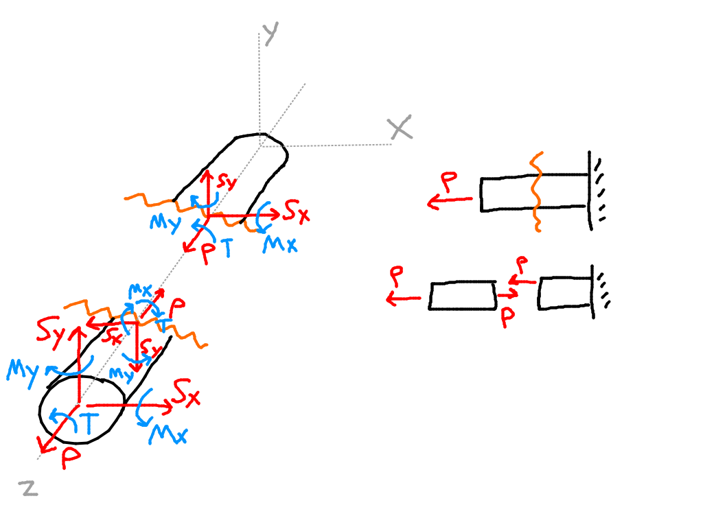
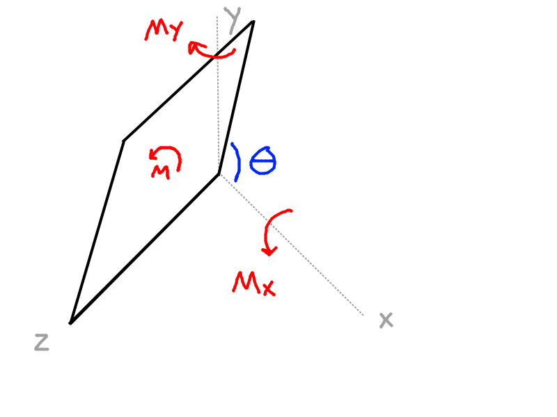

- $M = 100 kNm$
- $\beta = 30\degree$

Find: $\sigma_z$ distribution

We have to break $M$ into vector components.
- $M = [M_x, M_y]$
- $\sigma_z = \dfrac{M_x}{I_{xx}}y + \dfrac{M_y}{I_{yy}}x$

First, $M_x$:
- $M_x = M\cos \beta = 86.6 kNm$

Then, $M_y$:
- $M_y = M\sin \beta = 50 kNm$

Now find $\sigma_z$
- $\sigma_z = \dfrac{86.6 *10^6}{193.7 * 10^6}(y) - \dfrac{50*10^6}{27*10^6}(x)$
- $\sigma_z = 0.45y - 1.85x$

We can then find the stresses at each coordinate of interest.
- $[-100, 150]: \sigma_z = +252.5$
- $[+100, 150]: \sigma_z = -117.5$
- $[-100, -150]: \sigma_z = +117.5$
- $[+100, -150]: \sigma_z = -252.5$

- The NA line shows where the stresses are zero. We can find the angle $\alpha$ of this line.
- $\sigma = 0.45y - 1.85x = 0$
- $\dfrac{y_{NA}}{x_{NA}} = \dfrac{1.85}{0.45} = \tan \alpha \rightarrow \alpha = 76.3 \degree$

It can also be calculated by:
- Recall that $\sigma = \dfrac{M_x}{I_{xx}}y + \dfrac{M_y}{I_{yy}}x$ $\dots$
- $\tan \alpha = $\dfrac{y}{x} = -\dfrac{M_y I_{xx}}{M_x I_{yy}}$

# Asymmetrical Bending

## External Loads

- $w$ is distributed loads, direction is in the positive axis
- $M$ are moments about their corresponding axes
- $P$ is an applied load
- $T$ is the torsion about the Z axis

## Internal Loads

- If $\theta < 90\degree$: $M_x > 0$, $M_y > 0$
- If $\theta > 90 \degree$: $M_x > 0$, $M_y < 0$

# Material Properties

- $\sigma_z = E \epsilon_z = \dfrac{\zeta}{\rho}$
  - $\zeta$ is "Zeta"

After derivation:
- $\sigma_z = \dfrac{I_{xx} M_y - I_{xy} M_x}{I_{xx}I_{yy} - I_{xy}^2}(x) + \dfrac{I_{yy} M_x - I_{xy} M_y}{I_{xx}I_{yy} - I_{xy}^2}(y)$

Another form, factoring for $M_x$ and $M_y$ instead:
- $\dfrac{I_{yy}*y - I_{xy}*x}{I_{xx}I_{yy}-I_{xy}^2}(M_x) + \dfrac{I_{xx}*x - I_{xy}*y}{I_{xx}I_{yy}-I_{xy}^2}(M_y)$

Special Cases:

A:
- $M_y = 0, M_x \not = 0 \rightarrow \sigma_z = f(x,y)$
- $M_y \not = 0, M_x = 0 \rightarrow \sigma_z = f(x,y)$
- As long as one of them is non-zero, it's a function of both X and Y.

B:
- $C_x$ and/or $C_y$ (centroidal axes) are axes of symmetry
- Axis of symmetry $\rightarrow I_{xy} = 0$
- $\sigma_z = \dfrac{M_y}{I_{yy}}x + \dfrac{M_x}{I_{xx}}y$