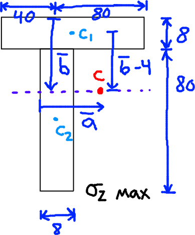
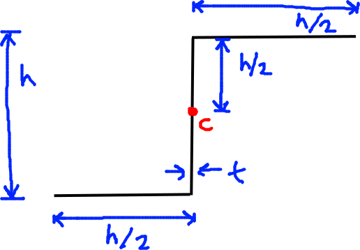
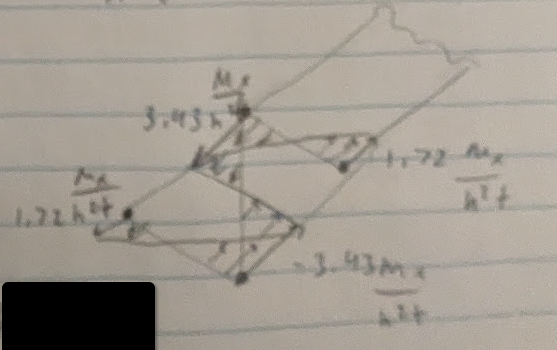

# Beams

We know $\sigma_z$ at the neutral axis $=0$
- $0 = \dfrac{I_{xx} M_y - I_{xy} M_x}{I_{xx}I_{yy} - I_{xy}^2}(x_{NA}) + \dfrac{I_{yy} M_x - I_{xy} M_y}{I_{xx}I_{yy} - I_{xy}^2}(y_{NA})$

We can find the angle of the neutral axis as:
- $\tan \alpha_{NA} = -\dfrac{y_{NA}}{x_{NA}} = \dfrac{M_y I_{xx} - M_x I_{xy}}{M_xI_{yy} - M_yI_{xy}}$

# Algorithm To Solve

1. Find the position of the centroid
2. Calculate $I_{xx}, I_{yy}, I_{xy}$
3. Use asymmetric bending equation to obtain $\sigma_z$ as a function of x, y
4. Use this function at each of the corners of the cross section to find the $\sigma_z$ distribution.

# Example 9.1

All dimensions are in  [mm] in the picture above.

**Step 1: Find the position of the centroid**
- $b = \dfrac{\sum b_i A_i}{A} = \dfrac{4*120*8 + 48*80*8}{120*8 + 80*8} = 21.6 mm$
- $a = \dfrac{\sum a_i A_i}{A} = \dfrac{24*120*8 + 4*80*8}{120*8+80*8}$

**Step 2: Calculate $I_{xx}, I_{yy}, I_{xy}$**

Remember: $I = \dfrac{bh^3}{12} + Ad^2$
- Where $b$ is the base, lying parallel to the axis of interest
- $h$ is the height, lying perpendicular to the axis of interest
- $A$ is the area of the section
- $d$ is the perpendicular distance from the centroid of the section to the overall centroid.

Calculating $I_{xx}$:
- $I_{xx} = \left[  \dfrac{120*8^3}{12} + (17.6^2)(120*8) \right] + \left[ \dfrac{8*80^3}{12} + (26.4^2)(80*8) \right]$
- $I_{xx} = 1.09*10^6 mm^4$

Calculating $I_{yy}$:
- $I_{yy} = \left[  \dfrac{8*120^3}{12} + (8^2)(120*8) \right] + \left[ \dfrac{80*8^3}{12} + (12^2)(80*8) \right]$
- $I_{yy} = 1.31*10^6 mm^4$

Calculating $I_{xy}$:
- $I_{xy} = I_{XY} + min\ A$
- We take note that $I_{XY} = 0$ (capital XY) due to there being an axis of symmetry 
- $I_{xy} = (17.6)(8)(120*8) + (-26.4)(-12)(80*8)M_x$
- $I_{xy} = 0.34 * 10^6 mm^4$

**Step 3: Find the stress distribution as a function of x, y**
- $\sigma_z = \dfrac{I_{yy}y - I_{xy}x}{I_{xx}I_{yy}-I_{xy}^2}$
- $\sigma_z = 1.5y - 0.39x$

# Example 9.2

Same procedure as before.

Step 1, find the centroid.
- We already know it from the diagram.

Step 2: Calculate the moment of inertias.
- First, we make the thin wall assumption and neglect higher orders of thickness.

Calculating $I_{xx}$:
- $I_{xx} = \left[\dfrac{\frac{h}{2} t^3}{12} + \dfrac{h}{2} \left(\dfrac{h}{2}\right)^2 \right] + \dfrac{th^3}{12}$
- $I_{xx} = \dfrac{h^3t}{3}$

Calculating $I_{yy}$:
- $I_{yy} = \dfrac{h^3t}{12} = \dfrac{1}{4} I_{xx}$

Calculating $I_{xy}$:
- $I_{xy} = \left(\dfrac{h}{2}\right)(t) \left(\dfrac{h}{4}\right)\left(\dfrac{h}{2}\right) + t \left(-\dfrac{h}{4}\right)\left(-\dfrac{h}{2}\right)$
- $I_{xy} = \dfrac{h^3t}{8}$

They're all similar, the denominators are different however.

Step 3: calculate $\sigma_z = f(x,y)$
- $\sigma_z = \dfrac{I_{yy}y - I_{xy}x}{I_{xx}I_{yy}-I_{xy}^2}M_x$
- $\sigma_z = \dfrac{M_x}{h^3t}(6.86y - 10.30x)$

Step 4:
- We solve it at four points, which are x, y = [x,y] as follows:

1. $\sigma \left[\dfrac{h}{2}, \dfrac{h}{2}\right]$
2. $\left[0, \dfrac{h}{2}\right]$
3. $\left[0, -\dfrac{h}{2}\right]$
4. $\left[-\dfrac{h}{2}, -\dfrac{h}{2}\right]$

We get:
- $\sigma_1 = -1.72 \dfrac{M_x}{h^2t}$
- $\sigma_2 = 3.43 \dfrac{M_x}{h^2t}$
- $\sigma_3 = -3.43 \dfrac{M_x}{h^2t}$
- $\sigma_4 = 1.72 \dfrac{M_x}{h^2t}$

# Shear of Beams - Intro

