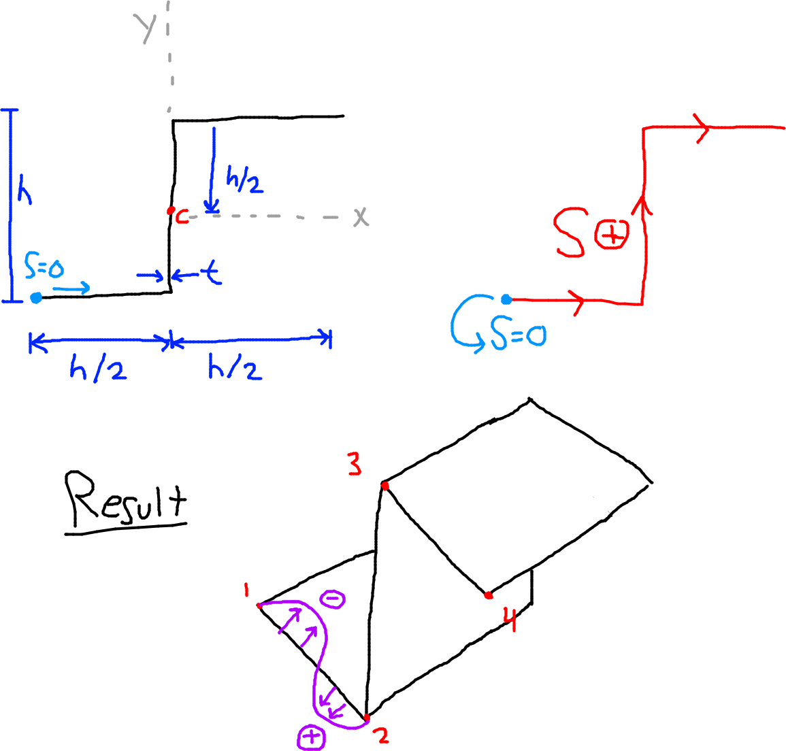

- [Shear of Thin Wall Beams](#shear-of-thin-wall-beams)
  - [Assumptions:](#assumptions)
  - [Ending of Lecture 9](#ending-of-lecture-9)
  - [Differential Element](#differential-element)
- [Shear of Open-Section Beams (OSB)](#shear-of-open-section-beams-osb)
- [Example 10.1](#example-101)
  - [Diagram](#diagram)
  - [Given:](#given)
  - [Analysis](#analysis)

# Shear of Thin Wall Beams

## Assumptions:

- No axial constraint (that might constrain the motion of the cross section)
- $\sigma_z$, $\tau$, constant across thickness
- Beam is uniform section
- Powers of $t$ are neglected

## Ending of Lecture 9

The previous lecture had a bit on thin wall beams but it's more relevant to put here.

Key Takeaways:

If we have a distributed load $W_x$ or $W_y$, the shear force in the beam is the derivative of the distributed load, and the moment is the derivative of the shear force. See the equation below (note, works for both x and y, just replace the subscript):
- $-W_x = \dfrac{\partial S_x}{\partial z} = \dfrac{\partial^2 M_x}{\partial z^2}$

Or in reverse order:
- $M_x = \int S_xdz = \int \int (-W_x dz) dz$

If $M \not \textrm{constant}$ then $S_y \not = 0$

## Differential Element

In the picture above, the diagrams the professor drew are combined into one. In orange is shear flow $q$, in red is normal stress $\sigma$, and in purple is shear stress $\tau$. The picture shows a differential element of a wing.

Looking at the differential element pictured above, we can use shear flow:
- $\dfrac{S}{L} = q$
- $\tau = \dfrac{q}{t} = \dfrac{S}{Lt}$
- $\tau_{sz} + \tau+{zs} = \tau$
- $q = \tau*t$

Summing the forces in the Z direction:
- $\sum F_z = 0$
- $\dfrac{\partial q}{\partial s} + \dfrac{\partial \sigma_z}{\partial s} t = 0$

Summing forces in S direction:
- $\dfrac{\partial q}{\partial z} + \dfrac{\partial \sigma_s}{\partial s}t = 0$

In the above two equations, $S$ and $Z$ refer to the sides, $q$ is shear flow, $t$ is thickness, $\sigma_z$ is normal stress.

# Shear of Open-Section Beams (OSB)

Consider an open-section beam of arbitrary cross-section supporting shear forces $S_x$ and $S_y$ such that there is **NO TWISTING** of the beam's cross section.

- This means the shear load passes through the **SHEAR CENTER** of the cross-section
- $\sigma_s = 0$
- $\dfrac{\partial q}{\partial s} + (t) \dfrac{\partial \sigma_z}{\partial z} = 0$

After some derivation:
- $\int \limits_0 ^s \dfrac{\partial q}{\partial s} ds = q_s - q_0 = \dots$ 
- If the origin of the S-axis is at the open edge: $q_0 = 0$
- General case if $q_0 = 0 \dots$
- $q_s = - \left ( \dfrac{S_x I_{xx} - S_y I_{xy}}{I_{xx} I_{yy} - I_{xy}^2} \right) \int \limits_0^s txds - \left ( \dfrac{S_y I_{yy} - S_x I_{xy}}{I_{xx}I_{yy} - I_{xy}^2}\right) \int \limits_0^s tyds$

To simplify:

If either the X or Y centroidal axes are axes of symmetry, $I_{xy} = 0$. This simplifies the general formula:
- $q_s = - \dfrac{S_x}{I_{yy}} \int \limits_0^s txds - \dfrac{S_y}{I_{xx}}\int \limits_0^s tyds$

  

# Example 10.1

## Diagram

## Given:
- $S_x = 0$
- $S_y \not = 0$
- Thickness is constant $t$ everywhere.
- $S_y$ acts through the shear center (which is the centroid here)

## Analysis

$q_s = \dfrac{S_y I_{xy}}{I_{xx}I_{yy} - I_{xy}^2} \int \limits_0^s tx ds - \dfrac{S_y I_{yy}}{I_{xx}I_{yy} - I_{xy}^2}\int \limits_0^s ty ds$

First we find the geometric properties $I_xx$, $I_yy$, and $I_{xy}$:
- $I_{xx} = \dfrac{h^3t}{3}$
- $I_{yy} = \dfrac{h^3t}{12}$
- $I_{xy} = $\dfrac{h^3t}{8}$

Now plug these back into the original $q_s$ equation. Doing this we get:
- $q_s = \dfrac{S_y}{h^3} \int \limits_0^s \left(10.32x - 6.84y \right)ds$

For the bottom flange (1-2):
- $x = -\dfrac{h}{2} + S_1$
  - $S_1 \rightarrow \left[ 0, \dfrac{h}{2} \right]$
- $y = -\dfrac{h}{2}\rightarrow \textrm{constant}$
- Note: these coordinates are relative to the centroid, NOT the start of the S axis.
- $q_{1,2} = \dfrac{S_y}{h^3}\int \limits_0^{S_1}\left(10.32S_1 - \dfrac{10.32}{2}h + \dfrac{6.84}{2}h\right)$
- $q_{1,2} = \dfrac{S_y}{h^3} + 5.16S_1^2 - 1.74hS_1$

 

Looking at points 1 and 2:
- Point 1: $S_1 = 0 \rightarrow q_1 = 0$
- Point 2: $S_2 = + \dfrac{h}{2} \rightarrow q_2 = 0.42 \dfrac{S_y}{h}$

We note that the distribution of $q_{1,2}$ is a parabola with respect to $S_1$. We have to check if there's a zero/sign change. Find the roots (two of them):
- $S_1 = 0$
- $S_1 = 0.336h=0.672 \dfrac{h}{2}$