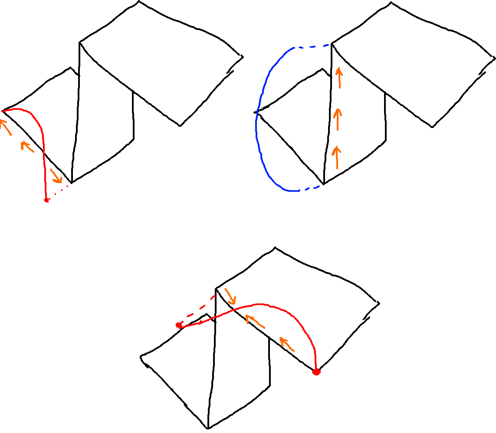
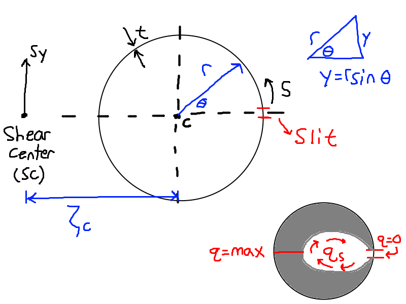
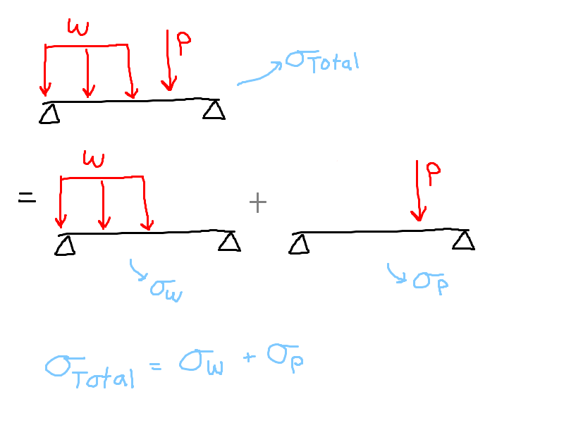
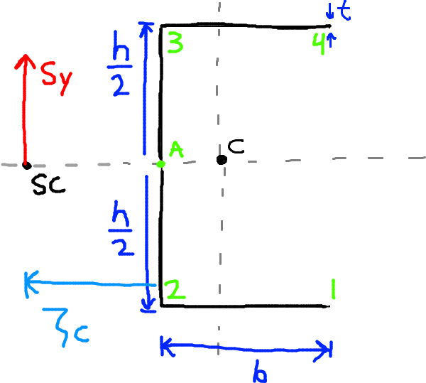
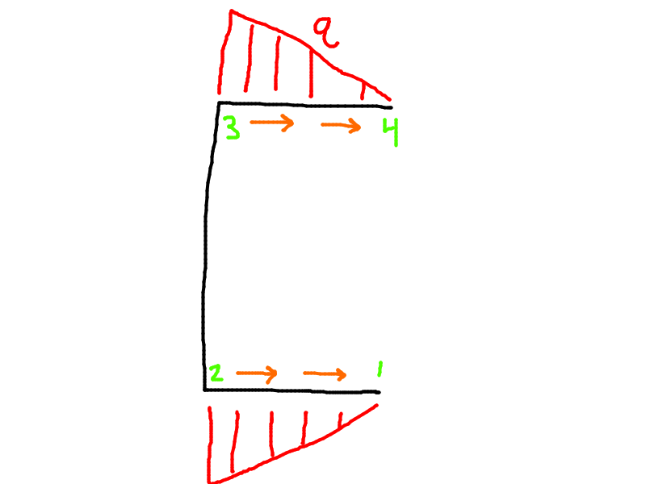

- [Example 11.1](#example-111)
  - [Web (2-3)](#web-2-3)
- [Shear Center](#shear-center)
- [Principle of Superposition - Review](#principle-of-superposition---review)
- [Algorithm to Find the Position of the Shear Center](#algorithm-to-find-the-position-of-the-shear-center)
- [Example 11.2](#example-112)
- [Example 11.3](#example-113)
  - [Step 1: Arbitrary $S\_y$](#step-1-arbitrary-s_y)
  - [Step 2, $q\_s$ distribution](#step-2-q_s-distribution)
  - [Step 3: Find the Shear Center](#step-3-find-the-shear-center)

# Example 11.1

**Continuing Example 10.1**

## Web (2-3)

Along Web 2-3, we can find the variation in shear flow distribution.
- $x = 0, \textrm{constant}$
- $y = -\dfrac{h}{2} + S_2$
  - $S_2$ goes from to $[0, h]$

Solving for the shear flow $q_{23}$:
- $q_{23} = \dfrac{S_y}{h^3} \int \limits_0^{S_2} \left(10.32(0) - 6.84(S_2) + \dfrac{6.84}{2}h\right)dS_2 + q_2$
- $q_2 = 0.42 \dfrac{S_y}{h}$, which is obtained from solving for the shear flow of web 1-2, $q_{12}$
- We get: $q_{23} = \dfrac{S_y}{h^3} \left(-3.42 S_2^2 + 3.42 hS_2 + 0.42 h^2 \right)$

Now that we have an equation for $q_{23}$ we can substitute in the points 2, and 3.
- Point 2:
  - $S_2 = 0$
  - $\therefore q_2 = 0.42 \dfrac{S_y}{h}$
- Point 3:
  - $S_2 = h$
  - $\therefore q_3 = 0.42 \dfrac{S_y}{h}$
- We note that $q_{23}$ is a parabola, and so the maximum is somewhere in the middle.

# Shear Center

# Principle of Superposition - Review

Superposition allows you to find the effects of various applied loads, distributed loads etc.. on stress and other parameters, by breaking the system down into multiple simpler systems and summing the results.

Principle of Superposition: $\sigma = \sigma_1 + \sigma_2 + \dots$

# Algorithm to Find the Position of the Shear Center

1. Apply arbitrary $S_y$ through the shear center
2. Calcualte the $q_s$ distributbion due to $S_y$
3. $S_y \zeta_S =$ Moment due to $q_S$
   - Use this to find $\zeta_S$

If there is symmetry, the shear center is on the symmetry axis.

Figure 6

# Example 11.2

There is a slit on the positive x axis quadrant of the cross section. This makes it an open-section beam.

The shear center (because it has a slit) is not on the cross section. This is the point where if force is applied, it will not cause twisting.

We want to find the shear flow (q) distribution.
- We have a singly symmetric beam here. $I_{xy} = 0$, $S_x = 0$
- $q_s = - \dfrac{S_y}{I_{xx}} \int \limits_0^S ty ds$
- $I_{xx} = 2I_{xy} = \pi r^3t$ for a semi circular cross section

Looking at the figure, we can draw a differential element and obtain:
- $y = r \sin \theta$
- $\dfrac{dS}{2} = r \sin \dfrac{d\theta}{2} = r \dfrac{d\theta}{2}$
- $dS = r d\theta$

Now we can plug this into the integral from above and switch to polar coordinates.
- $q_s = -\dfrac{S_y}{\pi r^3 t} \int \limits_0^\theta \left(t (r\sin\theta)(r)d\theta\right)$
- $q_s = -\dfrac{S_y}{\pi r} \int_0 ^\theta \sin \theta d\theta$
- $q_s = \dfrac{S_y}{\pi r} \cos \theta |_0 ^\theta$ 
- $q_s = \dfrac{S_y}{\pi r} (\cos \theta - 1)$

Now we look at the critical points.
- At $\theta = 0$
  - $q_s = 0$, slit
- At $\theta = \pi = 180 \degree$
  - $q_s = \textrm{Maximum} = - \dfrac{2S_x}{\pi r}$
- At $\theta = 2\pi = 360 \degree$
  - $q_s = 0$, slit

Here, we can apply the principle of superposition
- $S_y = S_{y, \textrm{shear center}} + T$
- $S_{y, \textrm{shear center}}\rightarrow q_c \rightarrow \tau_S$
- $T \rightarrow \tau_T$

Then by superposition:
- $\tau = \tau_S + \tau_T$

We apply the algorithm to find the position of the shear center

We pause this example to look at example 11.3 instead, which goes over how to find the shear center in detail.
- [Click here for Example 11-3](#example-113)

Moving on...

# Example 11.3

We refer to the algorithm, step by step, seen below.

## Step 1: Arbitrary $S_y$

Apply arbitrary $S_y$ through the shear center

## Step 2, $q_s$ distribution 

Find the $q_s$ distributbion due to $S_y$
- We have symmetry, so $I_{xy} = 0, $S_x = 0 \rightarrow q_s = - \dfrac{S_y}{I_{xx}} \int \limits _0 ^S tydS$
- $I_{xx} = \dfrac{th^2}{12} + bt \left(\dfrac{h}{2}\right)^2 \times \textrm{two flanges} = \dfrac{h^3t}{12} + \left(1 + \dfrac{6b}{h}\right)$
- $q_s = - \dfrac{12S_y}{h^3 t\left(1+ \dfrac{6b}{h}\right)} \int \limits_0 ^S tyds$
- $q_s = -\dfrac{12S_y}{h^3 \left(1 + \dfrac{6b}{h}\right)}\int \limits_0 ^S ydS$

Then we look at each critical point.

For 1-2:
- $y = -\dfrac{h}{2}$
- $q_s = \dfrac{6S_y}{h^2\left(1 + \dfrac{6b}{h}\right)}S_1$

At point 2:
- $q_2 = \dfrac{6S_yb}{h^2\left(1 + \dfrac{6b}{h}\right)}$

## Step 3: Find the Shear Center

We find point 2 specifically because we know it's zero at point 1, due to the open boundary. Point 2 allows us to calculate the distance between the Shear center and point A, seen below.
- $S_y \zeta_S = 2 \times \dfrac{h}{2} \int \limits_0 ^b \dfrac{6S_y}{h^2 \left(1+ \dfrac{6b}{h}\right)}S_1 dS_1$
- Where:
  - $\dfrac{h}{2}$ is the arm
  - $\int \limits_0 ^b \dfrac{6S_y}{h^2 \left(1+ \dfrac{6b}{h}\right)}S_1 dS_1$ is the force
  - We multiply by two because we have two forces

We take this equation and solve for $\zeta_S$. The result is:
- $\zeta_S = \dfrac{3b^2}{h\left(1 + \dfrac{6b}{h}\right)}$
- Only a function of geometric parameters (base, height), not forces or anything.

Lets take this equation for $\zeta_S$ and consider adding some numbers...
- $b = 50mm, h = 2b$
- $\zeta_S = \dfrac{3(50^2)}{2(50)\left(1 + \dfrac{6(50)}{2(50)}\right)}$
- $\zeta_S = 18.75 mm$

See the image above. This creates a point where if force is applied, no twisting will occur. Bending may still occur.

The torsional stiffness (resistance to twisting) of a closed-section beam is MUCH higher than that of an open-section beam. Even with the same value of cross sectional area, same mass, etc..
- When there is a concentrated torque in aerospace applications, closed section beams are used for this reason.