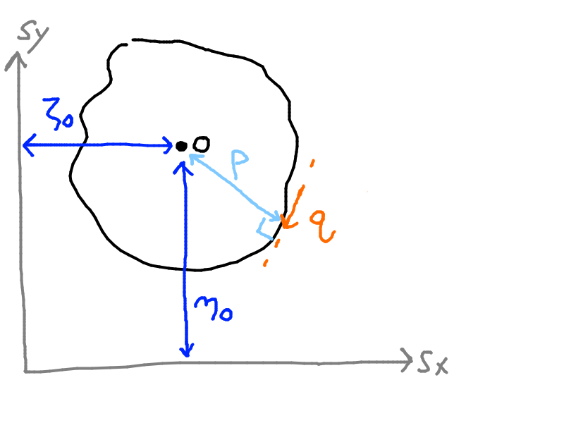
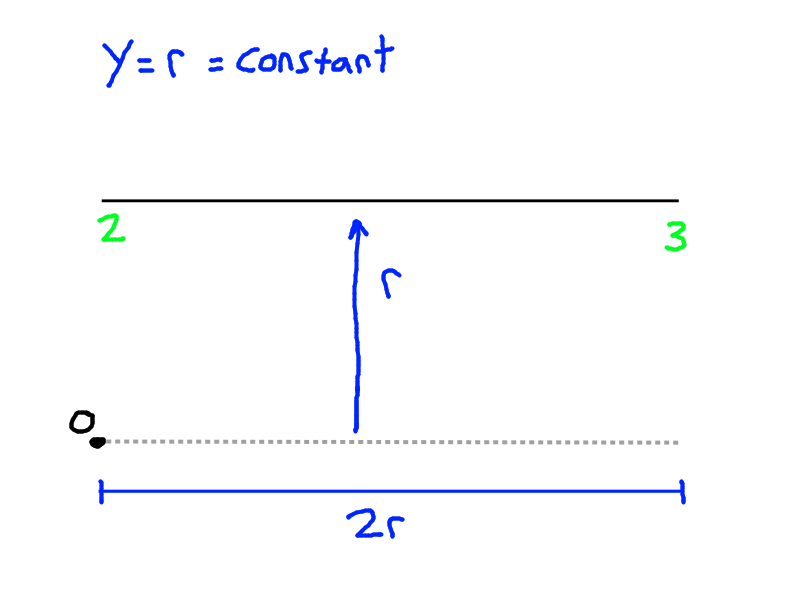
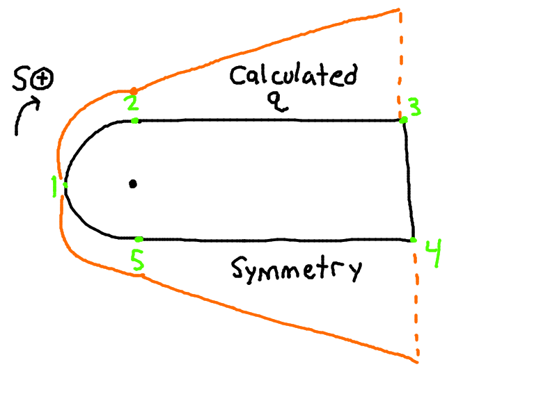

# Continuing Lecture 11

The beginning of this lecture added a little bit extra to lecture 11, seen below.

- $\zeta_S = \dfrac{3b^2}{h\left(1 + \dfrac{6b}{h}\right)}$
- Only a function of geometric parameters (base, height), not forces or anything.

Lets take this equation for $\zeta_S$ and consider adding some numbers...
- $b = 50mm, h = 2b$
- $\zeta_S = \dfrac{3(50^2)}{2(50)\left(1 + \dfrac{6(50)}{2(50)}\right)}$
- $\zeta_S = 18.75 mm$

See the image below. This creates a point where if force is applied, no twisting will occur. Bending may still occur.

The torsional stiffness (resistance to twisting) of a closed-section beam is MUCH higher than that of an open-section beam. Even with the same value of cross sectional area, same mass, etc..
- When there is a concentrated torque in aerospace applications, closed section beams are used for this reason.

# Shear of Closed-Section Beams

See the figure above:
1. $S_x$ & $S_y$ do NOT have to act through the shear center
2. It's usually not possible to choose an origin for the S coordinate, where $q_s$ is known.

General case for shear flow in a closed-section beam:
- $q_s = - \left(\dfrac{S_x I_{xx} - S_y I_{xy}}{I_{xx} I_{yy} - I_{xy}^2}\right) \int \limits_0^S txds - \left(\dfrac{S_y I_{yy} - S_x I_{xy}}{I_{xx} I_{yy} - I_{xy}^2}\right) \int \limits_0^S tyds + q_{s, 0}$

This is the same as the shear flow in an open section beam, loaded through the shear center. This is referred to as "Basic Shear Flow", expressed as $q_b$

We get: 
- $q_s  =q_b + q_{s, 0}$

Refer to the figure below.
- $S_x \eta_o - S_y \zeta_o = \oint p q ds = \oint pq_b dS + q_{s,0} \oint pds$
- $dA = \dfrac{1}{2} pdS \Rightarrow 2\delta A = pds \Rightarrow \oint pds = 2\oint \delta A = 2A$

Note that $\zeta_o$ and $\eta_o$ are the X and Y distances respectively, from the shear center to the origin. $\zeta \rightarrow$ Zeta, $\eta \rightarrow$ Eta

This results in the equation: 
- $S_x \eta_o - S_y \zeta_o = \oint p (q_b) ds + 2A q_{s,0}$

If the moment center is at the intersection of $S_x$ & $S_y$: 
- $\zeta_o = \eta_o = 0$
- Simplifies to: 
- $0 = \oint p q_b ds + 2A q_{s,0}$

The algorithm for finding $q_s$ is as follows:
1. Make a virtual cut, effectively creating an Open Section Beam out of the original Closed Section Beam. Solve for $q_b$
2. Use $M_{\textrm{external/applied}} = M_{\textrm{internal forces}}$
3. $q_s = q_b + q_{s, 0}$

# Example 12.1

Find the $q_s$ distribution.
- $I_{xx} = I_\textrm{semi-circle} + I_\textrm{remaining rectangle}$
- $I_{xx} = \left(\dfrac{\pi t r^2}{2}\right)_\textrm{semi-circle} + \left[(2rt)r^2 \times 2 + \dfrac{t(2r)^3}{12}\right]_\textrm{rectangle} = 6.24 tr^3$ 

 

We can write the equation for $q_s$ and plug in $I_{xx}$ and simplify:
- $q_s = -\dfrac{S_y}{I_{xx}} \int \limits_0^S tyds + q_{s,0}$
- $q_s = -0.16 \dfrac{S_y}{r^3} \int \limits_0 ^S yds + q_{s,0}$

## Step 1: Calculate $q_b$:

General expression with values subbed in:
- $-0.16 \dfrac{S_y}{r^3} \int \limits_0^S yds$

First look at Wall 1-2:

- We replace $y \rightarrow r \sin \theta$ and $dS \rightarrow r d\theta$
- We note that $q_{s, 0} = 0$ since we start at the virtual cut where $q = 0$
- $q_{b, 12} = -0.16 \dfrac{S_y}{r^3} \int \limits_0 ^{\pi/2} (r\sin \theta) (rd\theta) + 0$
- $q_{b, 12} = -0.16 \dfrac{S_y}{r} \int \limits_0 ^{\pi/2} \sin \theta d\theta$
- $q_{b, 12} = +0.16 \dfrac{S_y}{r} \cos \theta |_0^\theta$

Final equation:
- $q_{b, 12} = 0.16 \dfrac{S_y}{r} (\cos \theta - 1)$

Then we substitute in each point.
- Point 1: $\theta = 0 \Rightarrow q_{b,1} = 0$
- Point 2: $\theta = \dfrac{\pi}{2} \Rightarrow q_{b,2} = -0.16 \dfrac{S_y}{r}$

     

We do the same with Wall 2-3 now. The $y$ coordinate for any point in this wall is $r$.

- $y = r$, $x = S$
- We also have to add in the effects of $q_{b,12}$ since it immediately precedes wall 2-3.
- $q_{b, 23} = -0.16 \dfrac{S_y}{r^3} \int \limits_0^S rdS + q_{b, 12}$
- $q_{b, 23} = -0.16 \dfrac{S_y}{r^3} \int \limits_0^S rdS -0.16 \dfrac{S_y}{r}$
- $q_{b, 23} = -0.16 \dfrac{S_y}{r^2}S_1 - 0.16 \dfrac{S_y r}{r^2}$

Final equation:
- $q_{b, 23} = -0.16 \dfrac{S_y}{r^2}\left(S_1 + r\right)$

Then we check points 2, 3:
- Point 2: $S_1 = 0 \Rightarrow q_{b, 2} = -0.16 \dfrac{S_y}{r}$
  - This is the same as the value for point 2 we calculated previously, which confirms our answer is correct.
- Point 3: $S_1 = 2r \Rightarrow q_{b, 3}=-0.48 \dfrac{S_y}{r}$

Because the shape is perfectly symmetrical about its horizontal axis, we can draw in the shear flow distribution on the bottom of the shape as well (points 4-5-6), based on the value of the top (points 1-2-3). The vertical wall, 3-4, is covered next lecture.

[Lecture 13](./Lecture13.md)