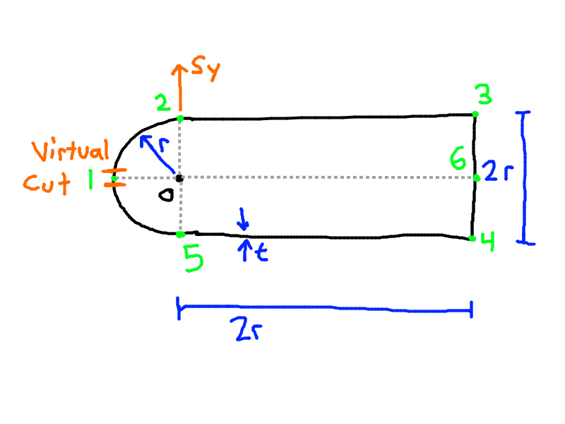
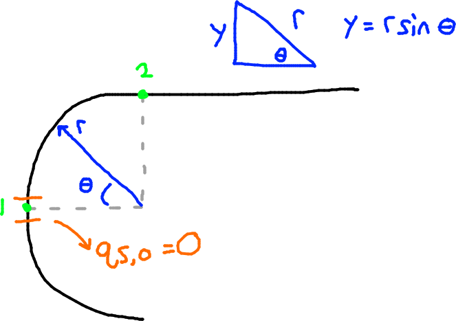
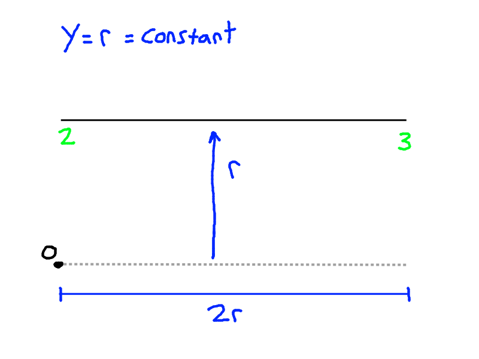
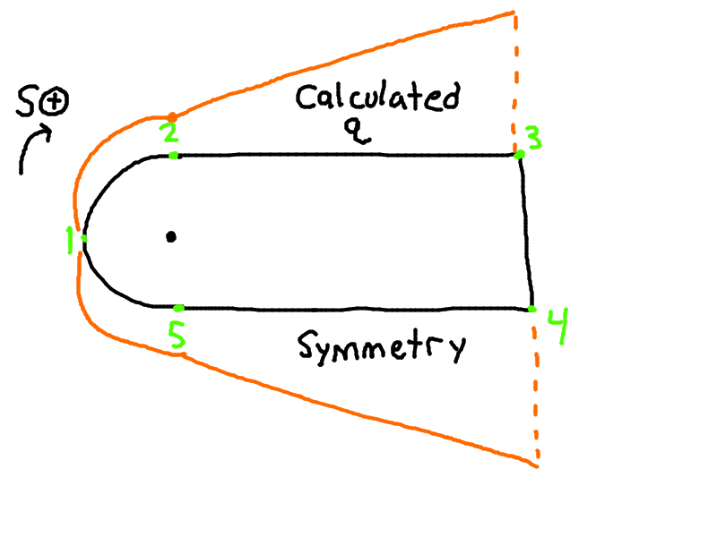
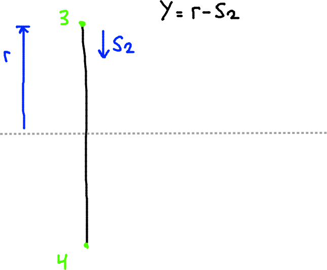
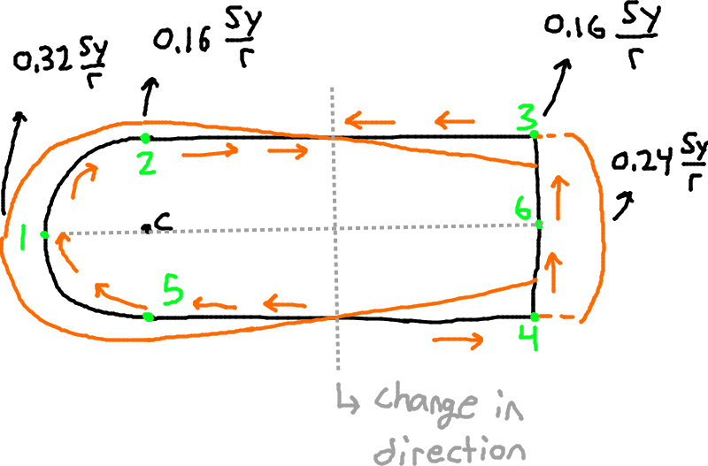
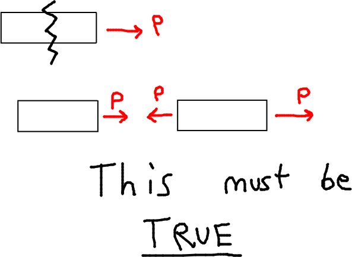
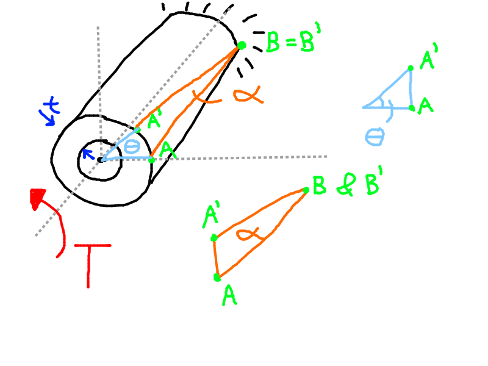

# Example 12.1 Continued

**The images and content below come from the end of lecture 12 and are repeated here.**

Find the $q_s$ distribution.
- $I_{xx} = I_\textrm{semi-circle} + I_\textrm{remaining rectangle}$
- $I_{xx} = \left(\dfrac{\pi t r^2}{2}\right)_\textrm{semi-circle} + \left[(2rt)r^2 \times 2 + \dfrac{t(2r)^3}{12}\right]_\textrm{rectangle} = 6.24 tr^3$ 

 

We can write the equation for $q_s$ and plug in $I_{xx}$ and simplify:
- $q_s = -\dfrac{S_y}{I_{xx}} \int \limits_0^S tyds + q_{s,0}$
- $q_s = -0.16 \dfrac{S_y}{r^3} \int \limits_0 ^S yds + q_{s,0}$

## Step 1: Calculate $q_b$:

General expression with values subbed in:
- $-0.16 \dfrac{S_y}{r^3} \int \limits_0^S yds$

First look at Wall 1-2:

- We replace $y \rightarrow r \sin \theta$ and $dS \rightarrow r d\theta$
- We note that $q_{s, 0} = 0$ since we start at the virtual cut where $q = 0$
- $q_{b, 12} = -0.16 \dfrac{S_y}{r^3} \int \limits_0 ^{\pi/2} (r\sin \theta) (rd\theta) + 0$
- $q_{b, 12} = -0.16 \dfrac{S_y}{r} \int \limits_0 ^{\pi/2} \sin \theta d\theta$
- $q_{b, 12} = +0.16 \dfrac{S_y}{r} \cos \theta |_0^\theta$

Final equation:
- $q_{b, 12} = 0.16 \dfrac{S_y}{r} (\cos \theta - 1)$

Then we substitute in each point.
- Point 1: $\theta = 0 \Rightarrow q_{b,1} = 0$
- Point 2: $\theta = \dfrac{\pi}{2} \Rightarrow q_{b,2} = -0.16 \dfrac{S_y}{r}$

     

We do the same with Wall 2-3 now. The $y$ coordinate for any point in this wall is $r$.

- $y = r$, $x = S$
- We also have to add in the effects of $q_{b,12}$ since it immediately precedes wall 2-3.
- $q_{b, 23} = -0.16 \dfrac{S_y}{r^3} \int \limits_0^S rdS + q_{b, 12}$
- $q_{b, 23} = -0.16 \dfrac{S_y}{r^3} \int \limits_0^S rdS -0.16 \dfrac{S_y}{r}$
- $q_{b, 23} = -0.16 \dfrac{S_y}{r^2}S_1 - 0.16 \dfrac{S_y r}{r^2}$

Final equation:
- $q_{b, 23} = -0.16 \dfrac{S_y}{r^2}\left(S_1 + r\right)$

Then we check points 2, 3:
- Point 2: $S_1 = 0 \Rightarrow q_{b, 2} = -0.16 \dfrac{S_y}{r}$
  - This is the same as the value for point 2 we calculated previously, which confirms our answer is correct.
- Point 3: $S_1 = 2r \Rightarrow q_{b, 3}=-0.48 \dfrac{S_y}{r}$

Because the shape is perfectly symmetrical about its horizontal axis, we can draw in the shear flow distribution on the bottom of the shape as well (points 4-5-6), based on the value of the top (points 1-2-3). The vertical wall, 3-4, is covered next lecture.

## New starting Lecture 13

For the vertical wall (Wall 34):

- $q_b = -0.16 \dfrac{S_y}{r} \int ydS$, where $y = r - S_2$
- $q_{b, 34} = -0.16 \dfrac{S_y}{r^2} \int_0^{S_2} (r - S_2)dS_2 - 0.48 \dfrac{S_y}{r}$
- $qq_{b, 34} = -0.16 \dfrac{S_y}{r} \left (S_2 r - \dfrac{S_2^2}{r}  \right ) - 0.48 \dfrac{S_y}{r}$
- $q_{b, 34} = -0.16 \dfrac{S_y}{r^3} \left(0.5 S_2^2 - rS_2 + 3r^2 \right )$

At point 3 (Top):
- $S_2 = 0 \Rightarrow q_{b,3} = -0.48 \dfrac{S_y}{r}$

At point 6 (Middle):
- $S_2 = r \Rightarrow q_{b, 6} = -0.56 \dfrac{S_y}{r}$

Because we have $S_2^2$ and we see that it's negative on both ends we note that it is a parabola and we can find the root/zero.

### Step 2 - Calculate qs,0

Figure 2

We place the axis in p.0
- $0 = \oint p q_b dS + 2A q_{s, 0}$

We can take advantage of symmetry and only integrate for one half (up to $\frac{\pi}{2})$, and then multiply it by two.
- Along the curve, the shear force acts tangentially, at a constant distance $r$ from the center.
- Along the vertical wall 34, the shear force acts vertically at a constant distance $$
- $0 = 2 \left[ \int_0^{\frac{\pi}{2}}0.16 \dfrac{S_y}{r} \left(\cos \theta - 1 \right) rd\theta -   \int_0^{2r} r \left[ 0.16 \dfrac{S_y}{r^2} (S_1 + r) \right]dS_1  - \int 2r \left[ 0.16 \dfrac{S_y}{r^3} (0.5S_2^2 - rS_2 + 3r^2)dS_2 \right] + 2\left(\dfrac{\pi r^2}{2} + (2r \times 2r) \right ) \right]$

Now we solve each integration and simplify.
- 0 = $0.16 S_y r \left (\sin \theta - \theta \right) \Bigr |_0 ^\frac{\pi}{2} - 0.16 \dfrac{S_y}{r} \int_0^{2r} (S_1 + r) dS_1 - 0.32 \dfrac{S_y}{r^2} \int_0^r -0.5S_2^2 + rS_2 + 3r^2)dS_2 + r^2 \left(4 + \dfrac{\pi}{2}\right) q_{s, 0}$

 

- $0 = 0.16 S_y r \left(1 - \dfrac{\pi}{2}\right) - 0.16 \dfrac{S_y}{r}\left[ 2r^2 + 2r^2 \right] - 0.32 \dfrac{S_y}{r^2}\left[ -\dfrac{r^3}{6} + \dfrac{r^3}{2} + 3r^3 \right] + r^2 \left[4 + \dfrac{\pi}{2} \right] q_{s, 0}$`

 

- $0 = -0.0912S_y r - 0.64 S_y r - 1.0667 S_y r + 5.57r^2 q_{s, 0}$

 

Now we can solve for $q_{s, 0}$
- $5.57r^2 q_{s, 0} = 1.7979 S_y r$
- $q_{s, 0} = 0.32 \dfrac{S_y}{r}$

### Step 3: qs = qb + qs0

We solve it in terms of each side.

First, the curve (12)
- $q_s = q_b + q_{s, 0}$
- $q_{s. 12} = 0.16 \dfrac{S_y}{r} (\cos \theta - 1) + 0.32 \dfrac{S_y}{r}$
- $q_{s, 12} = 0.16 \dfrac{S_y}{r} (\cos \theta + 1)$

Then the top (23)
- $q_{s, 23} = -0.16 \dfrac{S_y}{r} \left ( \dfrac{S_1}{r} + 1 \right ) + 0.32 \dfrac{S_y}{r}$
- $q_{s, 23} = 0.16 \dfrac{S_y}{r} \left ( 2 - 1 - \dfrac{S_1}{r} \right)$
- $q_{s, 23} = 0.16 \dfrac{S_y}{r} \left ( 1 - \dfrac{S_1}{r} \right)$

Finally the vertical edge (34)
- $q_{s, 34} = 0.16 \dfrac{S_y}{r^2} \left (0.5 S_2^2 - rS_2 - r^2 \right)$

As a sanity check look at the figure above. The result of the calculations should verify that this condition is true.

This example will likely be on the midterm. It will also appear in the tutorial. A solution is found in the textbook but it's not as comprehensive as the professor's.

# Torsion of Thick Walled Beams

## Rate of Twist
- $\gamma \rightarrow$ shear strain
- $\theta \rightarrow$ angle of twist
- $\dfrac{d\theta}{dz} = \textrm{constant}$
- We look at triangles B-A-A' and A-O-A'

Looking at the triangle of O-A-A':
- $AA' = L\gamma = R\theta$
- $d = \gamma = R d\theta$
- $\dfrac{d\theta}{dz} R = \gamma$

Now looking at the torque:
- $T = \oint q_s ds = RL$
- $T = \left[ \int \tau dA_{c/s} \right] R$ 
- $T =\left[ \int_{A_{c/s}} G\gamma dA_{c/s} \right] R$
- $T = GR \int_0^S \dfrac{d\theta}{dZ} R tdS$
- $T = Gt \dfrac{d\theta}{dZ}R^2 \int_0^S dS$
- $T = GTR^3 \dfrac{d\theta}{dZ} 2\pi$  
- $T = R \oint q_s ds = G + 2\pi R^3 \dfrac{d\theta}{dz}$
- $\dfrac{d\theta}{dz} = \dfrac{1}{2\pi R^2} \oint \dfrac{q_s}{Gt}dS$

Final expression for radial twist:
- $\dfrac{d\theta}{dz} = \dfrac{1}{2A} \oint \dfrac{q_s}{Gt}dS$

Some notes:
1. $G, t$ in the integral, in general, can be a function of $S$
2. $A$ is **NOT** Cross-sectional area. It is the area enclosed by the midline of the cross-section.
3. The above equation will stay the same for any arbitrary cross-section
4. We will use this expression as compatibility/kinematics condition.