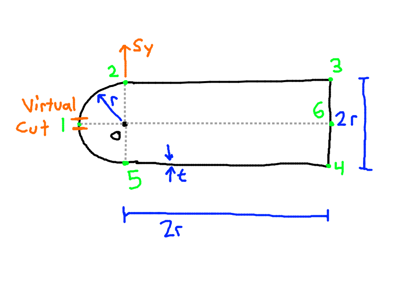
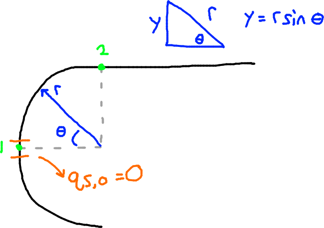
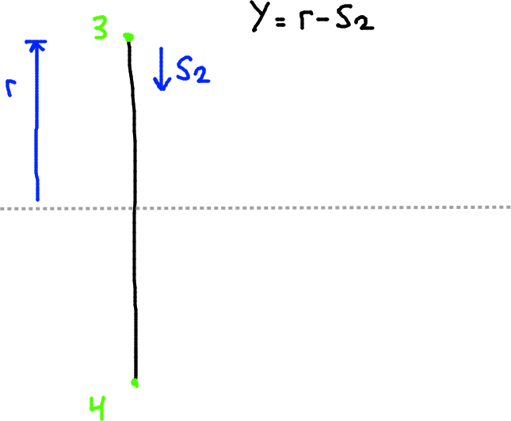
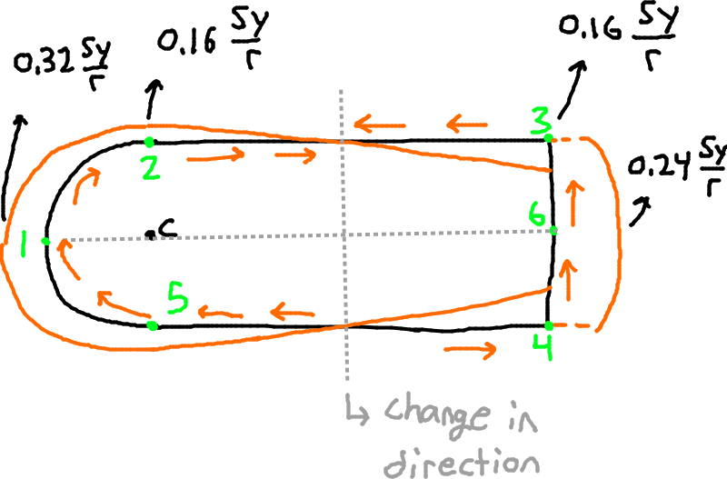
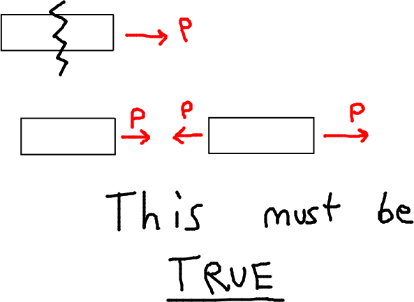

**RTF: $q_s$ distribution.**

We note that the shape is singly-symmetric:
- $\therefore I_{xy} = 0$

First, find $I_{xx}$.
- $I_{xx} = I_\textrm{semi-circle} + I_\textrm{wall 2-3} + I_\textrm{wall 3-4} + I_\textrm{wall 4-5}$

Since the top and bottom walls are symmetric:
- $I_{xx} = I_\textrm{semi-circle} + 2I_\textrm{top wall} + I_\textrm{wall 3-4}$

- $I_{xx} = \left(\dfrac{\pi t r^3}{2}\right) (\textrm{semi-circle}) + 2\left( \dfrac{2rt^3}{12} + 2rt(r^2)\right) (\textrm{top + bottom walls}) + \left( \dfrac{(2r)^3 t}{12} + 2rt(0) \right) (\textrm{vertical wall 3-4})$

For the top wall, the first term is neglected because it has a higher order of thickness. For the second term, the distance from point 6 to the X axis is zero, so that term drops out. We are left with:
- $I_{xx} = \left(\dfrac{\pi t r^3}{2}\right) + 2\left(2rt(r^2)\right) + \left( \dfrac{(2r)^3 t}{12}\right)$

Solving, we get:
- $I_{xx} = 6.24 tr^3$ 

 

We can write the equation for $q_s$ and plug in $I_{xx}$ and simplify:

- $q_s = -0.16 \dfrac{S_y}{r^3} \int \limits_0 ^S yds + q_{s,0}$

# Step 1: Calculate $q_b$:

Because it's singly symmetric, the shear center will lie somewhere on the X axis. Therefore we do not need to find $S_x$, and we say $S_x = 0$. Since $I_{xy} = 0$ as well, the equation for $q_s$ simplies to:
- $q_s = -\dfrac{S_y}{I_{xx}} \int \limits_0^S tyds + q_{s,0}$

Due to the equation simplification, the only moment of inertia needed is $I_{xx}$, so we don't have to calculate $I_{yy}$.

Substituting in $I_{xx}$ gives:
- $q_s = -0.16 \dfrac{S_y}{r^3} \int \limits_0 ^S yds + q_{s,0}$

## Wall 1-2 (Curve)
First look at Wall 1-2:

- We replace $y \rightarrow r \sin \theta$ and $dS \rightarrow r d\theta$
- We note that $q_{b, 1} = 0$ since we start at the virtual cut where $q = 0$
- $q_{b, 12} = -0.16 \dfrac{S_y}{r^3} \int \limits_0 ^{\theta} (r\sin \theta) (rd\theta) + 0$
- $q_{b, 12} = -0.16 \dfrac{S_y}{r} \int \limits_0 ^{\theta} \sin \theta d\theta$
- $q_{b, 12} = 0.16 \dfrac{S_y}{r} \cos \theta |_0^\theta$

Final equation:
- $q_{b, 12} = 0.16 \dfrac{S_y}{r} (\cos \theta - 1)$

Then we substitute in each point.
- Point 1: $\theta = 0 \Rightarrow q_{b,1} = 0$
- Point 2: $\theta = \dfrac{\pi}{2} \Rightarrow q_{b,2} = -0.16 \dfrac{S_y}{r}$

     

## Wall 2-3 (Horizontal)

We do the same with Wall 2-3 now. The $y$ coordinate for any point in this wall is $r$.

- $y = r$, $x = S$
- We also have to add in the effects of $q_{b,2}$ since it immediately precedes wall 2-3 (wall 2-3 connects to point 2 which was solved, and so the two values must match each other)
- $q_{b, 23} = -0.16 \dfrac{S_y}{r^3} \int \limits_0^S rdS + q_{b, 2}$
- $q_{b, 23} = -0.16 \dfrac{S_y}{r^3} \int \limits_0^S rdS -0.16 \dfrac{S_y}{r}$
- $q_{b, 23} = -0.16 \dfrac{S_y}{r^2}S_1 - 0.16 \dfrac{S_y r}{r^2}$

Final equation:
- $q_{b, 23} = -0.16 \dfrac{S_y}{r^2}\left(S_1 + r\right)$

Then we check points 2, 3:
- Point 2: $S_1 = 0 \Rightarrow q_{b, 2} = -0.16 \dfrac{S_y}{r}$
  - This is the same as the value for point 2 we calculated previously, which confirms our answer.
- Point 3: $S_1 = 2r \Rightarrow q_{b, 3}=-0.48 \dfrac{S_y}{r}$

This is the Basic Shear Flow $q_b$ up to this point, including the curve and the top & bottom walls.

Because the shape is perfectly symmetrical about its horizontal axis, we can draw in the shear flow distribution on the bottom of the shape as well (points 1-5-4), based on the value of the top (points 1-2-3). The vertical wall, 3-4, is covered next.

     

## Wall 3-4 (Vertical)

For the vertical wall (Wall 34):

Here, $y = r - S_2$, with $S_2 = 0$ at point 3 and $S_2 = 2r$ at point 4.

- $q_{b, 34} = -0.16 \dfrac{S_y}{r^3} \int ydS + q_{b,3}$

- $q_{b, 34} = -0.16 \dfrac{S_y}{r^3} \int_0^{S_2} (r - S_2)dS_2 - 0.48 \dfrac{S_y}{r}$

- $q_{b, 34} = -0.16 \dfrac{S_y}{r^3} \left (S_2 r - \dfrac{S_2^2}{2}  \right ) - 0.48 \dfrac{S_y}{r}$

Then factoring these terms together into one bracket:
- $q_{b, 34} = -0.16 \dfrac{S_y}{r^3} \left(-0.5 S_2^2 + rS_2 + 3r^2 \right )$

At point 3 (Top):
- $S_2 = 0 \Rightarrow q_{b,3} = -0.48 \dfrac{S_y}{r}$

At point 6 (Middle):
- $S_2 = r \Rightarrow q_{b, 6} = -0.56 \dfrac{S_y}{r}$

Because we have $S_2^2$ and we see that it's negative on both ends we note that it is a parabola and we can find the root/zero.

# Step 2 - Calculate qs,0

The image above is helpful in understanding what each component of the formula is.
- $0 = \oint p q_b dS + 2A q_{s, 0}$
- $p$ is the perpendicular distance, from the origin axis (in this case the X axis) to the shear flow.
- $q_b$ is the basic shear flow calculated in Step 1.
- $A$ is the area enclosed by the mid-line, NOT the cross-sectional area.
- $q_{s, 0}$ is the unknown shear flow and is what we are solving for.

We can take advantage of symmetry and only integrate for the top half of the shape, and the multiply it by two to complete the shape.

Integrating each segment is simpler and easier to understand. Then they are combined at the end.

## Wall 1-2 (Curve)

We need $\oint (p) (q_b)(dS)$ for segment 1-2
- Along the curve, the shear force acts tangentially, at a constant distance $r$ from the center. This gives us $p = r$
- We know $dS = rd\theta$ along the curve.
- We know $q_b = 0.16 \dfrac{S_y}{r} (cos \theta - 1)$ from Step 1.

Combining these:
- $\int_0^{\frac{\pi}{2}}(r) 0.16 \dfrac{S_y}{r} \left(\cos \theta - 1 \right)r d\theta$
- $0.16 S_y \int_0^{\frac{\pi}{2}} (\cos \theta - 1 )rd\theta$
- $0.16 S_yr \int_0^{\frac{\pi}{2}} (\cos \theta - 1 )d\theta$
- $0.16 S_y r \sin \theta - \theta$ -------- from $\theta=0$ to $\pi/2$
- $0.16 S_y r (\sin \frac{\pi}{2} - \frac{\pi}{2} - (\sin 0 - 0))$
- $0.16 S_y r (\sin \frac{\pi}{2} - \frac{\pi}{2})$

Final result:
- $-0.0916 S_y r$

## Wall 2-3 (Horizontal)

We need $\oint (p) (q_b)(dS)$ for segment 2-3
- Along the horizontal wall 2-3, the shear force acts horizontally at a constant distance $r$ from the horizontal axis.
- Here $dS = dS$ since we don't have any angles involved.
- $q_b = -0.16 \dfrac{S_y}{r} (\dfrac{S}{r} + 1) = -0.16 \dfrac{S_y}{r^2} (S + r)$ 

Combining these:
- $\int_0^{2r} (r) 0.16 \dfrac{S_y}{r^2}(S + r)dS$
- $0.16 \dfrac{S_y}{r} \int_0^{2r} (S + r)dS$
- $0.16 \dfrac{S_y}{r} \left(\dfrac{S^2}{2} + rS\right)$ ------ from $S = 0$ to $2r$
- $0.16 \dfrac{S_y}{r} \left(\dfrac{4r^2}{2} + 2r^2\right)$
- $0.16 \dfrac{S_y}{r} r^2 (2 + 2)$
- $0.64 S_y r$

This should be $-0.64 S_y r$. Why is it negative? TODO

## Wall 3-4 (Vertical)

We need $\oint (p) (q_b)(dS)$ for segment 3-4
- Along the vertical wall 34, the shear force acts vertically at a constant distance $2r$ from the center of the circle. 
- Since the shear force acts vertically, $p$ will be the horizontal distance, so $p = 2r$
- $dS = dS$ since we don't have any angles involved.
- We integrate from $0\rightarrow r$ and not $2r$ because we want only half of this segment, so that when we double it at the end we end up with the whole shape. If we did $2r$ we would be including too much.
- $q_b = -0.16 \dfrac{S_y}{r^3} \left(rS - 0.5S^2 + 3r^2 \right)$

Combining these:
- $\int_0^r \left( (2r) (-0.16 \dfrac{S_y}{r^3} (rS - 0.5S^2 + 3r^2)\right)dS$
- $-0.32 \dfrac{S_y}{r^2} \int_0^r \left(rS - 0.5S^2 + 3r^2\right)dS$
- $-0.32 \dfrac{S_y}{r^2} \left(r \dfrac{S^2}{2} - 0.5 \dfrac{S^3}{3} + 3r^2S\right)$ ---- from $S = 0$ to $r$
- $-0.32 \dfrac{S_y}{r^2} \left(\dfrac{r^3}{2} - 0.5 \dfrac{r^3}{3} + 3r^3 \right)$
- $-1.067 S_y r$

## Wall 1-2 + Wall 2-3 + Half of Wall 3-4

Now combining these, we get:
- $\oint pq_bdS = -0.0916 S_y r - 0.64 S_y r - 1.067 S_y r$
- $\oint pq_bdS = -1.7986 S_y r$

The original equation is:
- $0 = 2(\oint p q_b dS + 2A q_{s, 0})$
- $0 = 2(-1.7986 S_y r + 2A q_{s, 0})$

Remember that we double it since it's symmetrical, but since the equation is equal to zero we can drop the constant $2$.
- $0 = -1.7986 S_y r + 2A q_{s, 0}$

But now what is A??

## Area

Remember, A here is NOT the cross-sectional area. It's the area enclosed by the mid-line. It's essentially the cross-sectional area **IF** this was a solid cross-section and not a thin beam (BUT IT ISN'T, KEEP THAT IN MIND!)
- $A = A_{semi-circle} + A_{rectangle}$
- $A = \dfrac{\pi r^2}{2} + (2r)(2r)$
- $A = \dfrac{\pi r^2}{2} + 4r^2$
- $A = 5.57r^2$

## Solve for qs0

The original equation is:
- $0 = \oint p q_b dS + 2A q_{s, 0}$

Pluigging in what we have found thus far:
- $0 = -1.7986 S_y r + 2(5.57r^2) q_{s, 0}$

Solving for $q_{s, 0}$:
- $q_{s, 0} = \dfrac{1.7986\times S_y r}{2\times5.57r^2}$
- $q_{s, 0} = 0.165 \dfrac{S_y}{r}$

This should be $0.32 \dfrac{S_y}{r}$, why do they get rid of the $2$ in $(2Aq_{s, 0})$ ??? TODO

# Step 3: qs = qb + qs0

We solve it in terms of each side.

First, the curve (12)
- $q_s = q_b + q_{s, 0}$
- $q_{s. 12} = 0.16 \dfrac{S_y}{r} (\cos \theta - 1) + 0.32 \dfrac{S_y}{r}$
- $q_{s, 12} = 0.16 \dfrac{S_y}{r} (\cos \theta + 1)$

Then the top (23)
- $q_{s, 23} = -0.16 \dfrac{S_y}{r} \left ( \dfrac{S_1}{r} + 1 \right ) + 0.32 \dfrac{S_y}{r}$
- $q_{s, 23} = 0.16 \dfrac{S_y}{r} \left ( 2 - 1 - \dfrac{S_1}{r} \right)$
- $q_{s, 23} = 0.16 \dfrac{S_y}{r} \left ( 1 - \dfrac{S_1}{r} \right)$

Finally the vertical edge (34)
- $q_{s, 34} = 0.16 \dfrac{S_y}{r^2} \left (0.5 S_2^2 - rS_2 - r^2 \right)$

As a sanity check look at the figure above. The result of the calculations should verify that this condition is true.

This example will likely be on the midterm. It will also appear in the tutorial. A solution is found in the textbook but it's not as comprehensive as the professor's.
